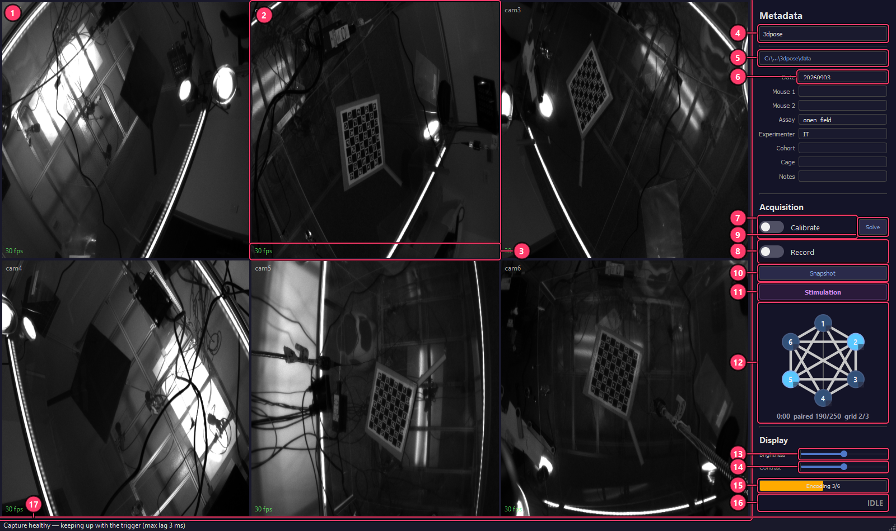

# Panopticon — 3DPose

Multi-camera **hardware-synchronized** acquisition for 3D pose estimation: N cameras
triggered off one clock, encoded to H.264 on the GPU *during* capture, and written out
already frame-aligned so that frame *i* is the same instant in every view.

This repo is the **3dpose rig** deployment. The `gui_app/` codebase is shared unchanged
with [3dface](https://github.com/Elmaestrotango/3dface); only the rig profile differs.

| | 3dpose (this repo) | 3dface |
|---|---|---|
| **Cameras** | 6x Basler a2A1920-165g5m (GigE) | 6x Basler acA1300-200um (USB3) |
| **Resolution** | 1920x1200 | 1280x1024 (full sensor) |
| **Interface** | GigE (2x 10 GbE, 3 cameras per port) | USB 3.0 |
| **Storage / 10 min** | ~a few GB (online encode) · ~138 GB/cam in raw fallback | ~a few GB · ~79 GB/cam raw |
| **Calibration board** | ChArUco 8x8, 15mm squares | ChArUco 5x5, 0.5mm squares |

> **Offline use:** once installed, acquisition, encoding and calibration run fully
> offline. Only `git clone` and `uv sync` need the internet.

---

## The interface

New to the rig? **[docs/UI_GUIDE.md](docs/UI_GUIDE.md)** is an annotated
screenshot with every control numbered and explained, plus a first-session
walkthrough.

[](docs/UI_GUIDE.md)

---

## Will this run on my hardware?

Honest answer up front, because the compatibility surface is narrow in one specific
place and wide everywhere else.

| Layer | Requirement | How hard to change |
|---|---|---|
| **Cameras** | **Basler** (pypylon) | **Moderate.** All vendor code lives in `gui_app/backends/basler.py` behind a documented `CameraBackend` contract — nothing else in `gui_app/` imports pypylon. Write one file. The hard part is not the API, it is supplying the *guarantees*: a per-frame trigger ordinal, an observable buffer pool, and genuinely zero-copy pixel access. |
| **GPU** | NVIDIA with NVENC | Easy — the session limit and encoder config are *probed*, not assumed. |
| **OS** | Windows (today) | Moderate — a handful of Win32 calls, all isolated. See *Porting to Linux*. |
| **Trigger** | Arduino/Teensy on a serial port | Easy — pins, port and rate are profile fields. |
| **Camera count** | any | Easy — `n_cameras` in the profile. |

A new backend is a single file. `gui_app/backends/__init__.py` documents exactly what it
must provide and why each guarantee matters; `basler.py` is the worked example.

**~1,300 LOC is already fully portable** with no camera, GUI or OS dependency:
`frame_sync.py` (the cross-camera coordinator, with a proof of equivalence to post-hoc
block-ID intersection), `alignment.py`, `stim_compiler.py`, `stim_trace.py`,
`session_config.py`, `serial_controller.py`, `board_detector.py`. If you only want the
synchronization logic, take `frame_sync.py` — it is 173 lines and depends on nothing.

**Four of the five test suites run with no hardware at all**, so you can develop against
this without a rig:

```bash
uv run python test_frame_sync.py        # coordinator == post-hoc intersection
uv run python test_grab_failure.py      # camera-failure paths (stub camera + router)
uv run python test_stim_compiler.py     # stim graph -> firmware
uv run python test_serial_handshake.py  # trigger-board handshake (stubs pyserial)
uv run python test_sync_router.py       # NEEDS an NVENC GPU
```

---

## Requirements

### Software

| Requirement | Why | Notes |
|---|---|---|
| **uv** | everything | [install](https://docs.astral.sh/uv/getting-started/installation/). No conda needed. |
| **Basler pylon SDK** | camera drivers | [download](https://www.baslerweb.com/en/downloads/software-downloads/). Install before `uv sync`. |
| **NVIDIA driver** | NVENC H.264 during capture | Recent driver. Without a working NVENC the GUI falls back to raw-to-disk + post-hoc encode, which needs **~100x more disk**. |
| **Arduino IDE** *or* `arduino-cli` | only for the Stimulation editor | Not needed for plain acquisition. Set `PANOPTICON_ARDUINO_CLI` if it is installed somewhere unusual. |

### Hardware

These are **measured on the reference rig** (6 cameras, 1920x1200, 100 fps), not
guesses. Scale them by your own camera count and pixel rate.

| Resource | Minimum | Reference rig | Why it matters |
|---|---|---|---|
| CPU | 4 cores | Intel Ultra 9 285K (24 cores) | Each grab thread must finish its cycle inside one frame period (10 ms at 100 fps). Cores beyond that mostly help the *network* stack, not Python. |
| RAM | 16 GB | 64 GB | Dominated by buffers: `n_cams x MaxNumBuffer x frame_bytes` for the driver pool **plus** `n_cams x (kick_max_lag + 264) x 1.5 x frame_bytes` for the NV12 ring. At 6 cameras that is ~29 GB; at 9 it is ~41 GB. **Panopticon computes this and refuses to start if it will not fit.** |
| GPU | NVIDIA w/ NVENC | RTX 5080 | You need **one concurrent encode session per camera**. The driver caps this — measured **12** on the reference rig, and NVIDIA has moved the cap over time (2 -> 3 -> 5 -> 8 -> 12). Panopticon probes it at startup and refuses a real-time start if there are fewer sessions than cameras. |
| Disk | 500 GB free | 2x NVMe | Online encode writes only a few GB/session. The **raw fallback** writes `n_cams x fps x frame_bytes`: 1.38 GB/s at 6 cameras, 2.07 GB/s at 9. Spread that across drives — a single consumer NVMe drops to ~1.6 GB/s once its SLC cache is exhausted. |
| Network (GigE) | — | 2x 10 GbE, 3 cameras/port | Each 1920x1200 mono8 camera at 100 fps is ~1.84 Gbit/s. Keep cameras-per-port low; see *Tuning*. |

On launch Panopticon runs a hardware check and warns about anything below minimum. At
**Record** time it runs a second, stricter check against the *actual* camera count and
refuses to start rather than half-record.

---

## Installation (step by step)

### 1. Clone the repository

```bash
git clone https://github.com/Elmaestrotango/3dpose.git
cd 3dpose
```

### 2. Install Python dependencies

```bash
uv sync
```

This creates a `.venv` with all dependencies (pypylon, PyQt5, numpy, plus PyNvVideoCodec + the CUDA runtime for online GPU encoding, etc.). No conda required. Requires internet access once.

### 3. Generate camera settings (.pfs file)

Connect all cameras to the machine, then open **Pylon Viewer** (installed with the Pylon SDK):

1. Open a camera in Pylon Viewer
2. Set **Pixel Format** to `Mono8`
3. Set **Width** and **Height** to full sensor (e.g., 1920x1200 for a2A1920-165g5m)
4. Set **Acquisition Frame Rate** to `165` (or higher than your target fps)
5. File > **Save Features** > save as `configs/<descriptive_name>.pfs`

Example naming: `mono8_1920x1200.pfs`, `mono8_1280x1024.pfs`

### 4. Update the rig profile

Edit `profiles/<your_rig>.yaml` to point to your `.pfs` file:

```yaml
name: my_rig
frame_width: 1920          # Must match .pfs Width
frame_height: 1200         # Must match .pfs Height
frame_rate: 100            # Trigger rate in Hz
quality: 21                # NVENC QP (lower = higher quality, 15-30 typical)

pfs_path: "configs/mono8_1920x1200.pfs"               # Relative to repo root
output_dir: "data"                                      # Relative to repo root
board_config: "configs/boards/charuco_8x8_15mm.yaml"   # Calibration board

serial_port: COM3                 # Teensy serial port
trigger_pins: [2, 4, 6, 8, 10, 12]  # One Teensy GPIO pin per camera
```

All paths can be **relative** (resolved against the repo root) or **absolute**.

### 5. Configure cameras (GigE)

```powershell
# Run as Administrator
& "C:\Program Files\Basler\pylon\Runtime\x64\PylonGigEConfigurator.exe" auto-all

# Add firewall rule
New-NetFirewallRule -DisplayName PanopticonGigE -Direction Inbound -Action Allow -Protocol UDP -Program "<repo>\.venv\Scripts\python.exe"
```

GigE cameras require IP configuration and a firewall rule to allow UDP discovery. Both commands must be run as Administrator.

### 6. Flash the Teensy

1. Open `campy/campy/trigger/trigger.ino` in Arduino IDE
2. Select your Teensy board and COM port
3. Upload the sketch
4. Close Arduino Serial Monitor (it holds the COM port)

### 7. Test the installation

```bash
uv run python gui.py
```

Cameras should appear in the live preview grid at ~30 fps. If you see a hardware check warning, review the recommendations.

### 8. Create a Desktop shortcut (optional)

```powershell
powershell -ExecutionPolicy Bypass -File make_shortcut.ps1
```

This points the shortcut straight at the venv's `pythonw.exe`, which is a GUI-subsystem
binary — Windows never allocates a console for it, so you get exactly one window.

Do **not** point a shortcut at `_launch.bat`: a `.bat` is a console program, so Windows
gives it a console window, and `uv run` then blocks for the whole life of the app — that
console sits on the taskbar for the entire session. (Marking the shortcut "minimised"
hides it but does not stop it existing.)

`_launch.bat` is still the right thing to run when you *want* the console — if the app
fails to start, it shows you why. It also goes through `uv run`, so it picks up
dependency changes; the shortcut does not, so run `uv sync` after a `pyproject.toml`
change.

---

## Directory structure

```
<repo>/
  gui.py                    Entry point (splash screen + main window)
  _launch.bat               Windows batch launcher
  pyproject.toml             Python dependencies (uv sync)
  panopticon.ico             Application icon
  1_calibrate.py             sleap-anipose calibration script
  configs/                   Camera and board config files (tracked in git)
    *.pfs                    Basler camera feature persistence files
    boards/                  ChArUco board definitions
      *.yaml                 One file per board (see Board Configuration)
  profiles/                  Rig profiles (tracked in git)
    <rigname>.yaml           One file per rig (see Profile Configuration)
  data/                      Default output directory (gitignored)
    YYYYMMDD/                Date directories
      subject1_subject2/     Session directories
        ...                  Videos, frametimes, metadata
  gui_app/                   Application code
    main_window.py           Layout, theme, state machine, acquisition flow
    camera_manager.py        Camera lifecycle, mode switching, grab threads
    grab_thread.py           Per-camera: frame grab + raw binary write
    encode_worker.py         Background NVENC H.264 encoding
    calibration_worker.py    Background sleap-anipose calibration
    serial_controller.py     Teensy serial trigger control
    session_config.py        Profile loading, session paths, metadata
    hardware_check.py        Startup hardware screening
    widgets/
      camera_grid.py         Dynamic NxM camera grid with zoom
      sidebar.py             Metadata form, profile selector, toggles, sliders
      toggle_switch.py       Animated toggle switch widget
  campy/                     Teensy firmware (git submodule)
    campy/trigger/trigger.ino
```

---

## Profile configuration

Each rig has a YAML profile in `profiles/`. The profile defines everything specific to one camera setup.

| Field | Type | Description |
|---|---|---|
| `name` | string | Display name in the GUI dropdown |
| `frame_width` | int | Sensor width in pixels (must match .pfs) |
| `frame_height` | int | Sensor height in pixels (must match .pfs) |
| `frame_rate` | int | Trigger rate in Hz (typically 100) |
| `quality` | int | NVENC QP parameter (0-51, lower = better quality, 21 is default) |
| `realtime_encode` | bool | Encode H.264 on the GPU during capture (default `true`). `false` = raw-to-disk + post-hoc encode |
| `realtime_kick` | bool | Real-time cross-camera frame kick-out (default `true`): only frames every camera caught are encoded, so videos come out trigger-aligned with no post-hoc re-encode. `false` = post-hoc block-ID alignment instead |
| `kick_max_lag` | int | Kick-out coordinator buffer in frames (default 240). The NV12 ring scales with it — do not raise blindly (1000 starved capture) |
| `encode_parallel` | int | Concurrent ffmpeg jobs at stop: `.h264`→mp4 remuxes (online) or raw→H.264 encodes (fallback). Default 3 |
| `pfs_path` | string | Path to Basler .pfs file (relative or absolute) |
| `output_dir` | string | Base data directory (relative or absolute) |
| `board_config` | string | Path to ChArUco board YAML (relative or absolute) |
| `serial_port` | string | Teensy COM port (e.g., `COM3`) |
| `trigger_pins` | list[int] | Teensy GPIO pins, one per camera (e.g., `[2, 4, 6, 8, 10, 12]`) |

This repo ships one profile per rig: **`3dpose`** and **`3dface`**. Both use real-time
GPU encode with cross-camera frame kick-out. See **Frame alignment** below for what
kick-out does.

### Falling back to raw capture

Dedicated `(raw)` profiles used to ship alongside these and were removed once the
real-time path proved out (a 20-minute 6-camera run at 99.95%, zero buffer underruns,
zero forced drops). The raw path itself is **still fully supported** — it is a profile
flag, not dead code. To get it back, copy the profile and flip one field:

```bash
cp profiles/3dpose.yaml profiles/3dpose_raw.yaml
```
```yaml
name: 3dpose (raw)
realtime_encode: false     # write raw.bin during capture, encode after
```

Worth knowing before you do: raw capture writes `n_cams x fps x frame_bytes` — **1.38
GB/s at 6 cameras, ~138 GB per camera per 10 minutes** — and then needs a post-hoc encode
pass of roughly real time. The GUI also falls back to raw *automatically*, per camera, if
NVENC cannot start, so you do not need a raw profile just to be safe.

To create a new profile for a different rig:

1. Copy an existing profile: `cp profiles/3dpose.yaml profiles/my_rig.yaml`
2. Update `name`, resolution, `.pfs` path, and board config
3. Ensure the `.pfs` file exists in `configs/`
4. Ensure the board YAML exists in `configs/boards/`
5. Launch the GUI — your new profile appears in the dropdown

---

## Board configuration

ChArUco calibration boards are defined in `configs/boards/*.yaml`. Each rig references one board in its profile.

```yaml
board_x: 8            # Squares along width
board_y: 8            # Squares along height
square_length: 15.0   # Square side length in mm
marker_length: 12.0   # ArUco marker side length in mm
marker_bits: 4        # Marker dictionary bit count
dict_size: 1000       # Marker dictionary size
max_frames: 200       # Max frames for calibration subsampling
```

To create a new board config:

1. Measure your physical ChArUco board
2. Create `configs/boards/<descriptive_name>.yaml` with the parameters above
3. Update `board_config` in your rig profile to point to it

---

## Usage

### Recording workflow

1. Launch the GUI (`uv run python gui.py` or Desktop shortcut)
2. Select the rig profile from the dropdown
3. Fill in session metadata (date, subject IDs, assay, experimenter, etc.)
4. Flip **Calibrate** toggle — record calibration videos with ChArUco board visible
5. Flip it off — the per-camera H.264 streams are wrapped into mp4 (seconds; a brief progress bar shows during the remux)
6. Click **Solve** — runs sleap-anipose calibration on the encoded videos
7. Flip **Record** toggle — record behavioral data
8. Flip it off — videos are finalized (seconds), and `calibration.toml` is copied to the recording directory

> With online encode (the default), encoding happens live during capture, so step 5/8 is a near-instant remux. With `realtime_encode: false` these steps run the full post-hoc encode instead (~10 min for a 10-min recording).

### Keyboard / mouse

- **Double-click** a camera view to zoom (fills entire grid area)
- **Double-click** the zoomed view to return to grid
- **Brightness / Contrast** sliders adjust display only (recorded data is unaffected)

---

## Naming conventions

| Item | Convention | Example |
|---|---|---|
| Date | `YYYYMMDD` | `20260517` |
| Session ID | `<subject1>_<subject2>` | `slmc001_slmc002` |
| Camera names | `cam1`, `cam2`, ..., `camN` (auto-assigned by serial number order) | `cam1` |
| Video files | `<date>-<session_id>-<cam>-<acq_type>.mp4` | `20260517-slmc001_slmc002-cam1-recording.mp4` |
| Frame times | `frametimes.npy` (numpy array: row 0 = frame numbers, row 1 = relative timestamps in seconds) | |
| Session metadata | `session_metadata.json` | |
| Calibration output | `calibration.toml` (sleap-anipose camera parameters) | |
| Board definition | `board.toml` (generated during calibration solve) | |

---

## Output structure

```
data/
  YYYYMMDD/
    subject1_subject2/
      session_metadata.json
      calibration/
        cam1/
          YYYYMMDD-subject1_subject2-cam1-calibration.mp4
          frametimes.npy
        cam2/
          ...
        camN/
          ...
        board.toml
        board.jpg
        calibration.toml
        calibration_metadata.h5
        reprojection_error_histogram.png
        reprojections/
      recording/
        cam1/
          YYYYMMDD-subject1_subject2-cam1-recording.mp4
          frametimes.npy
        cam2/
          ...
        camN/
          ...
        calibration.toml          (copied from calibration/)
```

During an online-encode recording each `camN/` briefly holds a `stream.h264` that is
replaced by the `.mp4` at stop; in raw fallback mode it holds `raw.bin`, removed after
the post-hoc encode.

---

## Architecture

### Real-time GPU encoding (default) — "online encode"

During recording, each camera's grab thread does only retrieve → copy → queue → release
(so the GigE buffer pool always drains at full rate), and a dedicated per-camera
**encoder thread** converts the mono8 frame to NV12 (the gray frame *is* the luma plane;
chroma is a constant) and encodes it to H.264 on the GPU via
[PyNvVideoCodec](https://pypi.org/project/PyNvVideoCodec/) (NVENC) — one encoder session
per camera, all running concurrently. Frames go straight to a per-camera `stream.h264`
elementary stream. On stop, each stream is wrapped into an `.mp4` with a fast
`ffmpeg -c copy` remux (no re-encode — finishes in seconds).

Encoding must never stall capture: if a camera's encoder dies mid-recording, its
remaining frames are written raw (`raw_tail.bin`) in arrival order and merged back into
the stream at stop, so the recording stays gapless. Each frame's GigE block ID (trigger
ordinal) is saved to `blockids.npy` alongside `frametimes.npy`, making any dropped frame
a detectable, re-alignable gap instead of a silent cross-camera desync.

So there is **no large transient file and no post-hoc encode pass**: a 10-minute
6-camera session writes a few GB total and is fully encoded the instant recording stops.

**Why this works now (it didn't before):** the old path piped frames through *ffmpeg*,
whose CPU-side gray→yuv420p conversion bottlenecked at ~80 fps for 6 cameras.
PyNvVideoCodec does the conversion *and* encode on the GPU, so the CPU only copies the
gray bytes — measured ~1400 fps aggregate for 6×1920x1200 on an RTX 5080 (~2.3× the
600 fps needed), at under 2 CPU cores.

Controlled by the `realtime_encode` profile field (default **true**). If PyNvVideoCodec
or the CUDA runtime is unavailable, each camera transparently falls back to the
raw-to-disk path below — no data is lost.

### Frame alignment (GigE drops → trigger-aligned videos)

At 6×100 fps over GigE the network occasionally drops a frame on one camera but not the
others, so frame *i* is **not** the same trigger across cameras — and the drift
accumulates (measured up to ~2 s of cross-camera skew over a 15-minute recording).
Truncating each video to the shortest does **not** fix this; it only equalizes the
counts. Every recorded frame is therefore tagged with its GigE **block ID** (trigger
ordinal) in `blockids.npy`, and the videos are made truly trigger-aligned one of two ways:

- **Real-time frame kick-out (default, `realtime_kick: true`).** A shared coordinator
  (`gui_app/frame_sync.py`) releases a trigger to the encoders only once *all* cameras
  have captured it; triggers any camera missed are dropped before encoding. The videos
  come out equal-length and trigger-aligned **by construction — one encode, no post-hoc
  pass.** `kick_max_lag` bounds how far a lagging camera (e.g. recovering lost packets
  via resends) holds up the others before its late frames are sacrificed.
- **Post-hoc block-ID alignment (`realtime_kick: false`).** Encode everything, then after
  stop intersect the cameras' block IDs and re-encode each video down to the common
  frames (`gui_app/alignment.py`). Immune to network jitter (keeps slightly more frames)
  but pays a re-encode. The same logic is available as a CLI for old recordings:
  `uv run 2_align.py <recording_dir> --replace`.

Either way the per-camera videos end up identical length with identical block IDs.

### Raw capture + post-hoc encoding (fallback)

Used when `realtime_encode: false` or when NVENC is
unavailable. Raw mono8 frames are written directly to disk via `os.write()` into
`raw.bin`; after recording stops, ffmpeg encodes them to H.264 via NVENC
(`encode_parallel` cameras at a time). Rock-solid — the disk write can never fall
behind — but it writes ~138 GB per camera per 10 min at 1920x1200, and the encode pass
runs at roughly real-time (~10 min for a 10-min session).

### Camera modes

| Mode | TriggerMode | Frame Rate | Purpose |
|---|---|---|---|
| Idle (preview) | Off | 30 fps free-run | Live camera grid |
| Acquiring | On (Line1, rising edge) | 100 fps hardware-triggered | Recording / calibration |

Mode switching: `StopGrabbing() -> reconfigure -> StartGrabbing()`

### Frame synchronization

The Teensy delivers TTL pulses to all cameras simultaneously (~30 ns cross-pin skew). After acquisition, all cameras' data is truncated to the minimum frame count across cameras.

### Calibration

Uses [sleap-anipose](https://github.com/talmolab/sleap-anipose). Board parameters are loaded from the board config YAML. Calibration videos are subsampled to `max_frames` (default 200) before solving to keep runtime under 2 minutes.

---

## Tuning for your hardware

The constants in `profiles/*.yaml` are **calibrated to the reference rig**. They are not
universal, and inheriting them blindly on different hardware is the most likely way to
get a bad session. What generalizes is the *method*, so here it is.

### The one number that matters

Each grab thread must complete its cycle within one frame period. The grab-thread log
line prints it directly:

```
[grab0] frames=87000 ... avg_wait=8.63ms avg_proc=0.87ms  deliv_lag=-0.027s  cycle=10.00ms
```

- **`cycle`** — start-of-iteration to start-of-iteration. It must equal the trigger
  period (10.00 ms at 100 fps). **Anything above it means you are accumulating backlog**,
  and the failure stays silent for as long as the buffer pool can absorb it.
- **`deliv_lag`** — how stale a frame is when retrieved, measured against the camera's
  own clock. Should sit at ~0. If it grows without bound, the loop is losing to the
  trigger.
- **`avg_wait` >> `avg_proc`** is healthy: the thread is *waiting for triggers*, i.e. it
  has slack. The reference rig runs 8.6 ms of wait against 0.87 ms of work.

### Things to re-derive, not copy

| Setting | Reference value | Depends on |
|---|---|---|
| `kick_max_lag` | 480 | **RAM.** The NV12 ring is `(max_lag + 264)` buffers per camera — 2.39 GiB each at 480. Raising it is not free, and 1000 once starved capture outright (24% loss). |
| `MaxNumBuffer` (`camera_manager.py`) | 1000 | RAM, and how much silent backlog you are willing to hide. 1000 buffers is 10 s at 100 fps. |
| `GevSCPD` (in the `.pfs`) | 10000 | Cameras per port and link speed. Inter-packet delay; 0 causes collisions. |
| `AcquisitionFrameRate` | 165 | Sets your exposure ceiling. In trigger mode the minimum interval is `exposure + 1/rate`, so at 165 anything past ~3.94 ms exposure silently **halves** the frame rate. |
| NIC RSS receive queues | 4 | Your NIC. See below. |

### Profiling your own rig

Included probes, all runnable standalone:

```bash
uv run probe_copy_scaling.py     # is a hot-path operation GIL-bound? (no hardware)
uv run probe_gil_wait.py         # split "executing" from "waiting for the GIL" (no hardware)
uv run probe_zerocopy.py         # A/B frame-access routes on a real camera
uv run probe_lag.py --seconds 90 # the full capture path, headless, real cameras
uv run python probe_native_cpu.py --counters-only --duration 150
```

Two methodological warnings that cost this project real time:

1. **Never wall-clock a GIL-releasing call.** numpy releases the GIL for a large memcpy
   and must re-acquire it before returning, so the wait lands *inside* your timer. That
   is how a 0.08 ms copy got measured as 2.7 ms, and it misled this project twice. Split
   execution from waiting with `QueryThreadCycleTime` — `probe_gil_wait.py` shows how.
2. **Measure on a quiet machine.** Competing CPU load moved the cycle from 10.00 to
   10.32 ms, which is enough to accumulate 5.6 s of backlog in 150 s.

### Network tuning (GigE rigs)

`configure_nic.ps1` (run elevated) spreads receive processing across cores. On the
reference rig both ports defaulted to **one RSS receive queue**, funnelling ~78,000
packets/s per port through a single core's DPC — measured at 46% of two cores while the
24-core average was 4%, with one port discarding packets at the NIC. Check yours:

```powershell
Get-NetAdapterRss -Name "Ethernet 4" | Select-Object Name,NumberOfReceiveQueues
```

Also verify jumbo frames (MTU 9014) end to end, receive buffers at maximum, and Energy
Efficient Ethernet **disabled** — EEE caused a catastrophic stall on this rig.

---

## Porting to Linux

Not done, but the surface is small and known:

- `os.O_BINARY` — already handled via `getattr(os, "O_BINARY", 0)`.
- `subprocess.STARTUPINFO` in `encode_worker.py` — already guarded by `sys.platform`.
- Serial port — a profile field; set `serial_port: /dev/ttyACM0`.
- `arduino-cli` — discovered via PATH or `PANOPTICON_ARDUINO_CLI`, no longer hardcoded.
- The perf probes (`probe_gil_wait.py`, `probe_native_cpu.py`) are Win32-only. The
  capture path does not depend on them.

NVENC and pypylon both support Linux, so nothing structural blocks it.

---

## Troubleshooting

Panopticon tries to fail **loudly and specifically**: most messages name the likely cause
and what to do about it. If something goes wrong *silently*, that is a bug worth
reporting.

### It refuses to start a recording

| Message | What it means |
|---|---|
| `Expected N cameras but M enumerated` | A camera did not appear. Names are positional by serial number, so starting anyway would rename every later camera and attach calibration extrinsics to the **wrong physical camera**. Power-cycle the missing one. Set `n_cameras: 0` to disable the check. |
| `NVENC granted only N concurrent sessions but M cameras need one each` | The driver's encode-session cap is below your camera count. Use the `(raw)` profile, or record fewer cameras. |
| `Not enough RAM for N cameras` | The buffer arithmetic does not fit. Lower `kick_max_lag` or `MaxNumBuffer`, or close other applications. The message shows the breakdown. |
| `PixelFormat is Mono12, not Mono8` | The `.pfs` was saved with the wrong pixel format. Anything wider than 8-bit is silently truncated mod 256, so this refuses rather than recording shredded video. |
| `Pin N cannot carry a stim waveform` | A stim block targets a camera trigger pin (which would desynchronize that camera) or UART RX0/TX0. Move it. |
| `No cameras are open` | Recording would run the trigger protocol and any stim paradigm while saving nothing. |

### It warns during or after a recording

| Message | What it means |
|---|---|
| `FATAL: PaddingX=… rows would shear` | The camera reports row padding, which the zero-copy frame view does not handle. That camera is retired rather than recording sheared frames. |
| `camera did not start grabbing` / `stream dead after N re-arms` | That camera was **retired** from the alignment set so the others keep recording aligned. You get N-1 cameras instead of an empty session. |
| `block-ID bookkeeping claimed X frames but only Y were persisted` | An encoder fell behind or died. Metadata is truncated to what is actually in the video, and a `WARNINGS.txt` is written beside it. |
| `STOP NOT CONFIRMED` / a failed `Test stopped` dialog | The trigger board did not accept the stop command. **A looping stim chain never ends on its own** — power-cycle the board and key off the laser. |
| `ffmpeg reported success but <file> is missing or empty` | The source file is kept rather than deleted. |

### Cameras not found

| Symptom | Fix |
|---|---|
| "No cameras found" on launch | Check power and cabling. Close PylonViewer or anything else holding the cameras. |
| .pfs file not found | `pfs_path` in the profile must point at an existing file in `configs/`. |
| GigE cameras not detected | `PylonGigEConfigurator auto-all` as Administrator, plus an inbound UDP firewall rule for the Python interpreter. |
| Cameras vanish after a NIC change | Expected — the adapters reset. They re-enumerate within seconds. |

### Serial / trigger board

| Symptom | Fix |
|---|---|
| "Could not open COM3" | Close the Arduino Serial Monitor. Check `serial_port` in the profile. |
| Board does not acknowledge | Verify the sketch is flashed. Panopticon retries with a reset before giving up. |
| `arduino-cli was not found` | Install the Arduino IDE, or set `PANOPTICON_ARDUINO_CLI`. Only the Stimulation editor needs it. |

### Recording quality

| Symptom | Fix |
|---|---|
| `cycle` above the frame period | Something is stealing CPU, or a hot-path change added work. See *Tuning*. |
| Very low fps (about half expected) | `exposure + 1/AcquisitionFrameRate` exceeds the trigger period. Lower exposure or raise `AcquisitionFrameRate`. |
| Frames lost, high resend counts | Network. Check RSS queues, jumbo frames, EEE, and cameras-per-port. |
| Video will not seek in the labeler | The mp4 lost its explicit GOP. Every encode path must pass `-g <fps>` and `-movflags +faststart`. |

### Calibration

| Symptom | Fix |
|---|---|
| "0 boards detected" | Board parameters in `configs/boards/*.yaml` must match the physical board — including `board_legacy` for pre-OpenCV-4.6 layouts. |
| numpy ABI error | `1_calibrate.py` pins its own dependencies. `uv cache clean` and retry. |

---

## Teensy wiring

| Teensy Pin | Destination |
|---|---|
| USB | Computer (serial port, 115200 baud) |
| 2, 4, 6, 8, 10, 12 | Camera Line1 trigger inputs (one per camera) |
| 13 | Stim Arduino interrupt pin (optional) |
| GND | Camera GND (shared ground) |

Serial protocol: `<num_pins>,<pin1>,<pin2>,...,<fps>` to start, `<num_pins>,<pin1>,<pin2>,...,-1` to stop.

Example: `6,2,4,6,8,10,12,100` (start 6 cameras at 100 fps), `6,2,4,6,8,10,12,-1` (stop).

---

## Cross-references

- **3dface rig**: https://github.com/Elmaestrotango/3dface
- **sleap-anipose**: https://github.com/talmolab/sleap-anipose
- **stac-mjx**: https://github.com/talmolab/stac-mjx
- **Basler Pylon SDK**: https://www.baslerweb.com/en/downloads/software-downloads/
