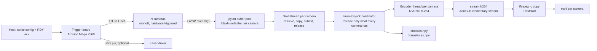
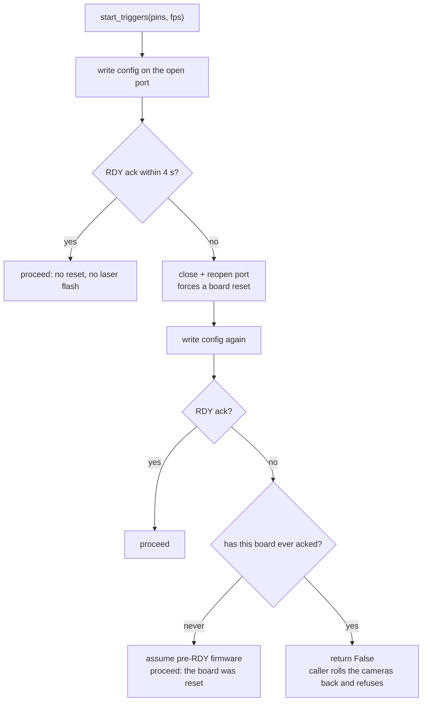
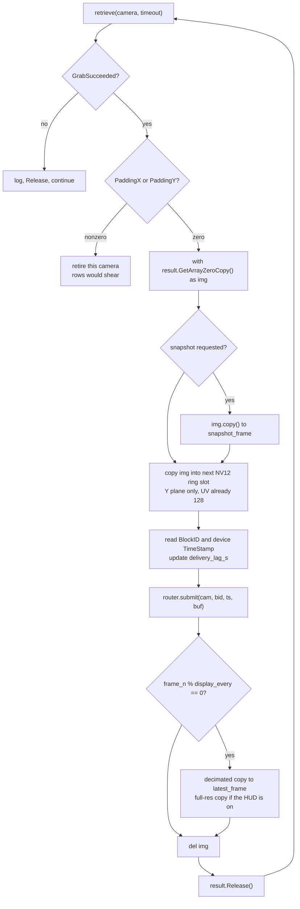
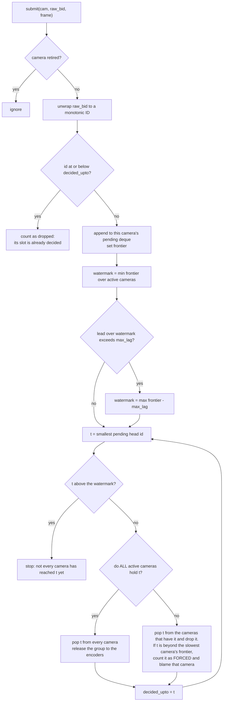
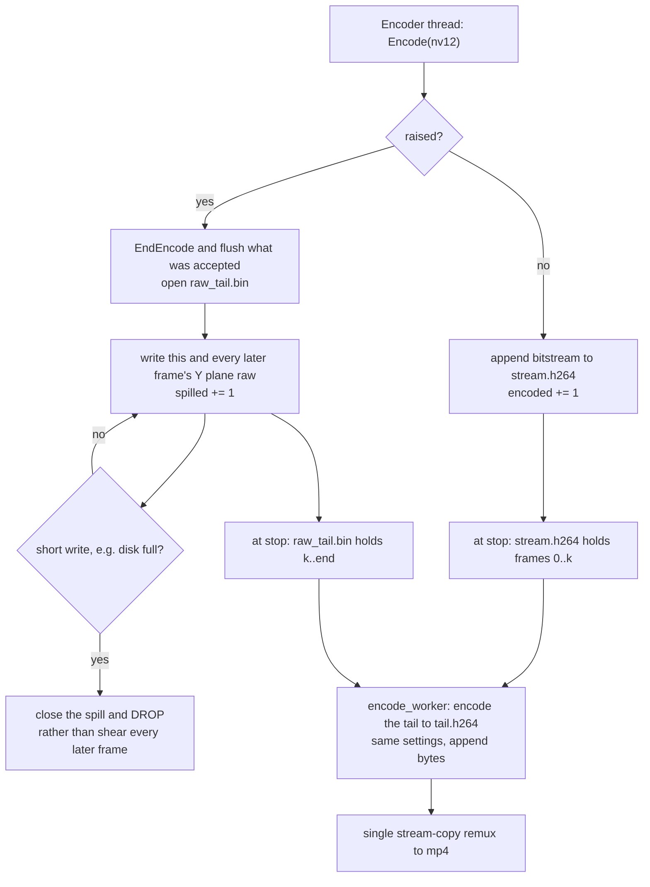
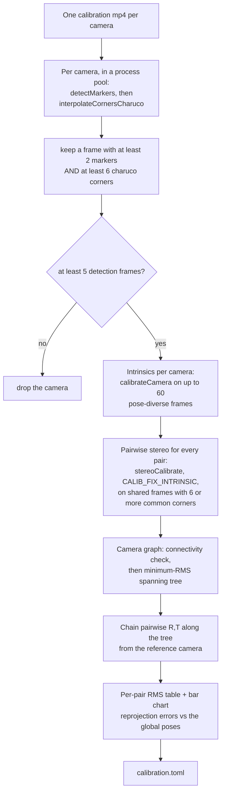

# The nitty gritty

How Panopticon gets from photons to files, in enough detail to fix it, port it, or
run it on hardware that is not the reference rig. Numbers quoted from the
reference rig (6x Basler a2A1920-165g5m GigE, 1920x1200 mono8, 100 fps) are
examples of the arithmetic, not requirements — every one of them is derived from
resolution, frame rate and camera count.

---

## 1. Shape of the system

One microcontroller generates the frame clock. It drives a TTL line into every
camera's `Line1` input, so all cameras expose on the same edge. Each camera
streams frames over its own transport to the host, where one thread per camera
retrieves them. A shared coordinator holds each frame until every camera has
delivered the same trigger, then releases the whole group to per-camera NVENC
encoders. On stop, the H.264 elementary streams are remuxed to mp4 by stream
copy.



Module map:

| File | Responsibility |
|---|---|
| `gui_app/backends/__init__.py` | The camera-backend contract, and the grab-result duck type |
| `gui_app/backends/basler.py` | The only module that knows what a Basler camera is |
| `gui_app/camera_manager.py` | Vendor-neutral orchestration: open, describe, mode switches, start/stop |
| `gui_app/grab_thread.py` | The per-camera hot loop, the NV12 ring, and the encoder drain thread |
| `gui_app/frame_sync.py` | Cross-camera release logic. Pure integers, no Qt, no SDK |
| `gui_app/sync_encode.py` | Router: owns the coordinator, the encoders, and the recorded metadata |
| `gui_app/nvenc.py` | PyNvVideoCodec loader, encoder factory, session probe |
| `gui_app/encode_worker.py` | Post-stop remux and the raw-mode encode pool |
| `gui_app/alignment.py` | Block-ID unwrap, intersection, post-hoc re-encode |
| `gui_app/serial_controller.py` | Trigger-board link and the RDY handshake |
| `gui_app/stim_compiler.py` | Stim graph to Arduino sketch, including the trigger loop |
| `gui_app/stim_trace.py` | Per-frame model of what the paradigm delivered |
| `gui_app/board_detector.py`, `coverage_worker.py` | Live ChArUco coverage during calibration |
| `1_calibrate.py` | The calibration solve (standalone, PEP 723 script) |
| `2_align.py`, `3_stim_trace.py` | Standalone equivalents of the in-app passes |

---

## 2. Hardware triggering

### One clock

`stim_compiler.compile_ino()` emits the sketch the board runs. Its `loop()` is
the frame clock:

```c
if (FPS_OUT > 0) {
  camsLow();
  while (micros() - FRAME_START < FRAME_PERIOD / 2) { updateStim(); }
  camsHigh();
  while (micros() - FRAME_START < FRAME_PERIOD) { updateStim(); }
  FRAME_START += FRAME_PERIOD;
}
```

Properties that matter:

- `FRAME_PERIOD` is integer microseconds, `1e6 / FPS_OUT`. `FRAME_START` is
  advanced by adding the period, never by re-reading the clock, so period error
  does not accumulate.
- The line is LOW for the first half period and HIGH for the second, giving a
  50% duty square wave at the frame rate. Cameras are configured for
  `RisingEdge`, so the trigger instant is half a period after `FRAME_START`.
- `camsHigh()` and `camsLow()` write every trigger pin inside
  `noInterrupts()`/`interrupts()`, so inter-pin skew is bounded by the write
  loop and cannot be extended by an interrupt landing mid-loop. The firmware
  lineage (`campy/campy/trigger/trigger.ino`) documents this design as ±0.35 µs
  inter-frame interval precision and ~30 ns synchronicity between pins.
- Nothing on the host is in the timing path. The host only tells the board which
  pins to drive and at what rate.

On the reference rig the pins are `[2, 4, 6, 8, 10, 12]` (profile field
`trigger_pins`), one per camera, each wired to that camera's `Line1`. All of them
are written inside the same `noInterrupts()` block, so one fanned-out line is
electrically equivalent provided the output can source every input. The pin count
in the serial command is what the sketch drives; adding a camera means adding a
pin to the profile, nothing more.

### Why the same board owns stimulation

The generated sketch runs a non-blocking stim state machine, `updateStim()`,
called from inside both trigger busy-wait loops. `setup()` (and the `loop()`
reconfigure branch) sets `FRAME_START = micros()` and calls `initStim()` a few
microseconds later, so **stim t=0 is trigger t=0 on the same clock**, with no
host timestamp anywhere. That is what makes `stim_trace.csv` exact: the time of
a recorded frame is `t = (unwrapped_blockid - 1) / fps`, and the stim model is
evaluated at that same `t`.

Consequences of running both on one MCU:

- `updateStim()` must not do floating-point maths. It runs inside the trigger
  busy-wait, and an AVR float divide is around 30 µs — enough to blunt the edge
  precision above. The compiler resolves period and pulse width to integer
  microseconds; `test_stim_compiler.py` asserts no floats reach that function.
- A stim chain must never be placed on a trigger pin. Extra rising edges on one
  camera's line make that camera acquire more frames than the others, so its
  block IDs advance faster and block ID N stops denoting the same instant on
  every camera — the assumption the whole alignment path rests on.
  `stim_compiler.forbidden_pin_uses()` blocks Apply, Test and Record on it.
- Pins listed in the profile's `stim_safe_pins` are set `OUTPUT` and driven LOW
  by `allStimLow()` as the **first statement in `setup()`**, before
  `Serial.begin()`. `setup()` blocks on the serial handshake, so anything after
  it leaves the pin floating for as long as the GUI takes to connect, and a
  powered laser driver reads a floating modulation input as ON.
  `pinMode()` precedes `digitalWrite()` because writing LOW to a pin still
  configured as `INPUT` only disables the pullup.
- The MCU reset window is not coverable in software. During reset and the
  bootloader wait every GPIO is high-Z because the sketch is not executing.
  Fitting a laser interlock is the only hard gate; a pulldown across the
  modulation input does not necessarily work (a driver input with a stiff
  internal pullup needs a resistor low enough to exceed the MCU's per-pin
  current limit when driving high).

### Serial protocol

115200 baud, 8N1. One command format, used for both start and stop:

```
<n_pins>,<pin1>,...,<pinN>,<fps>\n
```

`fps < 0` means stop: the sketch's reconfigure branch runs `camsLow()`,
`allStimLow()`, sets `FPS_OUT = 0` and stops emitting triggers. The trailing
newline terminates the sketch's final `parseFloat()` immediately instead of
letting it burn its one-second timeout.

The sketch replies `RDY <n_cams> <fps>` from `announceReady()`, called from both
config paths — `setup()` and the `loop()` reconfigure branch — and printed
before `FRAME_START` is set so the print latency cannot skew the clock.

### The RDY handshake

Opening the port pulses DTR, which resets the board. That reset is load-bearing:
it returns the sketch to `setup()` with a cleared serial RX buffer. Suppressing
it (`dtr=False`) makes the board ignore the config and emit zero triggers, which
produces a full-length recording containing no frames. The reset is therefore
relocated rather than defeated: `main_window` opens one `TeensyController` at
launch and holds it until quit, so the board resets at GUI launch and on firmware
upload, never at the start of a recording.

Because a start command can now land in `loop()` instead of a freshly reset
`setup()`, every start is confirmed. `TeensyController.start_triggers()` returns
a bool and takes exactly four paths:



The never-acked / has-acked distinction is the safety property. Collapsing it one
way locks legacy firmware out of recording; the other way lets a silent
zero-trigger session through. `test_serial_handshake.py` pins all four branches
and stubs pyserial, so it needs no board.

`ACK_TIMEOUT` is 4 s because the sketch's `readFPS()` can burn a one-second
`parseFloat()` timeout followed by `delay(500)`; a legitimate ack takes about
1.5 s. `stop_triggers()` returns whether the board accepted the command, and the
caller surfaces a failure loudly: a looping stim chain never ends on its own, so
an unacknowledged stop can leave a laser driven with the UI showing IDLE.
`pyserial`'s `is_open` stays True after the USB device disappears, so port state
is not evidence that the board is there.

---

## 3. Exposure and the frame-rate ceiling

### The rule

In trigger mode the camera's internal frame-rate timer starts **after exposure
ends**, so the minimum interval between acquisitions is

```
minimum interval = exposure + 1 / AcquisitionFrameRate
```

`AcquisitionFrameRate` does nothing useful while the camera is externally
triggered, but it still enforces that floor. The trigger period must exceed it,
so usable exposure is

```
exposure_max = 1/trigger_fps - 1/AcquisitionFrameRate
```

`BaslerBackend.set_triggered()` applies the profile's `trigger_rate_limit` as
`AcquisitionFrameRate` (165 on both shipped profiles, i.e. 6.06 ms).
`CameraManager.apply_exposure_gain()` derives and **enforces** the ceiling with a
10% margin rather than trusting the profile:

```python
ceiling_us = (1e6 / fps - 1e6 / limit) * 0.9
```

| Trigger rate | Period | Limiter | Floor from limiter | Headroom | Enforced ceiling |
|---|---|---|---|---|---|
| 100 fps | 10.00 ms | 165 | 6.06 ms | 3.94 ms | 3.55 ms |
| 60 fps | 16.67 ms | 165 | 6.06 ms | 10.61 ms | 9.55 ms |
| 30 fps | 33.33 ms | 165 | 6.06 ms | 27.27 ms | 24.55 ms |
| 100 fps | 10.00 ms | 500 | 2.00 ms | 8.00 ms | 7.20 ms |

The last row is illustrative: the limiter cannot be set above the camera's own
maximum frame rate, and the camera clamps it silently if asked.

A too-large exposure is clamped and logged; it is never silently accepted. The
calibration acquisition exploits the same arithmetic in reverse: at the 30 fps
`calibration_frame_rate` the light budget is roughly seven times a 100 fps
recording's, which is why `calibration_exposure_us` (15000 on the reference rig)
can be far longer than the recording exposure. Recording passes
`exposure_us=None`, which **restores** the values read from the `.pfs` at open
rather than recomputing them, so a calibration exposure cannot leak into a
100 fps session.

### The failure mode when it is exceeded

Nothing errors. If the minimum interval exceeds the trigger period but is under
two periods, the camera ignores every second trigger and delivers half the
requested rate. The frames it does deliver are correct and correctly numbered,
so the videos remain mutually aligned; the *rate* is wrong and the recording is
half as long in frames as expected. Symptoms, in order of how quickly they are
noticed:

- live frame rate reads ~50 fps at a 100 fps trigger rate;
- `frametimes.npy` spans the right wall-clock duration with half the rows;
- block-ID span divided by duration reads ~50 fps rather than ~100. That ratio is
  the diagnostic that separates an **acquisition** failure from a **delivery**
  failure: a frame lost in transmission still consumed its block ID, so delivery
  loss leaves the span intact and the row count short, while a trigger the camera
  never acquired shortens the span itself. Only the first kind is recoverable by
  the alignment path, and any time base derived from block IDs (including
  `stim_trace.csv`) assumes one trigger per ID.

The preview cannot show this: preview is free-run at 30 fps with 33 ms of
headroom, so an over-long exposure looks fine there and only halves the rate
once triggered. Verify exposure changes against a recording.

### Why the limiter is not disabled

Setting `trigger_rate_limit: 0` calls `AcquisitionFrameRateEnable = False`,
which removes the floor and the exposure ceiling with it. It also removes the
pacing: with the limiter on, readout and transmission are spread across
`1/limit`; with it off, every camera bursts onto its link immediately after the
shared trigger. On the reference rig that cost 8–15% of frames **in
transmission** — the cameras still acquired every trigger and numbered them
contiguously, but delivery fell from 99.98% to 85–92%. Keep the limiter above
the trigger rate. Raising the limiter (rather than disabling it) buys exposure
headroom at the cost of pacing, and is the knob to try if more light is needed
and the network has margin.

Exposure and gain live in the `.pfs` only; no code path sets them except the
calibration override and the ceiling clamp. Order of preference when frames are
too dark: more illumination (real photons, better signal-to-noise), then
exposure, then gain. Gain is a multiplier on both signal and noise, and it
clips: on a representative frame from the reference rig 3.0x leaves ~4% of
pixels saturated while 7x clips 12.7%.

---

## 4. GigE transport

### GVSP

Each camera streams over UDP using the GigE Vision Streaming Protocol. A frame
is one *block*, fragmented into packets. Every block carries a **block ID**,
assigned by the camera when it acquires the frame. The host driver reassembles
packets into a buffer taken from a per-camera pool; a complete buffer becomes a
grab result.

Two consequences used throughout the pipeline:

- The block ID is the trigger ordinal, identical on every camera for a given
  trigger edge, because all cameras receive the same edge and start numbering at
  1 when grabbing starts.
- A frame lost in transmission still consumed its block ID, so loss appears as a
  **gap** in the delivered sequence rather than a shift. This is what makes
  `alignment.py`'s `trigger_span = max(last) - min(first) + 1` a meaningful
  denominator and per-camera `dropped = trigger_span - recorded` a real count.

### Packet size, jumbo frames, inter-packet delay

From `configs/mono8_1920x1200.pfs`:

| Feature | Value | What it does |
|---|---|---|
| `GevSCPSPacketSize` | 9000 | Stream packet payload size. Requires jumbo frames enabled end to end (NIC MTU 9014, and every switch in the path). |
| `GevSCPD` | 10000 | Inter-packet delay, in device timestamp ticks. Paces packets so several cameras sharing a port do not collide. |
| `GevSCFTD` | 0 | Frame transmission delay. Nonzero staggers whole frames between cameras. |

Packet size is the dominant lever on host CPU: a 1920x1200 mono8 frame is
2,304,000 bytes, which is ~260 packets at 9000 bytes and ~1600 at 1500. At
100 fps that is the difference between ~26,000 and ~160,000 packets per second
per camera, every one of which the host must process in interrupt/DPC context.
Three cameras per port at 9000 bytes is the ~78,000 packets/s figure in the DPC
numbers below.

A path that cannot carry the configured packet size does not degrade gracefully:
the oversized frames are dropped and the camera delivers incomplete buffers or
nothing at all. Enable jumbo frames on the NIC (MTU 9014) **and** on every switch
in the path, and verify rather than assume.

Inter-packet delay trades latency for collision avoidance. Zero on a port shared
by several cameras causes collisions and resends. It must be re-tuned for a
different cameras-per-port ratio, link speed, or frame size.

Bandwidth arithmetic, which determines everything above:

```
per camera bits/s = width * height * bytes_per_pixel * 8 * fps
1920 * 1200 * 1 * 8 * 100 = 1.84 Gbit/s
```

Three of those per port needs a 10 GbE port with margin for resends; at 30 fps
or lower resolution the same camera fits comfortably on 1 GbE. Cat6a or better
for 10 GbE runs.

### Resends and driver choice

`BaslerBackend.select_gige_driver()` selects the receive path from the profile's
`gige_driver`:

- **`socket`** — user-space receive. Higher host CPU, and its packet resend
  behaviour reliably recovers lost packets. This is the shipped setting. It also
  maxes `SocketBufferSize` to the node's advertised maximum, giving the receive
  thread more slack when the encoders contend for CPU.
- **`filter`** — the in-kernel pylon GigE Vision driver. Far less CPU, but with
  default resend settings it discards a frame containing a lost packet instead of
  asking for it again: measured ~23% frame loss under a 6x100 fps load, appearing
  as thousands of single-frame gaps per camera.
- **`auto`** — leave the vendor default. No-op for non-GigE transports.

A high resend count with a near-zero `Failed_Buffer_Count` is a noisy link doing
its job, not a fault. On the reference rig the cameras split into two groups by
physical path — one group issues ~3 resend requests over 20 minutes, the other
~9,700 — and both groups capture 100% of triggers, because every resend is
recovered.

### The buffer pool

`camera_manager.MAX_NUM_BUFFER = 1000` driver-side buffers per camera, applied at
open. At 1920x1200 mono8 that is 2.3 GB per camera: about 13.8 GB at six cameras
and 20.7 GB at nine. `GrabStrategy_OneByOne` delivers oldest-first.

Deep slack has two faces. It absorbs genuine network jitter, and it hides a
per-frame deficit: a grab loop a fraction of a millisecond over budget loses
nothing at first, because the pool fills instead. Nothing errors for minutes;
what actually happens is that every retrieved frame is progressively staler. By
the time the pool is exhausted the session is spoiled. That is why the loop
publishes `delivery_lag_s` live (see §5) and why the GUI reports it during
recording. Pool size is not monotonic in quality — an oversized ring elsewhere
has starved capture outright — so change it only with a rig A/B.

### The counters that matter

`BaslerBackend.stream_stats()` reads these at stop, before `StopGrabbing()`
resets them:

| Counter | Meaning |
|---|---|
| `Buffer_Underrun_Count` | The pool ran dry. **The host could not keep up.** |
| `Failed_Buffer_Count` | A frame was given up on: resends exhausted or incomplete. |
| `Resend_Request_Count`, `Resend_Packet_Count` | Packets lost and asked for again. High with `Failed_Buffer_Count` near zero is healthy. |
| `Total_Buffer_Count`, `Total_Packet_Count` | Denominators. `Total_Packet_Count = 0` on every camera means the board sent no triggers. |

`Statistic_Failed_Packet_Count` is deliberately excluded: on this hardware it
reports values larger than the total packet count and cannot be trusted.

Host-side, the receive load lands in DPC context on whichever core the NIC's
receive queue is bound to. On the reference rig each port's ~78,000 packets/s
funnel through a single core at ~46% DPC time while the 24-core average is ~4%,
and one port discards a fraction of a percent of packets at the NIC while the
other discards exactly zero. Those discards are recovered by resends and are not
in the frame-loss path today, but `ReceivedDiscardedPackets` per port is the
metric to watch when adding cameras: a healthy port reads exactly 0.
`configure_nic.ps1` sets RSS receive queues (four per port) and verifies the
result rather than assuming, because some drivers apply RSS only to TCP.

---

## 5. The capture loop

### One thread per camera, one trigger period per frame

`GrabThread.run()` is a `QThread` per camera. The budget per iteration is the
trigger period: 10 ms at 100 fps. If the mean iteration exceeds it, the loop
falls behind the camera permanently, absorbed by the buffer pool until it is not.

Per frame, in kick-out mode, the loop does exactly this:



Every consumer copies out of `img`. The view is a window onto the driver buffer
and must not outlive `Release()`; `del img` is what enforces that, because Python
does not unbind a `with` target at block exit and pypylon's own exit guard
structurally cannot see the with-target itself.

### Why a copying accessor is unaffordable

pypylon's `GetArray()` (i.e. `result.Array`) allocates a fresh 2.3 MB array and
memcpys the driver buffer into it **with the GIL held** — it is on pypylon's
explicit no-thread list. `np.frombuffer(GetBuffer())` is not a substitute; it
measures the same.

| Access route | GIL-held cost per frame |
|---|---|
| `result.Array` | 0.837 ms |
| `np.frombuffer(result.GetBuffer())` | 0.902 ms |
| `with result.GetArrayZeroCopy() as img:` | **0.157 ms** |

The reason the difference is decisive is that GIL-held work does not run
concurrently. It serialises across every Python thread in the process, so the
aggregate demand per trigger period is `n_threads x cost_per_frame`. With one
grab thread and one encoder thread per camera, nine cameras is 18 threads plus
the UI. At 0.84 ms per frame per camera the copying route alone asks for 7.5 ms
of a 10 ms window; at 0.16 ms it asks for 1.4 ms.

The tolerance boundary was measured directly, by driving one production-shaped
copy against N competitor threads each burning a fixed amount of GIL-held work
every 10 ms. Cell values are the per-copy wall-clock median in milliseconds;
5 competitors is 6 grab threads, 11 is 6 grab plus 6 encoder threads, 17 is the
nine-camera target:

| GIL-held µs per competitor per frame | 0 competitors | 5 | 11 | 17 |
|---|---|---|---|---|
| 100 µs | 0.135 | 0.145 | 0.125 | 0.223 |
| 300 µs | 0.130 | 0.321 | 0.324 | 0.128 |
| 1000 µs | 0.130 | 1.031 | **10.19** | **17.14** |

**Acceptance criterion for any hot-path change: ≤300 µs of GIL-held work per
thread per frame is safe even at 17 threads; ~1000 µs blows a 10 ms budget at
11.** Reproduce with `probe_gil_wait.py`; A/B an access route with
`probe_zerocopy.py`.

A corollary for anyone measuring this: **never bracket a GIL-releasing call with
a plain wall-clock timer.** numpy releases the GIL for a memcpy and must
re-acquire it before returning, so the re-acquisition wait lands inside the
bracket. Contention inflates the bracket, not the work — in the table above the
worst case moved wall by x127 while executed cycles moved by x1.6. Split
executing from waiting with `QueryThreadCycleTime`.

### The NV12 ring

Each grab thread preallocates its own ring of NV12 buffers:

```python
np.full((height * 3 // 2, width), 128, np.uint8)
ring_n = router.max_lag + ENCODE_QUEUE_DEPTH + 64      # kick-out mode
ring_n = ENCODE_QUEUE_DEPTH + 4                        # decoupled mode
```

`ENCODE_QUEUE_DEPTH` is 200. The ring must outlast a frame's whole journey — held
by the coordinator for up to `max_lag`, then queued at the encoder — before its
slot is reused. At `kick_max_lag: 480` that is 744 buffers, 2.39 GiB per camera;
at 240 it is 504 buffers, 1.62 GiB. The ring is the term that makes a
nine-camera RAM budget tight, and it scales linearly with `kick_max_lag`.

The `np.full(..., 128, ...)` is load-bearing twice: it sets the constant chroma
plane once and for all, and it pre-faults every page. `np.empty`/`np.zeros` would
put a first-touch page fault (~0.4 ms) back on the hot path.

`MemoryError` at allocation is caught and retires the camera rather than escaping
`run()` and taking the GUI with it.

### Instrumentation

Every 1000 recorded frames each grab thread prints one line:

```
[grab0] frames=12000 timeouts=0 avg_wait=8.52ms avg_proc=0.81ms qsize=0 |
        deliv_lag=-0.031s copy=0.73 submit=0.02 disp=0.05 rel=0.11 cycle=10.00ms
```

The counters accumulate **seconds over 1000 frames**, so each figure reads
directly as milliseconds per frame. What each one means:

| Field | Definition | Healthy |
|---|---|---|
| `avg_wait` | Time blocked in `retrieve()` | Large. It is the slack in the period |
| `avg_proc` | Everything from `retrieve()` returning to the end of the display branch | Well under the period |
| `cycle` | Start of one iteration to the start of the next | **Exactly the trigger period** |
| `copy`, `submit`, `disp`, `rel` | Components of `proc`, plus `Release()` | `copy` dominates |
| `deliv_lag` | `(host time at retrieve − device timestamp)` minus its value at the first frame | ~0, not growing |
| `qsize` | Encoder queue depth, or coordinator pending depth in kick mode | ~0 |

`cycle` is the one number that closes the budget: `wait + proc` does not cover
the whole iteration, because `Release()`, the frame-rate bookkeeping and the loop
edge sit outside both. A `cycle` above the trigger period means the loop is
losing to the clock even if `proc` looks fine.

`deliv_lag` is measured against the camera's own clock, so host scheduling cannot
skew it. It is the honest health signal, because the failure it catches is silent
by construction. `CameraManager.delivery_lags` publishes it live and the GUI
status bar reports it during recording: under 0.25 s is healthy, under 1 s is
"falling behind", above that is "frames will be lost when the pool fills".

For reference, a healthy 20-minute six-camera run on the reference rig: `cycle`
10.00 ms on every camera for the whole run, `avg_proc` 0.77–0.84 ms, slack
8.47–8.86 ms, `deliv_lag` −0.03 to −0.05 s, `Buffer_Underrun_Count` 0 on all
six, forced drops 0, and 120,106 frames — identical on every camera.

`probe_lag.py` drives the same real code path headlessly (CameraManager,
GrabThread, SyncEncodeRouter, FrameSyncCoordinator, TeensyController) and writes
a per-camera lag trace, which is the fastest way to check a change without the
GUI.

### Timeouts, stalls and giving up

| Constant | Value | Purpose |
|---|---|---|
| retrieve timeout | 200 ms recording, 2000 ms preview | A timeout is normal when triggers stop |
| `STALL_TIMEOUTS` | 25 consecutive timeouts (~5 s) | Stall detector. Long enough that a burst of resends cannot trip it |
| `MAX_REARMS` | 5 | Stop thrashing a genuinely dead link |
| `MAX_CONSEC_ERRORS` | 10 | A camera raising on every frame is not recoverable by retrying |
| resync tolerance | 0.25 of a trigger period | Refuse to guess an ordinal |

A stalled GigE stream never self-recovers: the loop would time out for the rest
of the session. After 25 consecutive timeouts the thread re-arms the stream
(`StopGrabbing()` then `StartGrabbing()`). **`StartGrabbing()` restarts the
camera's block-ID counter**, which the coordinator's wrap detection would read as
a wrap and place the camera far ahead, force-dropping every other camera's
frames. `_resync_offset()` recovers the true ordinal from the device timestamp —
a free-running hardware clock that survives the restart — by counting elapsed
trigger periods, and returns `None` unless the gap lands within 0.25 of a period
boundary. Publishing frames under a guessed ordinal is worse than losing the
camera, so failure to realign retires it.

Retirement is the escape hatch throughout. In kick-out mode the coordinator waits
for every camera, so a camera that never publishes force-drops every trigger for
**all** of them: one dead camera otherwise yields empty videos from all nine. Every
early exit from `run()` therefore calls `router.retire()`, including a catch-all in
the `finally` block for the paths with no exception at all (notably
`IsGrabbing()` going False underneath the loop). `test_grab_failure.py` pins each
of those paths and needs neither cameras nor NVENC.

---

## 6. Frame synchronisation

### The problem

Cameras drop frames independently — a resend that fails, a buffer given up on.
So frame *i* of one camera's video is **not** the same trigger as frame *i* of
another's. The block ID is what makes the correspondence recoverable, and every
recorded frame's block ID is written to `blockids.npy`.

Two mechanisms make the videos aligned. Both produce the same answer; they differ
in when they pay for it.

### Real-time kick-out (the default)

`FrameSyncCoordinator` (in `gui_app/frame_sync.py`) is pure integer logic — no
Qt, no SDK, no frame copies of its own; frames are opaque pass-through tokens.
Each camera submits its successfully grabbed frames in block-ID order. State per
camera: a pending deque, a frontier (highest ID seen), and a wrap offset.



Key points:

- A released trigger is released **by every active camera, once, in increasing
  order per camera**. Each encoder therefore receives a gapless, in-order stream
  and normal GOP encoding yields equal-length, trigger-aligned videos with no
  post-hoc pass.
- A camera that missed trigger N reveals it by delivering N+1. Confirmation lag
  is one or two frames when the cameras are keeping up.
- `max_lag` (`kick_max_lag`) bounds how far the fastest camera may get ahead of
  the slowest before the laggard's missing triggers are force-dropped, so one
  stalled camera cannot freeze the rest. Forced drops are counted and attributed
  in `forced_by[]`, and the router logs
  `lag_behind_leader[...] forced=... forced_by[...]` about every five seconds —
  that log line is what names the camera causing the loss.
- `retire(cam, reason)` drops a camera from the alignment set, clears its pending
  deque, and records the reason so it reaches the operator rather than stdout.
  Survivors stay aligned with each other; the retired camera's video ends there.
- `flush()` at stop decides every remaining trigger with no `max_lag` forcing.
- The ring RAM cost is linear in `max_lag`, and observed cross-camera lag on a
  healthy rig is 0–2 frames, so headroom beyond that buys nothing. Very large
  values have starved capture outright.

### The 16-bit wrap

GVSP 16-bit block IDs cycle through 1..65535 (0 is reserved), so they wrap every
65535 triggers — about 11 minutes at 100 fps. `BaslerBackend.enable_extended_block_ids()`
asks for 64-bit IDs at open (`GevGVSPExtendedIDMode` plus the stream grabber's
`UseExtendedIdIfAvailable`) and logs whether it got them. That is an
optimisation, not a requirement, because both alignment paths unwrap in software:

- live, incrementally, in `FrameSyncCoordinator._unwrap()` — a raw ID below
  `last_raw - 32767` is a wrap, adding 65535 to that camera's offset;
- post-hoc, vectorised, in `alignment._unwrap_blockids()` — a diff below
  `-(period // 2)` is a wrap, and the result must be strictly increasing or the
  function raises, because a small decrease means corrupt or reordered data
  rather than a wrap.

All cameras are triggered together and start at 1, so unwrapping each stream
independently keeps ordinals consistent across cameras.

### Post-hoc block-ID intersection (the alternative)

With `realtime_kick: false`, `gui_app/alignment.py` runs after encoding:
intersect the per-camera unwrapped block-ID arrays, compute each camera's frame
indices into that common set (`np.searchsorted`, verified), and write
`aligned/alignment.npz` plus `alignment.json` — a lossless index that costs
nothing. With `--replace` (or the in-app path) it also re-encodes each video down
to the common frames and atomically replaces the original, rewriting that
camera's `blockids.npy` and `frametimes.npy` to match. `2_align.py` is the
standalone CLI for existing recordings.

The trade: the intersection sees the whole recording, so it keeps slightly more
frames — it is immune to the jitter that makes the live coordinator force a drop
— but it costs a full re-encode of every video. The kick-out path costs a bounded
amount of RAM instead.

### The equivalence, stated precisely

`test_frame_sync.py` proves, over randomised scenarios (independent per-camera
drop rates from 0 to 20%, 50–1500 triggers, randomised submission interleavings
that preserve per-camera order):

1. **Group integrity, always.** Every released trigger is released by all N
   cameras, exactly once each, and in increasing order per camera.
2. **With no forcing** (`max_lag` larger than the run), the released set is
   **exactly** the intersection of the delivered sets — the coordinator and the
   post-hoc pass keep the same frames.
3. **With bounded skew inside `max_lag`**, still exactly equal.
4. **With forcing** (skew beyond `max_lag`), the released set is a **subset** of
   the intersection: forcing can only discard triggers the intersection would
   have kept, never invent one.
5. **Across the 16-bit wrap** (70,000 triggers with wrapped raw IDs), still
   exactly the intersection.
6. **Retirement** resumes releases and keeps survivors aligned; a retired
   camera's late frames never re-enter the stream; forced drops are attributed
   to the lagging camera.

`test_sync_router.py` is the router smoke test and needs NVENC.

---

## 7. Encoding

### NV12 from mono8

NVENC takes NV12: a full-resolution 8-bit Y plane followed by an interleaved
half-resolution UV plane. A mono8 frame **is** the Y plane, and neutral chroma is
a constant 128, so the conversion is one memcpy into the top `height` rows of a
buffer whose lower `height/2` rows were filled with 128 at allocation. There is
no colour conversion and no per-frame chroma write.

This is also why pixel format is verified against the camera rather than the
profile at open. A Mono12 `.pfs` makes every frame `uint16`, and
`buf[:height, :] = img` then truncates **mod 256 with no error at all** — a
full-length, perfectly aligned, visually shredded recording.
`CameraManager.open_all()` refuses anything but Mono8, and refuses a resolution
that differs from camera 1.

### Sessions

Concurrent NVENC sessions are capped by the driver. The cap has moved across
driver generations (2 → 3 → 5 → 8 → 12), so it is **probed, never hardcoded**:
`nvenc.probe_max_sessions()` creates encoders until refusal and releases them.
The budget is one session per camera, plus `encode_parallel` for the remux/encode
pool, plus one warm-up session.

Two facts about releasing them:

- `EndEncode()` ends the bitstream; the **session** is freed by the encoder
  object's destructor. The reference must be dropped —
  `_EncoderThread.release_encoder()` does `EndEncode()` then `del`, and callers
  `gc.collect()`. A leaked session can push one camera onto the raw fallback,
  which for that camera alone is ~129 GiB per 10 minutes at 1920x1200 and
  100 fps.
- NVENCSTATUS **21 is the session limit, not a configuration error**.
  `nvenc.create_h264_encoder()` descends a kwarg-fallback ladder for genuinely
  unsupported kwargs, but treats codes in `_NVENC_FATAL` (1, 2, 4, 5, 10, 21) as
  fatal after one GC retry. Descending the ladder on a session-limit error is
  actively harmful: if a slot frees mid-ladder, a later rung succeeds with a
  reduced config. Every rung therefore carries `gopLength`/`idrPeriod`, and the
  code says loudly when a reduced config was used.

`hardware_check.nvenc_session_capacity()` caches the probe but records whether
the answer was a refusal (the real ceiling) or the probe's own limit (a lower
bound), and re-probes when a larger request comes in. `check_capacity()` blocks a
recording that would grant fewer sessions than cameras, because the alternative
is a camera silently writing raw.

One more hazard: PyNvVideoCodec pulls in more machinery on the first `Encode()`
call. Six encoder threads hitting that simultaneously can wedge the whole process
inside the import machinery. `nvenc._warm()` does one throwaway 256x256 encode
inside the load lock so the encoder threads only ever meet the imported fast
path, and releases that session afterwards. (NVENC rejects 128x128, which is why
the warm-up frame is 256x256.)

### The encoder thread

One `_EncoderThread` per camera. The grab side copies gray into the ring
(GIL-held) and hands over a buffer; the encoder thread only calls `Encode()` and
`os.write()`, both of which release the GIL, so the encoder side costs
approximately zero GIL time per frame and all cameras' encoders run genuinely
concurrently.

Encoding must not run inline in the grab loop. Inline encode starves GigE packet
reassembly, which surfaces as incomplete buffers: ~28% frame loss under a
six-camera 100 fps load. Nothing goes back onto the grab loop's critical path.

Queue depth is `ENCODE_QUEUE_DEPTH = 200` frames. In the decoupled (non-kick)
path the grab thread blocks up to `PUT_TIMEOUT_S = 2.0` s on a full queue and
then drops, because back-pressure that long means the encoder is wedged and
blocking longer would exhaust the driver pool anyway. In kick-out mode the router
uses `put_nowait` and counts `dropped_full`, which should always be 0.

### The stream, and the remux

Each encoder writes an **Annex-B H.264 elementary stream** to `stream.h264`
(start codes and NAL units, no container). At stop, `EncodeWorker` remuxes by
stream copy:

```
ffmpeg -y -fflags +genpts -r <fps> -i stream.h264 -c:v copy -movflags +faststart out.mp4
```

No re-encode, no GPU, finishes in seconds. Timestamps are generated at a constant
`fps`, so the mp4 is constant frame rate and frame index is preserved exactly;
the real instant of frame *i* comes from `blockids.npy`, not from the container.

Two flags are non-negotiable on **every** path that writes an mp4:

- **`-g <fps>`** — one IDR per second. Without an explicit GOP, NVENC's default
  depends on the ffmpeg build and driver; one observed build emitted a single IDR
  for an entire 898 s / 415 MB recording, which makes showing frame N cost a
  decode of all N frames and makes the file unwalkable by `ffprobe`. One IDR per
  second also matches the browser labeler's own assumption
  (`kfInterval = Math.round(fps)`). Under constant-quantizer rate control the
  extra IDRs cost about 11% in file size.
- **`-movflags +faststart`** — moov atom at the front. LUC3D appends the file in
  1 MB pieces from byte 0 and stops when moov parses, so moov-at-end forces a
  read of the entire file, per camera, before frame 1 appears.

The mp4 writers are `encode_worker._cmd()` (both branches), `acquire._encode_raw()`
and `alignment.extract_aligned()` — that last one **replaces** the session
recording, so it needs both flags too. `_append_raw_tail()` and the in-capture
encoders emit Annex-B `.h264` and are exempt; the remux supplies the container.

Do not reach for `-preset superfast` to make files load faster: it changes
neither the GOP nor the atom order, and inflates files ~64%.

### Reconciliation: what `blockids.npy` is allowed to claim

The router records a block ID when `queue.put_nowait()` succeeds. That means the
**queue** accepted the frame, not that it was encoded. A dead encoder thread
silently accepts a queue's worth of frames and encodes none, so `blockids.npy`
would claim frames `stream.h264` does not contain — which makes frame *i* of the
mp4 map to the wrong trigger, and every downstream consumer takes block-ID
identity as given.

`SyncEncodeRouter.stop()` therefore reconciles against `encoded + spilled` (the
true persisted count, in arrival order because the queue is FIFO), truncates
`block_ids` and `timestamps` to it, and writes `WARNINGS.txt` beside the affected
camera's video. If an encoder thread outlives its join, its counters are still
moving, so nothing is truncated — the mapping is declared **unverified** instead,
and its fd and NVENC session are deliberately leaked rather than pulled out from
under a live writer. Retirements are folded into the same warning list, because a
retired camera's video ends early and the recording is no longer equal-length by
construction. Any warning forces the post-hoc alignment pass to run, which trims
the videos to the common set.

### The raw fallback, and spill-and-merge

`realtime_encode: false` writes full frames to `raw.bin` during capture and
encodes after the fact with the `h264_nvenc` ffmpeg pool (`encode_parallel`
concurrent jobs). It has no GPU work during capture and costs full frame rate to
disk: `n_cams x fps x width x height` bytes per second, 1.38 GB/s at six
1920x1200 cameras at 100 fps. In this mode `raw.bin`, `frametimes.npy` and
`blockids.npy` are truncated to the minimum frame count across cameras, and
alignment then runs.

The real-time path degrades in stages instead of failing:



The splice works because both segments carry their own SPS/PPS and start with an
IDR, so decoders handle it. `raw_tail.bin` is read back as fixed-size
`width x height` frames, which is why a short write must stop the spill: a
partial write would shear every subsequent frame while the counter kept calling
them good. If the merge fails, the tail is left on disk and the mismatch between
the mp4 and `frametimes.npy` is reported loudly.

Also degradable: if NVENC init fails for any camera the whole router reports
unavailable (releasing any sessions it did get) and capture falls back to the
decoupled per-camera encoder path; if that fails too, the grab thread writes
`raw.bin`. Data is never stranded, but the disk cost changes by three orders of
magnitude, which is why the preflight blocks rather than warns on sessions.

---

## 8. Calibration

Calibration is a separate acquisition, not a mode of recording: it runs at
`calibration_frame_rate` (30) with a 1:1 preview and its own exposure/gain, and
writes to `<session>/calibration/cam*/` instead of `<session>/recording/`.
Frames are triggered, encoded and aligned by exactly the same path as a
recording.

### Live coverage

`board_detector.BoardDetector` runs on full-resolution frames at ~30 Hz from
`coverage_worker.CoverageWorker`, off the UI thread (`GrabThread.set_keep_full`
enables the full-res copy; six ChArUco detections per UI tick would stutter the
preview). Full resolution matters for obliquely mounted cameras — the same
requirement the solve has.

Per detection tick, per camera, it counts **ArUco markers**, not interpolated
ChArUco corners:

| Threshold | Value | Effect |
|---|---|---|
| `glow_threshold` | 4 markers | Camera node pulses in the HUD |
| `edge_threshold` | 5 markers | Counts as "this camera saw the board this tick" |
| `optimal_shared` | 200 | Edge-thickness scale in the HUD |
| `min_edge` | 80 co-detection ticks | A pair counts as connected |
| `min_per_cam_shared` | 250 co-detection ticks | Per-camera floor |
| `MIN_GRID_CELLS` | 3 of 4 | Spatial spread, see below |

A tick with two or more cameras above `edge_threshold` increments each
participating camera's `per_cam_covis`, increments every participating pair's
`shared[a][b]`, and appends the participating cameras' current frame indices to
`codet_frames`. READY requires all three of: every camera at or above
`min_per_cam_shared`; the co-visibility graph (edges at or above `min_edge`) is a
single connected component, by union-find; and every camera has covered at least
3 of the 4 cells of a 2x2 grid over its field of view, keyed on the detected
markers' centroid. The grid criterion is what prevents degenerate intrinsics from
waving the board in one spot.


*All three conditions met. This and the other coverage-graph figures in these
docs are rendered illustrations of specific states, not captures of one session.*

Counts are at the display sample rate, not per recorded frame, so the thresholds
are relative coverage signals to be tuned on the rig rather than absolute frame
totals. At stop, `codet_frames.json` records which frame indices had
co-detections per camera, which lets the solve decode only those frames instead
of scanning every frame of every video.

The HUD's marker count is a proxy. It is not the test the solve applies (below),
and it is deliberately looser: counting interpolated corners is far stricter than
calibration eligibility and starves obliquely mounted cameras.

### The board

`configs/boards/*.yaml`:

```yaml
board_x: 8            # squares
board_y: 8
square_length: 15.0   # mm
marker_length: 10.0   # mm
marker_bits: 4        # dictionary DICT_4X4_1000
dict_size: 1000
board_legacy: true
max_frames: 500       # present in the file; not read by the current solve
```

Everything except `max_frames` is read by both the live detector and the solve,
and the two build the board identically so that a detection in the HUD means the
same thing as a detection in the solve.

`board_legacy` is not cosmetic. A board printed to the pre-OpenCV-4.6 ChArUco
layout, detected by a ≥4.7 `CharucoDetector` built without
`setLegacyPattern(True)`, detects every marker fine, maps them onto the new
layout, and returns **zero** ChArUco corners — no error, no warning, an empty
calibration. `1_calibrate.py` pins `opencv-contrib-python>=4.7` in its PEP 723
header for that reason, and `_apply_legacy_pattern()` **raises** rather than
skipping when `setLegacyPattern` is unavailable. OpenCV also moved
`CharucoBoard.chessboardCorners` (attribute) to `getChessboardCorners()` (method)
across the same version boundary; both spellings are handled.

### The solve

`1_calibrate.py <session_dir> --board-config <board.yaml>`, run by the GUI's
**Solve** button through `uv run` so its dependency set is resolved
independently of the GUI's environment.



Stage by stage:

- **Detection.** One process per camera (`ProcessPoolExecutor`), `cv2.setNumThreads(2)`
  inside each. `detectMarkers` first; fewer than 2 markers rejects the frame.
  `interpolateCornersCharuco` then produces ChArUco (chessboard) corners with
  stable IDs; fewer than 6 corners rejects the frame. With
  `codet_frames.json` present only the listed frame numbers are decoded
  (sequential `grab()`-skip); otherwise every `--skip`th frame is processed, with
  a short burst of consecutive frames after each successful detection.
- **Correspondences.** Object points are the board's chessboard corner
  coordinates, keyed by corner ID, so a detected corner ID maps directly to a 3D
  point. This is what makes correspondence across cameras exact rather than a
  matching problem.
- **Frame selection.** Where a camera has more usable frames than the cap (60 for
  intrinsics, 30 per stereo pair), `_pose_diverse_sample()` runs `solvePnP` per
  frame against a rough pinhole guess, drops the worst 10% by reprojection error,
  and farthest-point samples in normalised `[rvec, tvec]` space. The selected
  subset spans the range of board orientations and positions rather than
  clustering on whichever poses happened to be held longest.
- **Intrinsics.** `cv2.calibrateCamera` per camera with
  `CALIB_FIX_ASPECT_RATIO | CALIB_FIX_K3 | CALIB_ZERO_TANGENT_DIST`, needing at
  least 20 usable frames. Output is K and a 5-element distortion vector; RMS is
  printed per camera.
- **Extrinsics.** `cv2.stereoCalibrate` with `CALIB_FIX_INTRINSIC` for every
  camera pair with at least 3 frames holding at least 6 common corners. Pairs are
  the edges of a graph; connectivity is checked (isolated cameras are dropped and
  the graph rebuilt), then Prim's algorithm builds the **minimum-RMS spanning
  tree**, and pairwise `R, T` are chained along it outward from the reference
  camera (`--ref-camera`, default `cam1`, which becomes identity).
- **Quality.** Per-pair stereo RMS is printed and drawn to
  `reprojection_error_histogram.png` (green under 10 px, amber under 20, red
  above). Warnings are raised for any pair above 20 px and any camera with fewer
  than 30 detection frames. `compute_reprojection_errors()` computes per-camera
  reprojection error against the chained global poses across all detected frames.
- **Output.** `calibration.toml` in aniposelib layout: one `[cam_N]` table per
  camera with `name`, `size`, `matrix`, `distortions`, `rotation` (Rodrigues
  vector) and `translation`, plus an empty `[metadata]`. The GUI copies it beside
  the recording so a session directory is self-contained, and LUC3D reads it
  directly.

There is **no global bundle adjustment**. Extrinsics are pairwise stereo results
chained along a spanning tree; nothing re-optimises all cameras and all board
poses jointly afterwards. Error therefore accumulates along tree depth, which is
why the tree is chosen by minimum pairwise RMS and why the per-pair RMS table is
the quality signal to read. A downstream bundle adjustment over the same
correspondences would be the place to add one.

Camera order is load-bearing here: `enumerate_devices()` sorts by serial number
and position in that list becomes `cam1..camN`, which is baked into the
extrinsics. A camera that fails to **enumerate** (dead port, unpowered, still
booting) renames every camera after it, so every extrinsic attaches to the wrong
physical camera while triangulation still runs and produces a plausibly wrong
answer. The profile's `n_cameras` makes `open_all()` refuse to start unless
exactly that many cameras enumerate. Set it.

---

## 9. Data integrity

### What guarantees frame *i* is the same instant everywhere

Five links, in order:

1. **One clock, one edge.** All cameras are hardware-triggered from the same pin
   writes inside `noInterrupts()`. No host timestamp is in the path. Exposure
   length comes from the same `.pfs` for every camera, and recording restores
   those values rather than recomputing them.
2. **A shared ordinal.** The GVSP block ID is assigned per acquired frame and is
   the same number on every camera for a given trigger, so a lost frame is a gap
   rather than a shift.
3. **Group release.** The coordinator releases a trigger only when every active
   camera holds it, and releases in increasing order per camera. Position *i* in
   each `stream.h264` is therefore the same trigger, by construction.
4. **A checkable record.** `blockids.npy` holds the trigger ordinal of every
   persisted frame, reconciled against what the encoder actually wrote. The
   claim is verifiable after the fact, not merely asserted.
5. **A lossless container step.** The remux is a stream copy at constant frame
   rate, so frame indices survive into the mp4 unchanged.

### Every place it can be lost

| Where | Mechanism | Guard |
|---|---|---|
| Camera naming | A camera that fails to enumerate renames all later cameras; extrinsics attach to the wrong physical camera | `n_cameras` in the profile; `open_all()` refuses a partial set |
| Pixel format | A Mono12 `.pfs` makes frames `uint16`; the NV12 copy truncates mod 256 with no error | Format and geometry read back from the camera at open; anything but Mono8 refuses |
| Row padding | A padded row buffer reshaped to (H, W) shears every frame | `PaddingX`/`PaddingY` checked before the zero-copy view; nonzero retires the camera |
| A camera that never arms | In kick mode it holds the frontier and force-drops every trigger for every camera | Every early exit in `run()` calls `router.retire()`, including a `finally` catch-all |
| Stream stall and re-arm | `StartGrabbing()` restarts the block-ID counter; the wrap detector would place the camera far ahead | `_resync_offset()` re-derives the ordinal from the device clock, and refuses outside 0.25 of a period |
| 16-bit wrap | IDs cycle at 65535 (~11 min at 100 fps) | 64-bit IDs requested at open; software unwrap live and post-hoc; post-hoc raises if not monotonic |
| Dead encoder | The queue accepts frames nobody encodes, so `blockids.npy` over-claims | `stop()` reconciles against `encoded + spilled`, truncates, writes `WARNINGS.txt` |
| Encoder outliving its join | Counters still moving, so any repair is based on a snapshot | Declared unverified; fd and session leaked rather than pulled from a live writer |
| Unmerged raw tail | mp4 shorter than `frametimes.npy` claims | Merge failure warns loudly and keeps the tail on disk |
| Retirement mid-recording | That camera's video ends early, so lengths differ | Recorded as a warning, and any warning forces the alignment pass |
| Wedged encoder queue | Dropping a released frame desyncs that camera | `dropped_full` counted and logged; should be 0 |
| Stim on a trigger pin | Extra rising edges make one camera's ordinals advance faster | `forbidden_pin_uses()` blocks Apply, Test and Record |
| Exposure over the ceiling | Camera ignores alternate triggers; ordinals stay dense while triggers double | Ceiling derived from the trigger rate and clamped in `apply_exposure_gain()` |
| Downstream frame-index arithmetic | Frame *i* is not trigger *i* after any drop | Every consumer uses `blockids.npy`; `stim_trace` uses `t = (unwrapped_blockid - 1) / fps` |

### What is on disk

```
<output_dir>/<date>/<mouse1>_<mouse2>/
  session_metadata.json           host, OS, GPU, driver, NVENC sessions, session fields
  snapshots/<date>_<HHMMSS>/cam*.png
  calibration/
    codet_frames.json             co-detection frame indices per camera
    calibration.toml              the solve output
    reprojection_error_histogram.png
    cam1/ ... camN/
      <date>-<session>-camN-calibration.mp4
      frametimes.npy              2 x N: frame numbers, seconds from the first frame
      blockids.npy                int64 trigger ordinal per frame
  recording/
    calibration.toml              copied from the solve
    WARNINGS.txt                  written only when something needs saying
    stim_paradigm.json            graph, resolved chains, firmware SHA-256
    stim_paradigm.ino             the exact firmware that ran
    stim_trace.csv                one row per recorded frame
    aligned/alignment.npz, alignment.json
    cam1/ ... camN/
      <date>-<session>-camN-recording.mp4
      frametimes.npy, blockids.npy
      WARNINGS.txt                per-camera reconciliation notes
```

Transient, and removed on success: `stream.h264`, `raw.bin`, `raw_tail.bin`,
`tail.h264`, `encode_error.log`. Any of them left behind after a session means
that camera's encode did not complete, and the source was deliberately kept.
Stale copies are swept at the start of a new recording into the same directory,
including `WARNINGS.txt`, because a stale warning beside a clean recording is
exactly what somebody would believe months later.

`session_metadata.json` records the GPU driver version and the NVENC session
count on purpose: both are silent failure sources that move underneath a working
rig, and a driver update that lowers the session cap below the camera count
pushes cameras onto the raw fallback.

---

## 10. Extending it

### The camera backend interface

`gui_app/backends/` is the vendor boundary. Nothing else in `gui_app/` imports
pypylon. Implement `CameraBackend`, return grab results satisfying
`GrabResultProtocol`, and register the backend in `load_backend()`.

The split is deliberate. The **cold path** — enumerate, open, describe, mode
switches, teardown, statistics — goes through backend methods, because it runs a
handful of times per session and an extra layer costs nothing. The **hot path**
is not wrapped in per-field accessors: `retrieve()` returns a *native* result
object and the module documents the attributes it must expose. The reason is not
call overhead (a Python call is ~60 ns; seven per frame across nine cameras is
~40 µs per second). It is that the hot path has invariants a wrapper tends to
break quietly — the frame view must not outlive `Release()`, and it must not be
copied on the way through.

Cold path, per `CameraBackend`:

| Member | Requirement |
|---|---|
| `name` | Human-readable identifier |
| `TimeoutException` | The exception `retrieve()` raises on timeout. Must be distinguishable from a real error: a timeout is normal when triggers stop |
| `enumerate_devices()` | All attached cameras in a **stable** order (sort by serial). Position defines `cam1..camN`, which is baked into the extrinsics |
| `open(device, pfs_path, max_num_buffer)` | Open, apply the settings file, set the buffer pool depth. Raise on any problem — the caller refuses a partial set rather than shifting names |
| `describe(cam)` | `{width, height, pixel_format, serial}` read back **from the camera**, never from config |
| `set_freerun(cam, fps)` / `set_triggered(cam, rate_limit)` | Preview and hardware-trigger modes. Document your equivalent of the `exposure + 1/rate` floor |
| `start_grabbing` / `stop_grabbing` / `is_grabbing` | Stream control. Note whether restarting resets the frame ordinal |
| `retrieve(cam, timeout_ms)` | Block for the next frame; return a `GrabResultProtocol`; raise `TimeoutException` |
| `close(cam)` | Release the device |
| `stream_stats(cam)` | Whatever distinguishes **host starvation** from **network loss** |

Hot path, per `GrabResultProtocol`: `GrabSucceeded()`, `ErrorCode`,
`ErrorDescription`, `BlockID`, `TimeStamp`, `PaddingX`, `PaddingY`,
`GetArrayZeroCopy()`, `Release()`. Attribute access happens 100 times a second
per camera, so implementations must not allocate, copy or lock.

The hard part is rarely the API. It is three guarantees:

1. **A per-frame monotonic trigger ordinal that survives a stream restart.**
   Without it, cross-camera alignment has nothing to align on and every
   downstream stage mis-associates silently. If your SDK has no such counter, the
   pipeline needs a different alignment strategy, not a substitute field.
2. **A buffer pool deep enough to absorb jitter, and a way to observe when it is
   exhausted.** Without the observability, a host that is marginally too slow
   looks healthy until the session is already spoiled.
3. **Zero-copy access to the pixel data.** If your SDK only offers a copying
   accessor, measure it against the ≤300 µs per thread per frame criterion before
   assuming it is affordable, and say so loudly in the backend rather than
   silently substituting a copy.

Also required, and easy to miss: a **free-running device clock** in `TimeStamp`,
not a host clock. It is what re-derives the ordinal after a stream restart and
what makes `delivery_lag_s` immune to host scheduling.

Bring-up order for a new backend: `test_grab_failure.py` (no hardware, stubs the
camera and router, pins every retirement path), then `probe_lag.py` against real
cameras — and check that `cycle` equals your frame period exactly.

### What is Windows-specific

| Item | Detail | Porting |
|---|---|---|
| `os.O_BINARY` | Used on every raw/H.264 `os.open()` | Already `getattr(os, "O_BINARY", 0)`, which is the correct no-op on POSIX |
| `subprocess.STARTUPINFO` | Hides ffmpeg console windows in `encode_worker.py` and `alignment.py` | Already guarded by `sys.platform` / `os.name` |
| `os.add_dll_directory` | `nvenc.py` adds the pip-provided CUDA runtime directory before importing PyNvVideoCodec | Linux uses `LD_LIBRARY_PATH` or a system CUDA runtime |
| `WindowsFilterDriver` | One of the two `gige_driver` values | Socket driver is portable; the filter driver is not |
| Serial port names | Profiles carry `COM3` | A device path works as well; the code passes the string through |
| `configure_nic.ps1` | RSS receive queues via `Set-NetAdapterRss` | Linux equivalents are `ethtool -L`/`-X` and IRQ affinity |
| `make_shortcut.ps1` | Desktop shortcut creation | Cosmetic |
| `QueryThreadCycleTime` | Used by `probe_gil_wait.py` to separate executing from waiting | Linux equivalent is per-thread CPU clock via `clock_gettime(CLOCK_THREAD_CPUTIME_ID)` |
| `arduino-cli` upload | Invoked for firmware upload | Cross-platform, but the port name and reset behaviour differ |

pypylon, PyQt5, numpy, OpenCV, PyNvVideoCodec and the trigger firmware toolchain
are all cross-platform. Nothing in `frame_sync.py`, `alignment.py`,
`stim_compiler.py` or `stim_trace.py` is OS-dependent.

### Profile fields that change behaviour

`profiles/*.yaml` is the only place a rig differs; `gui_app/` is shared across
rigs, so nothing rig-specific belongs in code (notably not stim pin numbers).

| Field | Effect |
|---|---|
| `frame_width`, `frame_height`, `frame_rate` | Must match the `.pfs`; drive every capacity calculation |
| `calibration_frame_rate` | Trigger rate for the calibration acquisition, and its exposure budget |
| `quality` | NVENC constant quantizer (`-qp`) |
| `encode_parallel` | Concurrent remux/encode jobs, and part of the NVENC session budget |
| `realtime_encode` | GPU encode during capture, or the raw fallback |
| `realtime_kick` | Real-time cross-camera kick-out, or post-hoc alignment |
| `kick_max_lag` | Coordinator depth in frames. Ring RAM scales linearly with it |
| `n_cameras` | Refuse to start unless exactly this many cameras enumerate |
| `gige_driver` | `socket`, `filter` or `auto` |
| `trigger_rate_limit` | `AcquisitionFrameRate` in trigger mode; sets the exposure ceiling and paces readout |
| `pfs_path` | Camera settings file: exposure, gain, ROI, pixel format, packet size, `GevSCPD` |
| `board_config` | ChArUco geometry and `board_legacy` |
| `serial_port`, `trigger_pins` | Trigger board location and pin map |
| `stim_safe_pins` | Pins driven LOW before the serial handshake |
| `calibration_exposure_us`, `calibration_gain_db` | Calibration-only overrides; `0` / `-1` mean "leave the `.pfs` value alone" |

### Preflight arithmetic

`hardware_check.check_capacity()` runs at every acquisition start and refuses or
warns. It is the arithmetic to redo for a different rig:

```
frame_bytes  = width * height                      # mono8
nv12_bytes   = width * (height * 3 // 2)
ring_n       = kick_max_lag + 200 + 64             # kick mode
pool_bytes   = n_cams * MAX_NUM_BUFFER * frame_bytes
ring_bytes   = n_cams * ring_n * nv12_bytes        # real-time only
disk_per_s   = n_cams * fps * (4600 if realtime else frame_bytes)
```

Blocking conditions: no cameras open; RAM demand above available; NVENC granting
fewer sessions than cameras. Warnings: RAM above 75% of available, disk short of
an assumed worst-case duration, or raw capture above 1.5 GiB/s. Disk is a warning
and never a blocker, because the assumed duration is the most speculative number
in the calculation.

### Tests and probes

Plain scripts, no pytest. Run them directly.

| Command | Covers | Needs |
|---|---|---|
| `uv run python test_frame_sync.py` | Coordinator equals post-hoc intersection; group integrity; wrap; retirement; drop attribution | Nothing |
| `uv run python test_grab_failure.py` | Every path out of `GrabThread.run()` retires the camera | Qt only, offscreen |
| `uv run python test_serial_handshake.py` | The four handshake outcomes | Nothing; pyserial is stubbed |
| `uv run python test_stim_compiler.py` | Graph to sketch: start resolution, cycle-safe chains, integer µs, safe-pin boot order, pin conflicts, sketch structure, the RDY ack, the per-frame trace | numpy for the later cases |
| `uv run python test_sync_router.py` | Router smoke test | NVENC |
| `uv run probe_lag.py --seconds 120` | The real capture path headlessly, with a per-camera lag trace | Cameras |
| `uv run python probe_zerocopy.py` | A/B of frame-access routes on a live camera | A camera |
| `uv run python probe_gil_wait.py` | GIL-held work versus thread count, executing separated from waiting | Nothing |

Run `test_serial_handshake.py` after touching `serial_controller.py` — it is the
guard against silently recording zero frames. Run `test_stim_compiler.py` after
touching `stim_compiler.py` or `stim_trace.py`.

### Quick reference: the invariants worth reading twice

- Never write `result.Array` (or any copying accessor) in the grab loop.
- The frame view must not escape its `with` block or outlive `Release()`.
- The NV12 ring must be allocated with `np.full(..., 128, ...)`.
- A camera that cannot start, cannot resync, or cannot be trusted **must** be
  retired.
- Probe the NVENC session cap; never hardcode it. Release sessions by dropping
  the encoder reference, not by `EndEncode()` alone.
- Every mp4 writer needs `-g <fps>` and `-movflags +faststart`.
- `blockids.npy` may only claim frames that were actually persisted.
- Downstream, time comes from `(unwrapped_blockid - 1) / fps`, never from the
  frame index.
- No floating-point maths in `updateStim()`, and no stim chain on a trigger pin.
- `allStimLow()` stays the first statement in `setup()`.
