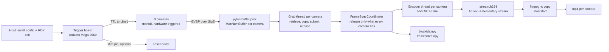
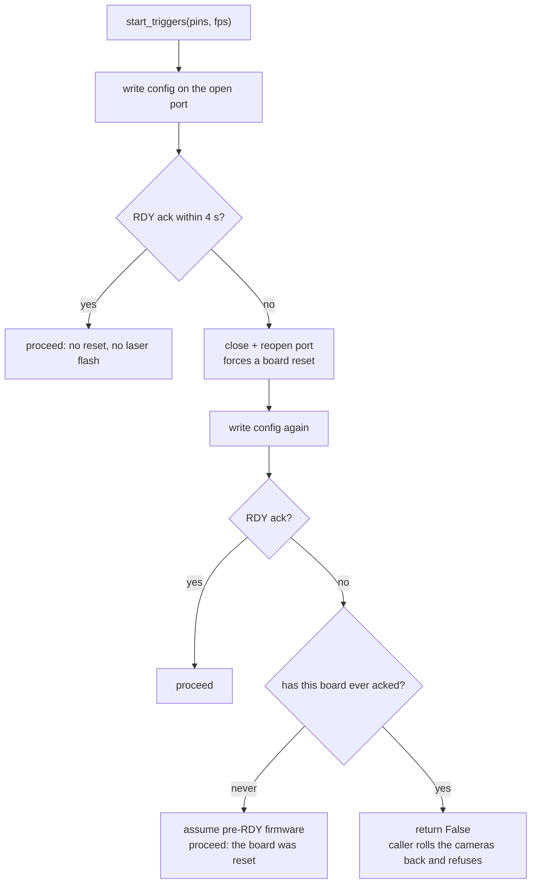
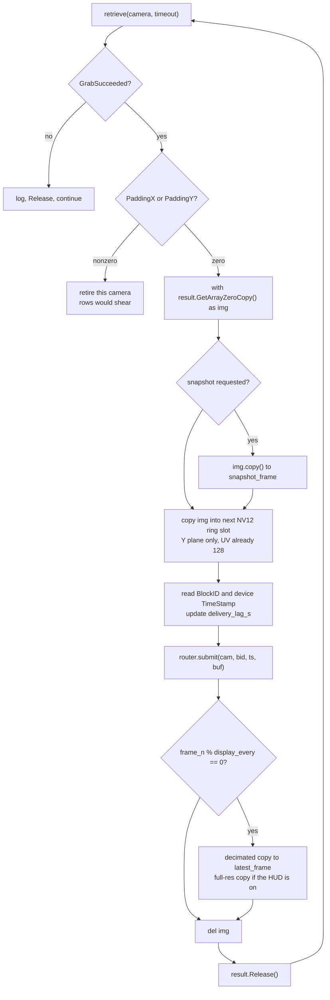
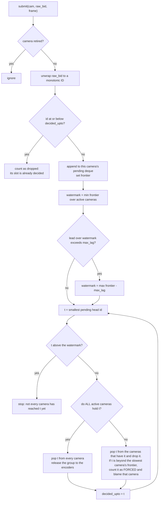
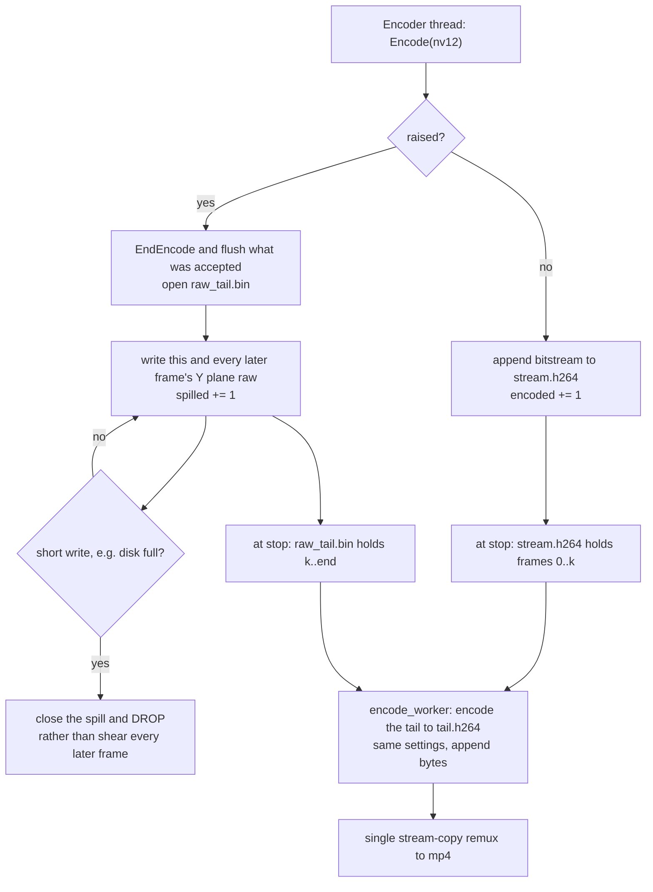
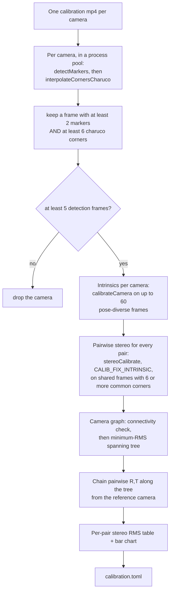

# The nitty gritty

This page explains how Panopticon gets from photons to files, in enough detail to
fix it, port it, or run it on hardware that is not the reference rig. It is the
deep page: if you only want to run a session, [WORKFLOW.md](WORKFLOW.md) walks
through one from start to finish, and you can come back here when something
behaves oddly and you need to know why.

Numbers quoted from the reference rig (6x Basler a2A1920-165g5m GigE, 1920x1200
mono8, 100 fps) are examples of the arithmetic, not requirements. Every one of
them is derived from resolution, frame rate and camera count, and the derivation
is given alongside the number so you can redo it for your own rig.

One piece of vocabulary is worth settling before anything else, because the page
uses it constantly. A setting can live in one of four places, and they are not
interchangeable:

- the **camera settings file**, `configs/mono8_1920x1200.pfs` — a Basler pylon
  GenApi persistence file, which is to say a dump of the camera's own registers,
  produced in pylon Viewer and applied to every camera at open. Exposure, gain,
  region of interest, pixel format and the GigE packet parameters live here, and
  the application never writes exposure or gain into it;
- the **rig profile**, `profiles/3dpose.yaml` — Panopticon's own settings: how
  many cameras, what frame rate, which serial port, which pins. This is the file
  a new site edits;
- the **board config**, `configs/boards/charuco_8x8_15mm.yaml` — a physical
  description of the printed calibration board;
- **code constants**, compiled in and changed only by editing the source.

Wherever a parameter appears below, its home is named. "Profile field
`kick_max_lag`" and "the `.pfs`'s `ExposureTime`" are different kinds of claim,
and confusing the two is the most common way to look for a setting in the wrong
file.

---

## 1. Shape of the system

The problem this whole system exists to solve is that several cameras must expose
at the same instant, and their frames must reach disk in a form that still says
which instant each frame belongs to. Everything below is in service of those two
sentences. The shape of the answer is a single hardware clock in front of the
cameras and a single integer travelling with every frame behind them.

One microcontroller generates the frame clock. It drives a TTL line into every
camera's `Line1` input, so all cameras expose on the same edge. Each camera
streams frames over its own transport to the host, where one thread per camera
retrieves them. A shared coordinator holds each frame until every camera has
delivered the same trigger, then releases the whole group to per-camera NVENC
encoders. On stop, the H.264 elementary streams are remuxed to mp4 by stream
copy.



The code follows that shape closely, so the module map doubles as a map of the
diagram above:

| File | Responsibility |
|---|---|
| `gui_app/backends/__init__.py` | The camera-backend contract, and the grab-result duck type |
| `gui_app/backends/basler.py` | The only module that knows what a Basler camera is |
| `gui_app/camera_manager.py` | Vendor-neutral orchestration: open, describe, mode switches, start/stop |
| `gui_app/grab_thread.py` | The per-camera hot loop, the NV12 ring, and the encoder drain thread |
| `gui_app/frame_sync.py` | Cross-camera release logic. Pure integers, no Qt, no SDK |
| `gui_app/sync_encode.py` | Router: owns the coordinator, the encoders, and the recorded metadata |
| `gui_app/nvenc.py` | PyNvVideoCodec loader, encoder factory, session probe |
| `gui_app/encode_worker.py` | Post-stop remux and the raw-mode encode pool |
| `gui_app/alignment.py` | Block-ID unwrap, intersection, post-hoc re-encode |
| `gui_app/serial_controller.py` | Trigger-board link and the RDY handshake |
| `gui_app/stim_compiler.py` | Stim graph to Arduino sketch, including the trigger loop |
| `gui_app/stim_trace.py` | Per-frame model of what the paradigm delivered |
| `gui_app/board_detector.py`, `coverage_worker.py` | Live ChArUco coverage during calibration |
| `1_calibrate.py` | The calibration solve — a standalone script, run through `uv run` in the project environment |
| `2_align.py`, `3_stim_trace.py` | Standalone equivalents of the in-app passes; these two are PEP 723 scripts, carrying their dependencies in an inline header |

---

## 2. Hardware triggering

Software cannot make several cameras expose simultaneously. Any scheme in which
the host asks each camera for a frame inherits the host's scheduling jitter, and
on a general-purpose operating system that jitter is milliseconds — an order of
magnitude worse than the synchrony a 3D reconstruction needs. So the host is
taken out of the timing path entirely. A single microcontroller emits one square
wave, every camera exposes on its rising edge, and the host's only involvement is
telling the board which pins to drive and how fast.

### One clock

`stim_compiler.compile_ino()` emits the sketch the board runs. Its `loop()` is
the frame clock:

```c
if (FPS_OUT > 0) {
  camsLow();
  while (micros() - FRAME_START < FRAME_PERIOD / 2) { updateStim(); }
  camsHigh();
  while (micros() - FRAME_START < FRAME_PERIOD) { updateStim(); }
  FRAME_START += FRAME_PERIOD;
}
```

Four properties of that loop are what make it trustworthy, and each is easy to
break by "tidying" the code.

The period is integer microseconds — `FRAME_PERIOD = 1e6 / FPS_OUT` — and
`FRAME_START` is advanced by *adding* the period rather than by re-reading the
clock. That distinction is the difference between a fixed rounding error and a
growing one: adding a constant means the error per frame never accumulates into
drift over a session.

Within each period the line is LOW for the first half and HIGH for the second,
which gives a 50% duty square wave at the frame rate. The cameras are configured
for `RisingEdge`, so the trigger instant is half a period after `FRAME_START` —
worth remembering when reasoning about where the exposure sits relative to the
loop's bookkeeping.

`camsHigh()` and `camsLow()` write every trigger pin inside a
`noInterrupts()`/`interrupts()` pair. Skew between pins is therefore bounded by
the write loop itself and cannot be stretched by an interrupt landing in the
middle of it. This design comes from the firmware lineage the project is built
on — campy, by Kyle Severson (`campy/campy/trigger/trigger.ino`) — which
documents it as ±0.35 µs inter-frame interval precision and roughly 30 ns
synchronicity between pins.

And nothing on the host is in the timing path at all. The host tells the board
which pins to drive and at what rate, and after that the board is on its own.

On the reference rig the pins are `[2, 4, 6, 8, 10, 12]` (profile field
`trigger_pins`), one per camera, each wired to that camera's `Line1`. All of them
are written inside the same `noInterrupts()` block, so one fanned-out line is
electrically equivalent provided the output can source every input. The pin count
in the serial command is what the sketch drives; adding a camera means adding a
pin to the profile, nothing more.

### Why the same board owns stimulation

The generated sketch runs a non-blocking stim state machine, `updateStim()`,
called from inside both trigger busy-wait loops. `setup()` (and the `loop()`
reconfigure branch) sets `FRAME_START = micros()` and calls `initStim()` a few
microseconds later, so **stim t=0 is trigger t=0 on the same clock**, with no
host timestamp anywhere. That is what makes `stim_trace.csv` exact: the time of
a recorded frame is `t = (unwrapped_blockid - 1) / fps`, and the stim model is
evaluated at that same `t`.

Sharing one microcontroller between the frame clock and the stimulus buys that
exactness, and it comes with four constraints. Three of them protect the timing;
the fourth is a laser-safety constraint and is the most important thing in this
section.

First, **`updateStim()` must not do floating-point maths.** It runs inside the
trigger busy-wait, and an AVR float divide takes around 30 µs — enough on its own
to blunt the ±0.35 µs edge precision described above. The compiler therefore
resolves every period and pulse width to integer microseconds before emitting
the sketch, and `test_stim_compiler.py` asserts that no floats reach that
function.

Second, **a stim chain must never be placed on a trigger pin.** Extra rising
edges on one camera's line make that camera acquire more frames than the others.
Its block IDs then advance faster than everyone else's, and block ID N stops
denoting the same instant on every camera — which is the single assumption the
entire alignment path rests on (§9 spells that assumption out and describes what
catches violations of it). `stim_compiler.forbidden_pin_uses()` blocks Apply,
Test and Record when a chain lands on a trigger pin.

Third, pins listed in the profile's `stim_safe_pins` are set `OUTPUT` and driven
LOW by `allStimLow()` as the **first statement in `setup()`**, before
`Serial.begin()`. The ordering is not stylistic. `setup()` blocks on the serial
handshake, so anything placed after it leaves the pin floating for as long as the
GUI takes to connect, and **a powered laser driver reads a floating modulation
input as ON.** Within `allStimLow()`, `pinMode()` precedes `digitalWrite()` for a
related reason: writing LOW to a pin still configured as `INPUT` only disables
the pullup, and leaves the pin floating.

Fourth, and unavoidably: **the MCU reset window is not coverable in software.**
During reset and the bootloader wait, every GPIO is high-Z, because the sketch is
not executing yet — there is no instruction that can run early enough to hold the
pin down. Fitting a laser interlock is the only hard gate. A pulldown across the
modulation input does not necessarily work: a driver input with a stiff internal
pullup would need a resistor low enough to exceed the MCU's per-pin current limit
when the pin is driven high, so there is no safe value to choose.

### Serial protocol

The host-to-board link carries only configuration, never timing, so the protocol
can afford to be tiny. It is 115200 baud, 8N1, with one command format used for
both start and stop:

```
<n_pins>,<pin1>,...,<pinN>,<fps>\n
```

`fps < 0` means stop: the sketch's reconfigure branch runs `camsLow()`,
`allStimLow()`, sets `FPS_OUT = 0` and stops emitting triggers. The trailing
newline terminates the sketch's final `parseFloat()` immediately instead of
letting it burn its one-second timeout.

The sketch replies `RDY <n_cams> <fps>` from `announceReady()`, called from both
config paths — `setup()` and the `loop()` reconfigure branch — and printed
before `FRAME_START` is set so the print latency cannot skew the clock.

### The RDY handshake

Opening the port pulses DTR, which resets the board. That reset is load-bearing:
it returns the sketch to `setup()` with a cleared serial RX buffer. Suppressing
it (`dtr=False`) makes the board ignore the config and emit zero triggers, which
produces a full-length recording containing no frames. The reset is therefore
relocated rather than defeated: `main_window` opens one `TeensyController` at
launch and holds it until quit, so the board resets at GUI launch and on firmware
upload, never at the start of a recording.

Because a start command can now land in `loop()` instead of a freshly reset
`setup()`, every start is confirmed. `TeensyController.start_triggers()` returns
a bool and takes exactly four paths:



The never-acked / has-acked distinction is the safety property. Collapsing it one
way locks legacy firmware out of recording; the other way lets a silent
zero-trigger session through. `test_serial_handshake.py` pins all four branches
and stubs pyserial, so it needs no board.

`ACK_TIMEOUT` is 4 s because the sketch's `readFPS()` can burn a one-second
`parseFloat()` timeout followed by `delay(500)`; a legitimate ack takes about
1.5 s. `stop_triggers()` returns whether the board accepted the command, and the
caller surfaces a failure loudly: a looping stim chain never ends on its own, so
an unacknowledged stop can leave a laser driven with the UI showing IDLE.
`pyserial`'s `is_open` stays True after the USB device disappears, so port state
is not evidence that the board is there.

---

## 3. Exposure and the frame-rate ceiling

Exposure is where "more light" and "the frame rate I asked for" collide, and the
collision is not obvious from any single setting. There is a hard upper bound on
exposure time that depends on the trigger rate, and crossing it does not produce
an error — it silently halves the frame rate. This is the most-misunderstood
number in the system, so it is worth deriving rather than just quoting.

### The rule

Start from a fact about the camera that is surprising in trigger mode: the
camera's internal frame-rate timer starts **after exposure ends**, not when
exposure begins. The camera is therefore unavailable for the exposure *plus* one
period of that internal timer. Its minimum interval between acquisitions is

```
minimum interval = exposure + 1 / AcquisitionFrameRate
```

The surprise is that `AcquisitionFrameRate` is a register that looks irrelevant
while the camera is externally triggered — it does nothing useful there, since
the timing comes from `Line1` — and yet it still enforces that floor. For the
camera to answer every trigger, the trigger period has to be longer than the
floor. Rearranging gives the ceiling on usable exposure directly:

```
exposure_max = 1/trigger_fps - 1/AcquisitionFrameRate
```

Two pieces of code decide those terms. `BaslerBackend.set_triggered()` applies
the profile's `trigger_rate_limit` as `AcquisitionFrameRate` — 165 in effect on
both shipped profiles, i.e. a 6.06 ms floor contribution, though only `3dpose`
sets the field: 165 is also the default in `RigProfile` when a profile omits it.
Then
`CameraManager.apply_exposure_gain()` derives the ceiling from the trigger rate
actually in use and **enforces** it with a 10% safety margin, rather than
trusting the profile to be self-consistent:

```python
ceiling_us = (1e6 / fps - 1e6 / limit) * 0.9
```

Worked through for the rates the rig actually uses:

| Trigger rate | Period | Limiter | Floor from limiter | Headroom | Enforced ceiling |
|---|---|---|---|---|---|
| 100 fps | 10.00 ms | 165 | 6.06 ms | 3.94 ms | 3.55 ms |
| 60 fps | 16.67 ms | 165 | 6.06 ms | 10.61 ms | 9.55 ms |
| 30 fps | 33.33 ms | 165 | 6.06 ms | 27.27 ms | 24.55 ms |
| 100 fps | 10.00 ms | 500 | 2.00 ms | 8.00 ms | 7.20 ms |

The last row is illustrative: the limiter cannot be set above the camera's own
maximum frame rate, and the camera clamps it silently if asked.

A too-large exposure is clamped and logged; it is never silently accepted.

The same arithmetic runs in reverse for calibration, and pleasantly so. At the
30 fps `calibration_frame_rate` the period is 33.3 ms instead of 10 ms, so the
light budget is roughly seven times a 100 fps recording's — for free. That is why
`calibration_exposure_us` (15000, i.e. 15 ms, on the reference rig) can be far
longer than any recording exposure. Recording then passes `exposure_us=None`,
which **restores** the values read from the `.pfs` at open rather than
recomputing anything, so a generous calibration exposure cannot leak into a
100 fps session.

What actually limits calibration exposure is not the ceiling but **motion blur**.
At 15 ms a briskly waved board smears and ChArUco corners stop resolving, which
costs detections in exactly the poses you were trying to add. Move the board
slowly and pause at each pose.

### The failure mode when it is exceeded

Nothing errors, and that is the whole problem.

If the minimum interval exceeds the trigger period but is still under two
periods, the camera is simply busy when the next pulse arrives, so it **ignores**
that pulse. It then answers the one after. The result is half the requested rate:
at a 100 fps trigger the camera delivers ~50 fps.

The frames it does deliver are individually fine: complete, uncorrupted, sharp.
What is *not* fine is their numbering, and this is the part that catches people
out. A block ID counts frames the camera acquired, not triggers
the board fired. An ignored trigger produces no frame, so it consumes no block
ID, and from that point on this camera's block ID N corresponds to trigger N+k
for a k that keeps growing. Because nothing was dropped, the block IDs stay
perfectly gapless, so nothing downstream notices: the camera's frames get paired
with other cameras' frames from a different instant, and the videos drift apart
in time while looking flawless. §9 covers the check that exists specifically for
this, and why it needs an independent clock to do its job.

The symptoms, in roughly the order somebody notices them, are a live frame rate
reading ~50 fps at a 100 fps trigger rate; a `frametimes.npy` that spans the
right wall-clock duration with only half the rows; and block-ID span divided by
duration reading ~50 rather than ~100 per second.

That last ratio is worth dwelling on, because it is the diagnostic that separates
an **acquisition** failure from a **delivery** failure. A frame lost in
transmission still consumed its block ID, so delivery loss leaves the block-ID
span intact and the row count short. A trigger the camera never acquired
shortens the span itself. Only the first kind is recoverable by the alignment
path — and every time base derived from block IDs, `stim_trace.csv` included,
assumes one trigger per ID, so the second kind corrupts the timing rather than
merely thinning it.

The preview cannot show any of this, which is the trap. The preview is free-run
at 30 fps, with 33 ms of headroom, so an over-long exposure looks perfectly
healthy there and only halves the rate once the cameras are triggered. **Verify
exposure changes against a real recording, never against the preview.**

### Why the limiter is not disabled

Reading the derivation above, the obvious move is to delete the term that is
costing you light. Setting `trigger_rate_limit: 0` calls
`AcquisitionFrameRateEnable = False`, which removes the floor and takes the
exposure ceiling away with it. That works, in the narrow sense that the ceiling
disappears.

What it also removes is the pacing, and the pacing turns out to be doing real
work. With the limiter on, each camera spreads readout and transmission across
`1/limit` — 6.06 ms at 165. With it off, every camera dumps its frame onto its
link as fast as it can immediately after the shared trigger, and since the
trigger is shared, they all do it at the same moment. Marginal links then drop
packets.

This was tried on the reference rig on 2026-08-11 and reverted the same day. It
cost **8–15% of frames in transmission**: the cameras still acquired every
trigger and numbered them contiguously, but delivery fell from 99.98% to 85–92%.
So keep the limiter above the trigger rate. If more light is genuinely needed,
*raising* the limiter rather than disabling it is the knob to reach for — it buys
exposure headroom at the cost of some pacing — and it is worth trying only when
the network has margin to give.

Exposure and gain themselves live in the `.pfs` and nowhere else; no code path
sets them except the calibration override and the ceiling clamp described above.
On the reference rig they are 3000 µs and 6.0 dB (about 3x), raised on 2026-08-11
from 2000 µs and 0 dB. The old values were not merely dim: they put 65% of pixels
in levels 0–15, with **21.5% of pixels clipped at exactly 0** — destroyed at the
ADC, and unrecoverable by brightening the video afterwards. At 3000 µs the
exposure still sits about 0.94 ms below the 3.94 ms ceiling that 100 fps and a
165 limiter imply; 3500 µs would leave only 0.44 ms of that margin, which is why
the current value is where it is.

When frames are too dark, the order of preference is **more illumination first,
then exposure, then gain.** Illumination buys real photons and therefore real
signal-to-noise; the other two do not. Gain in particular multiplies signal and
noise alike, and it clips: on a representative frame from the reference rig 3.0x
leaves about 4% of pixels saturated, while 7x clips 12.7% of them.

---

## 4. GigE transport

Six cameras at 1.84 Gbit/s each are, by most software's standards, a hostile
amount of incoming data — and it arrives over UDP, which means the network is
permitted to lose it. Two things follow, and they are what this section is about:
how the pixels get from camera to host without being dropped, and how the host
can tell the difference between "the network lost a frame" and "the host was too
slow to receive one". Those two failures look identical in a video file and have
completely different fixes.

### GVSP

Each camera streams over UDP using the GigE Vision Streaming Protocol. A frame is
one *block*, fragmented across many packets. Every block carries a **block ID**,
assigned by the camera at the moment it acquires the frame. The host driver
reassembles the packets into a buffer taken from a per-camera pool, and a
complete buffer becomes a *grab result* — the object the capture loop receives.

The block ID is the part of this that the rest of the pipeline leans on, for two
reasons.

The first is that it is the trigger ordinal. All cameras receive the same trigger
edge, and all start numbering at 1 when grabbing starts, so block ID N names the
same trigger — and therefore the same instant — on every camera. That holds while
each camera produces exactly one frame per trigger edge, which is the normal case
and also an assumption worth stating out loud rather than leaning on silently;
§9 does exactly that.

The second is that a frame lost *in transmission* still consumed its block ID.
Transmission loss therefore shows up as a **gap** in the delivered sequence
rather than as a shift of everything after it. That property is what makes
`alignment.py`'s `trigger_span = max(last) - min(first) + 1` a meaningful
denominator, and per-camera `dropped = trigger_span - recorded` a real count
rather than an estimate.

### Packet size, jumbo frames, inter-packet delay

From `configs/mono8_1920x1200.pfs`:

| Feature | Value | What it does |
|---|---|---|
| `GevSCPSPacketSize` | 9000 | Stream packet payload size. Requires jumbo frames enabled end to end (NIC MTU 9014, and every switch in the path). |
| `GevSCPD` | 10000 | Inter-packet delay, in device timestamp ticks. Paces packets so several cameras sharing a port do not collide. |
| `GevSCFTD` | 0 | Frame transmission delay. Nonzero staggers whole frames between cameras. |

Packet size is the dominant lever on host CPU: a 1920x1200 mono8 frame is
2,304,000 bytes, which is ~260 packets at 9000 bytes and ~1600 at 1500. At
100 fps that is the difference between ~26,000 and ~160,000 packets per second
per camera, every one of which the host must process in interrupt context. Three
cameras per port at 9000 bytes is the ~78,000 packets/s figure quoted in the
host-CPU numbers below.

A path that cannot carry the configured packet size does not degrade gracefully:
the oversized frames are dropped and the camera delivers incomplete buffers or
nothing at all. Enable jumbo frames on the NIC (MTU 9014) **and** on every switch
in the path, and verify rather than assume.

Inter-packet delay trades latency for collision avoidance. Zero on a port shared
by several cameras causes collisions and resends. It must be re-tuned for a
different cameras-per-port ratio, link speed, or frame size.

Bandwidth arithmetic, which determines everything above:

```
per camera bits/s = width * height * bytes_per_pixel * 8 * fps
1920 * 1200 * 1 * 8 * 100 = 1.84 Gbit/s
```

Three of those per port needs a 10 GbE port with margin for resends; at 30 fps
or lower resolution the same camera fits comfortably on 1 GbE. Cat6a or better
for 10 GbE runs.

### Resends and driver choice

UDP loses packets, and whether that costs you a frame depends entirely on which
receive path is in use, because the two available drivers disagree about whether
to ask for a lost packet again. `BaslerBackend.select_gige_driver()` picks the
path from the profile's `gige_driver`:

- **`socket`** — user-space receive. Higher host CPU, and its packet resend
  behaviour reliably recovers lost packets. This is the shipped setting. It also
  maxes `SocketBufferSize` to the node's advertised maximum, giving the receive
  thread more slack when the encoders contend for CPU.
- **`filter`** — the in-kernel pylon GigE Vision driver. Far less CPU, but with
  default resend settings it discards a frame containing a lost packet instead of
  asking for it again: measured on 2026-06-12 at ~23% frame loss under a
  6x100 fps load, appearing as thousands of single-frame gaps per camera, with
  nothing in the logs to say so.
- **`auto`** — leave the vendor default. No-op for non-GigE transports.

A high resend count is not in itself a fault — it is the recovery mechanism
working. What decides whether it costs you frames is how many of those resends
fail, which is what `Failed_Buffer_Count` reports.

The reference rig illustrates the difference, because its cameras split into two
groups by physical path even though the driver and socket settings are identical
on all six. Over a 20-minute six-camera run on 2026-09-03, the cameras on the
quiet path issued **3** resend requests apiece while those on the noisy path
issued around **9,700** apiece — a factor of three thousand apart — and the run
still came out with 120,106 frames on every camera, having lost 60 frames across
all six cameras out of 720,636 submissions. `Failed_Buffer_Count` over the same
run was 2 per camera on the quiet group and 13–14 on the noisy one. A 60 s run
on the same rig and the same configuration captured 100.00% of triggers.

The useful reading is therefore a matter of magnitude rather than of zero versus
non-zero: thousands of resend requests alongside failed buffers in the low tens
is a noisy link recovering nearly everything it loses, and chasing it is not
worth the rig time. Failed buffers in the **hundreds** are the signal that
matters, because that means the resends themselves are not completing.

### The buffer pool

`camera_manager.MAX_NUM_BUFFER = 1000` driver-side buffers per camera, applied at
open. At 1920x1200 mono8 that is 1000 frames of 2.3 MB, so 2.3 GB per camera —
12.9 GiB at six cameras and 19.3 GiB at nine, which is the pool half of the RAM
budget in [INSTALLATION.md](INSTALLATION.md). `GrabStrategy_OneByOne` delivers
oldest-first.

Deep slack has two faces. It absorbs genuine network jitter, and it hides a
per-frame deficit: a grab loop a fraction of a millisecond over budget loses
nothing at first, because the pool fills instead. Nothing errors for minutes;
what actually happens is that every retrieved frame is progressively staler. By
the time the pool is exhausted the session is spoiled. That is why the loop
publishes `delivery_lag_s` live (see §5) and why the GUI reports it during
recording. Pool size is not monotonic in quality — an oversized ring elsewhere
has starved capture outright — so change it only with a rig A/B.

### The counters that matter

When a session comes out short, the first question is always the same one: did
the host fail to keep up, or did the network lose frames? The camera's own stream
counters answer it, and `BaslerBackend.stream_stats()` reads them at stop —
before `StopGrabbing()`, because stopping the stream resets them:

| Counter | Meaning |
|---|---|
| `Buffer_Underrun_Count` | The pool ran dry. **The host could not keep up.** |
| `Failed_Buffer_Count` | A frame was given up on: resends exhausted or incomplete. |
| `Resend_Request_Count`, `Resend_Packet_Count` | Packets lost and asked for again. A high count is healthy as long as `Failed_Buffer_Count` stays in the low tens or below. |
| `Total_Buffer_Count`, `Total_Packet_Count` | Denominators. `Total_Packet_Count = 0` on every camera means the board sent no triggers. |

`Statistic_Failed_Packet_Count` is deliberately excluded: on this hardware it
reports values larger than the total packet count and cannot be trusted.

Host-side, the receive load lands in deferred procedure calls (DPCs) — the
kernel's mechanism for finishing interrupt work — on whichever core the NIC's
receive queue is bound to. On the reference rig each port's ~78,000 packets/s
funnel through a single core at ~46% DPC time while the 24-core average is ~4%,
and one port discards a fraction of a percent of packets at the NIC while the
other discards exactly zero. Those discards are recovered by resends and are not
in the frame-loss path today, but `ReceivedDiscardedPackets` per port is the
metric to watch when adding cameras: a healthy port reads exactly 0.
`configure_nic.ps1` sets receive-side-scaling (RSS) queues (four per port), which
is what spreads one port's receive work over several cores, and verifies the
result rather than assuming, because some drivers apply RSS only to TCP.

---

## 5. The capture loop

The capture loop is the one piece of Python in this system with a hard real-time
obligation. Every camera delivers a frame every trigger period, forever, and the
loop that receives them gets exactly that period to finish its work in. Miss the
budget by a fraction of a millisecond and nothing breaks immediately — which is
precisely what makes it dangerous. This section is therefore as much about how
the loop is *measured* as about what it does.

### One thread per camera, one trigger period per frame

`GrabThread.run()` is a `QThread` per camera. The budget per iteration is the
trigger period: 10 ms at 100 fps. If the mean iteration exceeds it, the loop
falls behind the camera permanently, absorbed by the buffer pool until it is not.

Per frame, in kick-out mode, the loop does exactly this:



Every consumer copies out of `img`. The view is a window onto the driver buffer
and must not outlive `Release()`; `del img` is what enforces that, because Python
does not unbind a `with` target at block exit and pypylon's own exit guard
structurally cannot see the with-target itself.

### Why a copying accessor is unaffordable

The diagram above insists on `GetArrayZeroCopy()`, and the awkward `del img` that
comes with it. The obvious alternative — ask pypylon for a plain numpy array and
skip the lifetime rules — is not merely slower. It is the difference between a
rig that captures 100% of triggers and one that loses frames for years without
ever explaining why. The argument takes four steps.

**Step one: what the copying accessor actually does.** pypylon's `GetArray()`
(i.e. the `result.Array` property) allocates a fresh 2.3 MB array and memcpys the
driver buffer into it **with the GIL held**, because `GetArray` sits on pypylon's
explicit no-thread list. `np.frombuffer(GetBuffer())` is not a way around it;
measured, it comes out the same or worse:

| Access route | GIL-held cost per frame |
|---|---|
| `result.Array` | 0.837 ms |
| `np.frombuffer(result.GetBuffer())` | 0.902 ms |
| `with result.GetArrayZeroCopy() as img:` | **0.157 ms** |

**Step two: why 0.68 ms per frame is a large number here.** GIL-held work does
not run concurrently. It serialises across every Python thread in the process, so
what matters is not the per-thread cost but the sum: the aggregate demand per
trigger period is `n_threads x cost_per_frame`. The thread count is set by the
architecture — one grab thread and one encoder thread per camera — so nine
cameras means 18 threads, plus the UI thread.

**Step three: do the arithmetic against the budget.** At 0.84 ms per frame per
camera, the nine grab threads' copies alone ask for 7.5 ms out of a 10 ms
window — before the encoders, the display or the UI get a turn. At 0.16 ms they
ask for 1.4 ms. One of those fits and the other does not, and the gap is not
something a faster CPU closes, because the constraint is serialisation rather
than throughput.

**Step four: find the boundary experimentally rather than trusting the model.**
The tolerance was measured directly, by driving one production-shaped copy
against N competitor threads, each burning a fixed amount of GIL-held work every
10 ms. Cell values are the per-copy wall-clock median in milliseconds. Read the
columns as rig sizes: 5 competitors is a 6-camera rig's grab threads, 11 is
6 grab plus 6 encoder threads, and 17 is the nine-camera target.

| GIL-held µs per competitor per frame | 0 competitors | 5 | 11 | 17 |
|---|---|---|---|---|
| 100 µs | 0.135 | 0.145 | 0.125 | 0.223 |
| 300 µs | 0.130 | 0.321 | 0.324 | 0.128 |
| 1000 µs | 0.130 | 1.031 | **10.19** | **17.14** |

The bottom row is the copying accessor's regime, and it does not degrade
gracefully — it collapses. That gives a criterion which is more useful than any
individual measurement:

**Acceptance criterion for any hot-path change: ≤300 µs of GIL-held work per
thread per frame is safe even at 17 threads; ~1000 µs blows a 10 ms budget at
11.** Reproduce the boundary with `probe_gil_wait.py`, and A/B a specific access
route on a live camera with `probe_zerocopy.py`.

None of this is theoretical. Moving the six-camera reference rig onto the
zero-copy view on 2026-09-03 took mean loop `cycle` from 12.0 ms to exactly
10.00 ms — the trigger period — and took `Buffer_Underrun_Count` from 245–882 per
camera to 0 and forced drops from as much as 12.34% to 0. A 60 s run after the
change captured 100.00% of triggers.

One methodological warning for anyone repeating these measurements, because
getting this wrong has misled this project more than once. **Never bracket a
GIL-releasing call with a plain wall-clock timer.** numpy releases the GIL for a
memcpy and must re-acquire it before returning, so the re-acquisition *wait*
lands inside the bracket along with the work. Contention then inflates the
bracket while leaving the work unchanged: in the table above, the worst case
moved wall-clock time by a factor of 127 while executed cycles moved by a factor
of 1.6. Separate executing from waiting with `QueryThreadCycleTime`.

### The NV12 ring

The frame has to be copied somewhere the moment it is retrieved, since the driver
buffer must be released promptly and the encoder will not consume it for a while
yet. That destination is an **NV12** buffer — the pixel layout NVENC consumes: a
full-resolution 8-bit luma plane followed by a half-resolution interleaved chroma
plane, and §7 explains why that layout reduces the conversion from mono8 to a
single memcpy. Allocating one per frame would put both an allocation and a
first-touch page fault on the hot path, so each grab thread preallocates its own
ring of them once, at start:

```python
np.full((height * 3 // 2, width), 128, np.uint8)
ring_n = router.max_lag + ENCODE_QUEUE_DEPTH + 64      # kick-out mode
ring_n = ENCODE_QUEUE_DEPTH + 4                        # decoupled mode
```

`ENCODE_QUEUE_DEPTH` is 200. The ring must outlast a frame's whole journey — held
by the coordinator for up to `max_lag`, then queued at the encoder — before its
slot is reused. At `kick_max_lag: 480` that is 744 buffers, 2.39 GiB per camera;
at 240 it is 504 buffers, 1.62 GiB. The ring is the term that makes a
nine-camera RAM budget tight, and it scales linearly with `kick_max_lag`.

The `np.full(..., 128, ...)` is load-bearing twice: it sets the constant chroma
plane once and for all, and it pre-faults every page. `np.empty`/`np.zeros` would
put a first-touch page fault (~0.4 ms) back on the hot path.

`MemoryError` at allocation is caught and retires the camera rather than escaping
`run()` and taking the GUI with it.

### Instrumentation

Because a loop that is slightly over budget produces no error for minutes, the
only way to know the capture is healthy is to measure it while it runs. Every
1000 recorded frames, each grab thread prints one line:

```
[grab0] frames=12000 timeouts=0 avg_wait=8.52ms avg_proc=0.81ms qsize=0 |
        deliv_lag=-0.031s copy=0.73 submit=0.02 disp=0.05 rel=0.11 cycle=10.00ms
```

The counters accumulate **seconds over 1000 frames**, so each figure reads
directly as milliseconds per frame. What each one means:

| Field | Definition | Healthy |
|---|---|---|
| `avg_wait` | Time blocked in `retrieve()` | Large. It is the slack in the period |
| `avg_proc` | From `retrieve()` returning to the end of the submit/write branch. The display branch, the fps bookkeeping and `Release()` all sit outside it | Well under the period |
| `cycle` | Start of one iteration to the start of the next | **Exactly the trigger period** |
| `copy`, `submit` | Components of `proc` | `copy` dominates |
| `disp`, `rel` | Measured separately, outside `proc`: the display branch, and `Release()` | Small |
| `deliv_lag` | `(host time at retrieve − device timestamp)` minus its value at the first frame | ~0, not growing |
| `qsize` | Encoder queue depth, or coordinator pending depth in kick mode | ~0 |

`cycle` is the one number that closes the budget: `wait + proc` does not cover
the whole iteration, because the display branch, `Release()`, the frame-rate
bookkeeping and the loop edge all sit outside both. A `cycle` above the trigger
period means the loop is losing to the clock even if `proc` looks fine.

`deliv_lag` is measured against the camera's own clock, so host scheduling cannot
skew it. It is the honest health signal, because the failure it catches is silent
by construction. `CameraManager.delivery_lags` publishes it live and the GUI
status bar reports it during recording: under 0.25 s is healthy, under 1 s is
"falling behind", above that is "frames will be lost when the pool fills".

For reference, a healthy 20-minute six-camera run on the reference rig: `cycle`
10.00 ms on every camera for the whole run, `avg_proc` 0.77–0.84 ms, slack
8.47–8.86 ms, `deliv_lag` −0.03 to −0.05 s, `Buffer_Underrun_Count` 0 on all
six, forced drops 0, and 120,106 frames — identical on every camera.

`probe_lag.py` drives the same real code path headlessly (CameraManager,
GrabThread, SyncEncodeRouter, FrameSyncCoordinator, TeensyController) and writes
a per-camera lag trace, which is the fastest way to check a change without the
GUI.

### Timeouts, stalls and giving up

Cameras and links fail in the middle of sessions, and the loop has to decide
between waiting, retrying and giving up — each of which is the wrong answer in
some situation. The constants that encode those decisions are worth knowing,
because each was chosen against a specific failure:

| Constant | Value | Purpose |
|---|---|---|
| retrieve timeout | 200 ms recording, 2000 ms preview | A timeout is normal when triggers stop |
| `STALL_TIMEOUTS` | 25 consecutive timeouts (~5 s) | Stall detector. Long enough that a burst of resends cannot trip it |
| `MAX_REARMS` | 5 | Stop thrashing a genuinely dead link |
| `MAX_CONSEC_ERRORS` | 10 | A camera raising on every frame is not recoverable by retrying |
| resync tolerance | 0.25 of a trigger period | Refuse to guess an ordinal |

A stalled GigE stream never self-recovers: the loop would time out for the rest
of the session. After 25 consecutive timeouts the thread re-arms the stream
(`StopGrabbing()` then `StartGrabbing()`). **`StartGrabbing()` restarts the
camera's block-ID counter**, which the coordinator's wrap detection would read as
a wrap and place the camera far ahead, force-dropping every other camera's
frames. `_resync_offset()` recovers the true ordinal from the device timestamp —
a free-running hardware clock that survives the restart — by counting elapsed
trigger periods, and returns `None` unless the gap lands within 0.25 of a period
boundary. Publishing frames under a guessed ordinal is worse than losing the
camera, so failure to realign retires it.

Retirement is the escape hatch throughout. In kick-out mode the coordinator waits
for every camera, so a camera that never publishes force-drops every trigger for
**all** of them: one dead camera otherwise yields empty videos from all nine. Every
early exit from `run()` therefore calls `router.retire()`, including a catch-all in
the `finally` block for the paths with no exception at all (notably
`IsGrabbing()` going False underneath the loop). `test_grab_failure.py` pins each
of those paths and needs neither cameras nor NVENC.

---

## 6. Frame synchronisation

### The problem

Triggering the cameras together is necessary but not sufficient. Cameras lose
frames independently of each other — a resend that never completes, a buffer the
driver gives up on — and every loss shifts each later frame one position earlier
in that camera's video. So from the first loss on any camera onwards, frame *i*
of one camera's video is **not** the same trigger as frame *i* of another's, and
stacking the videos side by side compares different instants without complaining.

What makes the correspondence recoverable is the block ID. Every recorded frame's
block ID is written to `blockids.npy`, so the mapping from a position in a video
back to a trigger ordinal is always looked up rather than assumed.

Two mechanisms turn that into aligned videos. They produce the same answer — the
last subsection here says in exactly what sense — and differ only in when they
pay for it.

### Real-time kick-out (the default)

`FrameSyncCoordinator` (in `gui_app/frame_sync.py`) is pure integer logic — no
Qt, no SDK, no frame copies of its own; frames are opaque pass-through tokens.
Each camera submits its successfully grabbed frames in block-ID order. State per
camera: a pending deque, a frontier (highest ID seen), and a wrap offset.



What that logic buys is a strong statement about the output: a released trigger
is released **by every active camera, once, and in increasing order per camera**.
Each encoder therefore sees a gapless, in-order stream, so ordinary GOP encoding
produces equal-length, trigger-aligned videos with no post-hoc pass at all. There
is nothing to fix up afterwards because nothing was ever misaligned.

The mechanism works because a camera that missed trigger N reveals the miss by
delivering N+1 — there is no need to wait for a timeout. When the cameras are
keeping up, confirmation therefore lags reality by one or two frames.

`max_lag` (profile field `kick_max_lag`) is the safety valve. It bounds how far
the fastest camera may get ahead of the slowest before the laggard's missing
triggers are force-dropped, so one stalled camera cannot freeze the rest of the
rig. Forced drops are counted and attributed in `forced_by[]`, and the router
logs `lag_behind_leader[...] forced=... forced_by[...]` about every five seconds.
That log line is the thing to read when a session is losing frames, because it
names the camera responsible rather than just the total.

Choosing `max_lag` is a trade against RAM, and it has been measured. A clean A/B
on 2026-08-11 over 100,968 frames and 17 minutes, with identical camera settings
and only the cap differing, gave **87.68 fps released and 12.34% loss at 240,
against 99.14 fps and 0.88% loss at 480** — which is why the reference profile
ships 480. The cost is linear: the ring is `max_lag + queue + 64` NV12 buffers
per camera, about 2.39 GiB each at 480. Bigger is not automatically better, and
1000 **starved capture outright**, at 24% loss on 2026-06-17. Since the grab-loop
fix of 2026-09-03 the observed cross-camera lag is median 0, p95 1, max 2 frames,
so the current headroom buys nothing in practice and 240 would very likely do;
lowering it is deferred pending a rig A/B rather than being wrong.

Two smaller pieces complete the coordinator. `retire(cam, reason)` drops a camera
from the alignment set, clears its pending deque, and records the reason so it
reaches the operator instead of only stdout; the survivors stay aligned with each
other and the retired camera's video simply ends there. And `flush()`, at stop,
decides every remaining trigger with no `max_lag` forcing, since no more frames
are coming.

### The 16-bit wrap

GVSP 16-bit block IDs cycle through 1..65535 (0 is reserved), so they wrap every
65535 triggers — about 11 minutes at 100 fps. `BaslerBackend.enable_extended_block_ids()`
asks for 64-bit IDs at open (`GevGVSPExtendedIDMode` plus the stream grabber's
`UseExtendedIdIfAvailable`) and logs whether it got them. That is an
optimisation, not a requirement, because both alignment paths unwrap in software:

- live, incrementally, in `FrameSyncCoordinator._unwrap()` — a raw ID below
  `last_raw - 32767` is a wrap, adding 65535 to that camera's offset;
- post-hoc, vectorised, in `alignment._unwrap_blockids()` — a diff below
  `-(period // 2)` is a wrap, and the result must be strictly increasing or the
  function raises, because a small decrease means corrupt or reordered data
  rather than a wrap.

All cameras are triggered together and start at 1, so unwrapping each stream
independently keeps ordinals consistent across cameras.

### Post-hoc block-ID intersection (the alternative)

With `realtime_kick: false`, `gui_app/alignment.py` runs after encoding:
intersect the per-camera unwrapped block-ID arrays, compute each camera's frame
indices into that common set (`np.searchsorted`, verified), and write
`aligned/alignment.npz` plus `alignment.json` — a lossless index that costs
nothing. With `--replace` (or the in-app path) it also re-encodes each video down
to the common frames and atomically replaces the original, rewriting that
camera's `blockids.npy` and `frametimes.npy` to match. `2_align.py` is the
standalone CLI for existing recordings.

The trade: the intersection sees the whole recording, so it keeps slightly more
frames — it is immune to the jitter that makes the live coordinator force a drop
— but it costs a full re-encode of every video. The kick-out path costs a bounded
amount of RAM instead.

`align_recording()` also runs the block-ID rate check described in §9 on its way
through, before it decides whether anything needs aligning at all. That ordering
is deliberate, and §9 explains why it has to be that way round.

### The equivalence, stated precisely

Two different mechanisms that both claim to align the same recording is one
mechanism too many, unless you can say exactly how their answers relate. The
question matters practically: switching `realtime_kick` should change what the
rig *costs*, not what the data *means*. So the relationship is stated as a
property and tested rather than asserted.

`test_frame_sync.py` checks it over randomised scenarios — independent per-camera
drop rates from 0 to 20%, runs of 50 to 1500 triggers, and randomised submission
interleavings that preserve per-camera order — and establishes the following, in
increasing order of how much the world is allowed to misbehave.

The first claim holds unconditionally:

1. **Group integrity, always.** Every released trigger is released by all N
   cameras, exactly once each, and in increasing order per camera.

The next three are the equivalence itself, and they degrade in one direction
only:

2. **With no forcing** (`max_lag` larger than the run), the released set is
   **exactly** the intersection of the delivered sets — the coordinator and the
   post-hoc pass keep precisely the same frames.
3. **With bounded skew inside `max_lag`**, still exactly equal.
4. **With forcing** (skew beyond `max_lag`), the released set is a **subset** of
   the intersection. This is the important asymmetry: forcing can only discard
   triggers the intersection would have kept. It can never invent one, so a
   kick-out recording is never *wrong*, only occasionally shorter.

The last two say the property survives the two events most likely to break it:

5. **Across the 16-bit wrap** (70,000 triggers with wrapped raw IDs), the
   released set is still exactly the intersection.
6. **Retirement** resumes releases and keeps survivors aligned; a retired
   camera's late frames never re-enter the stream; and forced drops are
   attributed to the lagging camera.

The same file also holds the block-ID rate check described in §9, which guards
the assumption all six of these properties are stated on top of. Alongside it,
`test_sync_router.py` is the router smoke test, and unlike `test_frame_sync.py`
it needs NVENC.

---

## 7. Encoding

Six cameras at 100 fps produce 1.38 GB of pixels every second, which no
reasonable amount of disk absorbs for long. Compression is therefore not a
convenience but part of the capture path — and that creates the central tension
of this section, because the grab loop cannot afford to wait for an encoder.
Everything here follows from resolving it: the GPU does the compression, it does
it on its own threads, and the format handed to it is chosen so that preparing a
frame costs a single memcpy.

### NV12 from mono8

NVENC takes NV12: a full-resolution 8-bit Y plane followed by an interleaved
half-resolution UV plane. A mono8 frame **is** the Y plane, and neutral chroma is
a constant 128, so the conversion is one memcpy into the top `height` rows of a
buffer whose lower `height/2` rows were filled with 128 at allocation. There is
no colour conversion and no per-frame chroma write.

This is also why pixel format is verified against the camera rather than the
profile at open. A Mono12 `.pfs` makes every frame `uint16`, and
`buf[:height, :] = img` then truncates **mod 256 with no error at all** — a
full-length, perfectly aligned, visually shredded recording.
`CameraManager.open_all()` refuses anything but Mono8, and refuses a resolution
that differs from camera 1.

### Sessions

A *session* is one live NVENC encode context, and the number of them that may
exist at once is capped by the driver rather than by the hardware in any
documented way. The cap has moved across driver generations — 2, then 3, 5, 8,
and 12 on the reference rig's current driver — which is why it is **probed, never
hardcoded**. `nvenc.probe_max_sessions()` creates encoders until the driver
refuses, then releases them. The budget to fit inside it is one session per
camera, plus `encode_parallel` for the remux/encode pool, plus one warm-up
session.

Releasing a session is less obvious than it looks, and two details matter.

The first is that **`EndEncode()` does not free a session.** It ends the
bitstream; the session itself is freed by the encoder object's destructor, so the
Python reference has to be dropped as well. `_EncoderThread.release_encoder()`
calls `EndEncode()` and then `del`, and its callers `gc.collect()`. Getting this
wrong leaks a slot, and a leaked slot can push one camera onto the raw fallback —
which for that one camera is about 129 GiB per 10 minutes at 1920x1200 and
100 fps.

The second is that **NVENCSTATUS 21 is the session limit, not a configuration
error.** `nvenc.create_h264_encoder()` descends a kwarg-fallback ladder when the
driver rejects a genuinely unsupported keyword, but it treats the codes in
`_NVENC_FATAL` (1, 2, 4, 5, 10, 21) as fatal after a single GC retry. Descending
the ladder on a session-limit error would be actively harmful rather than merely
useless: if a slot happens to free part-way down, a later rung succeeds with a
reduced configuration, and the recording quietly gets encoder settings nobody
chose. Every rung therefore carries `gopLength`/`idrPeriod` regardless, and the
code says loudly whenever a reduced configuration was used.

`hardware_check.nvenc_session_capacity()` caches the probe but records whether
the answer was a refusal (the real ceiling) or the probe's own limit (a lower
bound), and re-probes when a larger request comes in. `check_capacity()` blocks a
recording that would grant fewer sessions than cameras, because the alternative
is a camera silently writing raw.

One more hazard: PyNvVideoCodec pulls in more machinery on the first `Encode()`
call. Six encoder threads hitting that simultaneously can wedge the whole process
inside the import machinery. `nvenc._warm()` does one throwaway 256x256 encode
inside the load lock so the encoder threads only ever meet the imported fast
path, and releases that session afterwards. (NVENC rejects 128x128, which is why
the warm-up frame is 256x256.)

### The encoder thread

One `_EncoderThread` per camera. The grab side copies grey into the ring
(GIL-held) and hands over a buffer; the encoder thread only calls `Encode()` and
`os.write()`, both of which release the GIL, so the encoder side costs
approximately zero GIL time per frame and all cameras' encoders run genuinely
concurrently.

Encoding must not run inline in the grab loop. Inline encode starves GigE packet
reassembly, which surfaces as incomplete buffers: ~28% frame loss under a
six-camera 100 fps load. Nothing goes back onto the grab loop's critical path.

Queue depth is `ENCODE_QUEUE_DEPTH = 200` frames. In the decoupled (non-kick)
path the grab thread blocks up to `PUT_TIMEOUT_S = 2.0` s on a full queue and
then drops, because back-pressure that long means the encoder is wedged and
blocking longer would exhaust the driver pool anyway. In kick-out mode the router
uses `put_nowait` and counts `dropped_full`, which should always be 0.

### The stream, and the remux

Each encoder writes an **Annex-B H.264 elementary stream** to `stream.h264`
(start codes and NAL units, no container). At stop, `EncodeWorker` remuxes by
stream copy:

```
ffmpeg -y -fflags +genpts -r <fps> -i stream.h264 -c:v copy -movflags +faststart out.mp4
```

No re-encode, no GPU, finishes in seconds. Timestamps are generated at a constant
`fps`, so the mp4 is constant frame rate and frame index is preserved exactly;
the real instant of frame *i* comes from `blockids.npy`, not from the container.

Two flags are then non-negotiable on **every** path that writes an mp4. Both
exist for the same downstream reader: recordings are consumed in **LUC3D**, the
browser-based 3D labelling tool this pipeline feeds, written by Eric Leonardis at
the Salk Institute and hosted by the Talmo Lab
(<https://talmolab.github.io/luc3d/>). Both flags are also easy to forget when
adding a new encode path, and neither failure is loud.

- **`-g <fps>`** — one IDR per second. Without an explicit GOP, NVENC's default
  depends on the ffmpeg build and driver; one observed build emitted a single IDR
  for an entire 898 s / 415 MB recording, which makes showing frame N cost a
  decode of all N frames and makes the file unwalkable by `ffprobe`. One IDR per
  second also matches LUC3D's own assumption
  (`kfInterval = Math.round(fps)`). Under constant-quantiser rate control the
  extra IDRs cost about 11% in file size.
- **`-movflags +faststart`** — moov atom at the front. LUC3D appends the file in
  1 MB pieces from byte 0 and stops when moov parses, so moov-at-end forces a
  read of the entire file, per camera, before frame 1 appears.

The mp4 writers are `encode_worker._cmd()` (both branches), `acquire._encode_raw()`
and `alignment.extract_aligned()` — that last one **replaces** the session
recording, so it needs both flags too. `_append_raw_tail()` and the in-capture
encoders emit Annex-B `.h264` and are exempt; the remux supplies the container.

Do not reach for `-preset superfast` to make files load faster: it changes
neither the GOP nor the atom order, and inflates files ~64%.

### Reconciliation: what `blockids.npy` is allowed to claim

The router records a block ID when `queue.put_nowait()` succeeds. That means the
**queue** accepted the frame, not that it was encoded. A dead encoder thread
silently accepts a queue's worth of frames and encodes none, so `blockids.npy`
would claim frames `stream.h264` does not contain — which makes frame *i* of the
mp4 map to the wrong trigger, and every downstream consumer takes block-ID
identity as given.

`SyncEncodeRouter.stop()` therefore reconciles against `encoded + spilled` (the
true persisted count, in arrival order because the queue is FIFO), truncates
`block_ids` and `timestamps` to it, and writes `WARNINGS.txt` beside the affected
camera's video. If an encoder thread outlives its join, its counters are still
moving, so nothing is truncated — the mapping is declared **unverified** instead,
and its fd and NVENC session are deliberately leaked rather than pulled out from
under a live writer. Retirements are folded into the same warning list, because a
retired camera's video ends early and the recording is no longer equal-length by
construction.

Either of those two — a retirement or a bookkeeping truncation — leaves the
videos genuinely unequal, so the post-hoc alignment pass is run afterwards even
in kick-out mode, and it trims every camera back to the triggers they all kept.
That is the whole of what the pass can do: it removes frames one camera has and
another lacks. It follows that a warning about something other than unequal
lengths gets no repair from it, and the block-ID rate warning of §9 is exactly
that case — there the frames are misdated rather than missing, and the pass
finds nothing to trim.

### The raw fallback, and spill-and-merge

`realtime_encode: false` writes full frames to `raw.bin` during capture and
encodes after the fact with the `h264_nvenc` ffmpeg pool (`encode_parallel`
concurrent jobs). It has no GPU work during capture and costs full frame rate to
disk: `n_cams x fps x width x height` bytes per second, 1.38 GB/s at six
1920x1200 cameras at 100 fps. In this mode `raw.bin`, `frametimes.npy` and
`blockids.npy` are truncated to the minimum frame count across cameras, and
alignment then runs.

The real-time path degrades in stages instead of failing:



The splice works because both segments carry their own SPS/PPS and start with an
IDR, so decoders handle it. `raw_tail.bin` is read back as fixed-size
`width x height` frames, which is why a short write must stop the spill: a
partial write would shear every subsequent frame while the counter kept calling
them good. If the merge fails, the tail is left on disk and the mismatch between
the mp4 and `frametimes.npy` is reported loudly.

The same staged-degradation idea applies one level up. If NVENC initialisation
fails for any camera, the whole router reports itself unavailable — releasing any
sessions it did manage to get — and capture falls back to the decoupled
per-camera encoder path; if that fails too, the grab thread writes `raw.bin`.
Data is never stranded. What does change, by orders of magnitude, is the disk
cost, and that is why the preflight *blocks* on insufficient NVENC sessions
rather than merely warning: a session that silently degrades to raw can fill a
disk long before anybody looks at the log.

---

## 8. Calibration

Synchronised video is only half of a 3D measurement. To turn matching 2D
detections into a point in space you also need each camera's internal optics
(focal lengths, principal point, lens distortion) and where every camera sits
relative to the others. Calibration measures both, by showing all the cameras a
board whose geometry is known exactly and solving for the parameters that explain
what they saw.

Calibration is a separate acquisition, not a mode of recording: it runs at
`calibration_frame_rate` (30) with a 1:1 preview and its own exposure/gain, and
writes to `<session>/calibration/cam*/` instead of `<session>/recording/`.
Frames are triggered, encoded and aligned by exactly the same path as a
recording.

### Live coverage

`board_detector.BoardDetector` runs on full-resolution frames at ~30 Hz from
`coverage_worker.CoverageWorker`, off the UI thread (`GrabThread.set_keep_full`
enables the full-res copy; six ChArUco detections per UI tick would stutter the
preview). Full resolution matters for obliquely mounted cameras — the same
requirement the solve has.

Per detection tick, per camera, it counts **ArUco markers**, not interpolated
ChArUco corners:

| Threshold | Value | Effect |
|---|---|---|
| `glow_threshold` | 4 markers | Camera node pulses in the HUD |
| `edge_threshold` | 5 markers | Counts as "this camera saw the board this tick" |
| `optimal_shared` | 200 | Edge-thickness scale in the HUD |
| `min_edge` | 80 co-detection ticks | A pair counts as connected |
| `min_per_cam_shared` | 250 co-detection ticks | Per-camera floor |
| `MIN_GRID_CELLS` | 3 of 4 | Spatial spread, see below |

A tick with two or more cameras above `edge_threshold` increments each
participating camera's `per_cam_covis`, increments every participating pair's
`shared[a][b]`, and appends the participating cameras' current frame indices to
`codet_frames`. READY requires all three of: every camera at or above
`min_per_cam_shared`; the co-visibility graph (edges at or above `min_edge`) is a
single connected component, by union-find; and every camera has covered at least
3 of the 4 cells of a 2x2 grid over its field of view, keyed on the detected
markers' centroid. The grid criterion is what prevents degenerate intrinsics from
waving the board in one spot.


*All three conditions met. This and the other coverage-graph figures in these
docs are rendered illustrations of specific states, not captures of one session.*

Counts are at the display sample rate, not per recorded frame, so the thresholds
are relative coverage signals to be tuned on the rig rather than absolute frame
totals. At stop, `codet_frames.json` records which frame indices had
co-detections per camera, which lets the solve decode only those frames instead
of scanning every frame of every video.

The HUD's marker count is a proxy. It is not the test the solve applies (below),
and it is deliberately looser: counting interpolated corners is far stricter than
calibration eligibility and starves obliquely mounted cameras.

### The board

`configs/boards/*.yaml`:

```yaml
board_x: 8            # squares
board_y: 8
square_length: 15.0   # mm
marker_length: 10.0   # mm
marker_bits: 4        # dictionary DICT_4X4_1000
dict_size: 1000
board_legacy: true
max_frames: 500       # present in the file; not read by the current solve
```

Everything except `max_frames` is read by both the live detector and the solve,
and the two build the board identically so that a detection in the HUD means the
same thing as a detection in the solve.

`square_length` carries more weight than the others because it **sets the world
scale of the whole solve**. Every 3D coordinate produced downstream is in those
units, so a value that does not match the physical board scales the entire
reconstruction by the same factor. Measure the printed board and correct the
number, rather than trusting whatever the design file said.

`board_legacy` is not cosmetic. A board printed to the pre-OpenCV-4.6 ChArUco
layout, detected by a ≥4.7 `CharucoDetector` built without
`setLegacyPattern(True)`, detects every marker fine, maps them onto the new
layout, and returns **zero** ChArUco corners — no error, no warning, an empty
calibration. Two things guard against it. `_apply_legacy_pattern()` **raises**
rather than skipping when `setLegacyPattern` is unavailable, and
`pyproject.toml` pins `opencv-contrib-python>=4.7`, since that is the first
version to have the method at all.

Where that pin lives matters as much as the pin itself. It sits in the project's
dependency list rather than in an inline PEP 723 header inside `1_calibrate.py`,
and that is a deliberate choice: an inline header would send `uv run` off to
resolve a second environment the first time anybody solved, so a rig could
install perfectly and then fail at its first calibration for want of a network
connection. Kept where it is, `uv sync` is a one-shot install and every later
solve runs offline. OpenCV also moved
`CharucoBoard.chessboardCorners` (attribute) to `getChessboardCorners()` (method)
across the same version boundary; both spellings are handled.

### The solve

`1_calibrate.py <session_dir> --board-config <board.yaml>`, run by the GUI's
**Solve** button through `uv run`; it shares the project environment
deliberately, so a rig that has run `uv sync` can solve offline.

Besides the required `--board-config`, three options change the result — and none
of them is reachable from the GUI, which passes exactly the session directory and
`--board-config` and nothing else. Using any of the three therefore means running
the script from a terminal.

`--ref-camera` (default `cam1`) chooses the camera whose pose becomes the
identity, so every extrinsic is expressed relative to it. `--excluded-views`
drops named cameras from the solve entirely, which is what to reach for when the
quality chart convicts one camera. And `--skip` (default 3) processes every Nth
frame: lower means more detections and a slower solve, and it is genuinely a
quality knob rather than only a speed one — `--skip 10` produces a visibly
degraded calibration, while 3 is the tested value.

That last caveat only applies to a full scan, though. `--skip` governs the
full-video path alone, and when `codet_frames.json` is present the solve decodes
just the frames the live coverage HUD listed and ignores `--skip` altogether.
Since that file is written by every calibration recorded in the GUI, the normal
case is the co-detection path — so an in-app solve is always the default
configuration: `--skip 3` (unused), reference `cam1`, nothing excluded.



Stage by stage:

- **Detection.** One process per camera (`ProcessPoolExecutor`), `cv2.setNumThreads(2)`
  inside each. `detectMarkers` first; fewer than 2 markers rejects the frame.
  `interpolateCornersCharuco` then produces ChArUco (chessboard) corners with
  stable IDs; fewer than 6 corners rejects the frame. With
  `codet_frames.json` present only the listed frame numbers are decoded
  (sequential `grab()`-skip); otherwise every `--skip`th frame is processed, with
  a short burst of consecutive frames after each successful detection.
- **Correspondences.** Object points are the board's chessboard corner
  coordinates, keyed by corner ID, so a detected corner ID maps directly to a 3D
  point. This is what makes correspondence across cameras exact rather than a
  matching problem.
- **Frame selection.** Where a camera has more usable frames than the cap (60 for
  intrinsics, 30 per stereo pair), `_pose_diverse_sample()` runs `solvePnP` per
  frame against a rough pinhole guess, drops the worst 10% by reprojection error,
  and farthest-point samples in normalised `[rvec, tvec]` space. The selected
  subset spans the range of board orientations and positions rather than
  clustering on whichever poses happened to be held longest.
- **Intrinsics.** `cv2.calibrateCamera` per camera with
  `CALIB_FIX_ASPECT_RATIO | CALIB_FIX_K3 | CALIB_ZERO_TANGENT_DIST`, needing at
  least 20 usable frames. Output is K and a 5-element distortion vector; RMS is
  printed per camera.
- **Extrinsics.** `cv2.stereoCalibrate` with `CALIB_FIX_INTRINSIC` for every
  camera pair with at least 3 frames holding at least 6 common corners. Pairs are
  the edges of a graph; connectivity is checked (isolated cameras are dropped and
  the graph rebuilt), then Prim's algorithm builds the **minimum-RMS spanning
  tree**, and pairwise `R, T` are chained along it outward from the reference
  camera (`--ref-camera`, default `cam1`, which becomes identity).
- **Quality.** Per-pair stereo RMS is printed and drawn to
  `reprojection_error_histogram.png` — which, despite the filename, is a bar
  chart with one bar per camera *pair* rather than a histogram of individual
  errors (green under 10 px, amber under 20, red above). A pair with no bar at
  all never co-observed enough board views, which is usually a more serious
  finding than a tall bar. Warnings are raised for any pair above 20 px and any
  camera with fewer than 30 detection frames. Both the table and the chart show
  the residual `cv2.stereoCalibrate` itself returned for each pair; nothing
  recomputes error against the chained global poses afterwards. (The script does
  carry a `compute_reprojection_errors()` helper that would measure exactly
  that, per camera, over every detected frame, but nothing in the pipeline calls
  it — it is available to a caller that wants the number, not part of the
  solve.)
- **Output.** `calibration.toml` in aniposelib layout: one `[cam_N]` table per
  camera with `name`, `size`, `matrix`, `distortions`, `rotation` (Rodrigues
  vector) and `translation`, plus an empty `[metadata]`. The GUI copies it beside
  the recording so a session directory is self-contained, and LUC3D reads it
  directly.

There is **no global bundle adjustment**. Extrinsics are pairwise stereo results
chained along a spanning tree; nothing re-optimises all cameras and all board
poses jointly afterwards. Error therefore accumulates along tree depth, which is
why the tree is chosen by minimum pairwise RMS and why the per-pair RMS table is
the quality signal to read. A downstream bundle adjustment over the same
correspondences would be the place to add one.

Camera order is load-bearing here: `enumerate_devices()` sorts by serial number
and position in that list becomes `cam1..camN`, which is baked into the
extrinsics. A camera that fails to **enumerate** (dead port, unpowered, still
booting) renames every camera after it, so every extrinsic attaches to the wrong
physical camera while triangulation still runs and produces a plausibly wrong
answer. The profile's `n_cameras` makes `open_all()` refuse to start unless
exactly that many cameras enumerate. Set it.

---

## 9. Data integrity

A recording from this rig makes a specific scientific claim: that frame *i* of
every camera's video shows the same instant in time. Everything a downstream 3D
reconstruction produces depends on that claim being true, and — this is the
uncomfortable part — a recording where it is false looks exactly like one where
it is true. The videos play, the frame counts match, the file sizes are normal.
This section is about what makes the claim true, every way it can quietly stop
being true, and what evidence exists after the fact.

### What guarantees frame *i* is the same instant everywhere

Start by stating the assumption everything rests on, because it is easier to
protect something you have named:

> **A block ID is a trigger ordinal.** Block ID N on any camera names the Nth
> trigger the board fired, so two frames carrying the same block ID were exposed
> at the same instant.

This is an axiom rather than a theorem, and it comes with a precondition that is
usually invisible: **it is true only while a camera produces exactly one frame
per trigger.** A block ID counts frames the camera *acquired*, not pulses the
board *fired*, and those two counts coincide only when the camera answers every
pulse. Hold on to that sentence; the rest of this section is largely about it.

Given the axiom, five links carry a physical instant all the way to a frame index
in a file. The first two establish it and the last three carry it without loss:

1. **One clock, one edge.** All cameras are hardware-triggered from the same pin
   writes inside `noInterrupts()`. No host timestamp is in the path. Exposure
   length comes from the same `.pfs` for every camera, and recording restores
   those values rather than recomputing them.
2. **A shared ordinal.** The GVSP block ID is assigned per acquired frame and is
   the same number on every camera for a given trigger — this is the axiom in
   its concrete form — so a frame lost in transmission leaves a gap rather than
   shifting everything after it.
3. **Group release.** The coordinator releases a trigger only when every active
   camera holds it, and releases in increasing order per camera. Position *i* in
   each `stream.h264` is therefore the same trigger, by construction.
4. **A checkable record.** `blockids.npy` holds the trigger ordinal of every
   persisted frame, reconciled against what the encoder actually wrote. The
   claim is verifiable after the fact, not merely asserted.
5. **A lossless container step.** The remux is a stream copy at constant frame
   rate, so frame indices survive into the mp4 unchanged.

### Every place it can be lost

Each row below is a way that guarantee can break, together with the guard that
exists for it, running roughly from the earliest stage of the pipeline to the
latest. One row — exposure over the ceiling — is unlike all the rest in a way
that matters a great deal, so it gets its own discussion after the table.

| Where | Mechanism | Guard |
|---|---|---|
| Camera naming | A camera that fails to enumerate renames all later cameras; extrinsics attach to the wrong physical camera | `n_cameras` in the profile; `open_all()` refuses a partial set |
| Pixel format | A Mono12 `.pfs` makes frames `uint16`; the NV12 copy truncates mod 256 with no error | Format and geometry read back from the camera at open; anything but Mono8 refuses |
| Row padding | A padded row buffer reshaped to (H, W) shears every frame | `PaddingX`/`PaddingY` checked before the zero-copy view; nonzero retires the camera |
| A camera that never arms | In kick mode it holds the frontier and force-drops every trigger for every camera | Every early exit in `run()` calls `router.retire()`, including a `finally` catch-all |
| Stream stall and re-arm | `StartGrabbing()` restarts the block-ID counter; the wrap detector would place the camera far ahead | `_resync_offset()` re-derives the ordinal from the device clock, and refuses outside 0.25 of a period |
| 16-bit wrap | IDs cycle at 65535 (~11 min at 100 fps) | 64-bit IDs requested at open; software unwrap live and post-hoc; post-hoc raises if not monotonic |
| Dead encoder | The queue accepts frames nobody encodes, so `blockids.npy` over-claims | `stop()` reconciles against `encoded + spilled`, truncates, writes `WARNINGS.txt` |
| Encoder outliving its join | Counters still moving, so any repair is based on a snapshot | Declared unverified; fd and session leaked rather than pulled from a live writer |
| Unmerged raw tail | mp4 shorter than `frametimes.npy` claims | Merge failure warns loudly and keeps the tail on disk |
| Retirement mid-recording | That camera's video ends early, so lengths differ | Recorded as a warning; because the videos really are unequal, the alignment pass then trims them all to the triggers every camera kept |
| Wedged encoder queue | Dropping a released frame desyncs that camera | `dropped_full` counted and logged; should be 0 |
| Stim on a trigger pin | Extra rising edges make one camera's ordinals advance faster | `forbidden_pin_uses()` blocks Apply, Test and Record |
| Exposure over the ceiling | The camera **ignores** triggers rather than dropping frames, so its block IDs stop being trigger ordinals while remaining gapless. Different in kind from every row above — see below | Ceiling derived from the trigger rate and clamped in `apply_exposure_gain()`; block-ID rate check at stop and in `align_recording()` |
| Downstream frame-index arithmetic | Frame *i* is not trigger *i* after any drop | Every consumer uses `blockids.npy`; `stim_trace` uses `t = (unwrapped_blockid - 1) / fps` |

### The one failure that leaves no gap

Every other row in that table shares a property that makes it manageable:
whatever goes wrong, the evidence lands in `blockids.npy` as a **gap**. A frame
lost to a failed resend, a buffer the driver gave up on, a trigger force-dropped
by the coordinator, a camera retired mid-session — in each case a block ID was
consumed and no frame survived to carry it. The delivered sequence has a hole in
it, the post-hoc intersection sees the hole, and per-camera
`dropped = trigger_span - recorded` counts it.

A camera whose exposure exceeds the ceiling breaks that pattern, because it never
drops anything at all. It **ignores** the trigger: it is still busy with the
previous exposure when the pulse arrives, so no frame is acquired — and a trigger
that acquires no frame consumes no block ID. Follow that through, and every piece
of available evidence goes the wrong way at once:

- its block IDs stay perfectly **gapless**, so the release rule — which compares
  block IDs and nothing else — sees a clean, in-order stream;
- its frame count still **matches** the other cameras', because only common IDs
  are ever kept, so an equal-length recording is not evidence of anything;
- **no** packet, buffer, underrun or forced-drop counter moves, because nothing
  was lost anywhere: not on the link, not in the driver pool, not in the
  coordinator.

The release rule, the post-hoc intersection, and every packet and buffer counter
therefore report a clean session simultaneously, while the videos drift apart in
time — by more and more as the recording goes on — and look flawless doing it.
This is the one failure that presents as success, which is why it needs a check
of its own rather than another counter.

### Checking the axiom against an independent clock

The reason the failure is invisible is that every observation listed above is
derived from the block-ID counter, and the block-ID counter is the thing that has
gone wrong. Catching it requires a second witness that does not depend on it —
and every camera carries one already.

The device timestamp attached to each grab result comes from a free-running
hardware oscillator inside the camera. It has nothing to do with the block-ID
counter and is unaffected by whether a particular trigger was answered. That
independence is enough to make a test: **over any span, a camera's block IDs must
advance at the trigger rate.** If the board is firing 100 pulses a second and a
camera's IDs advance by only 50 per second of its own clock, then it acquired one
frame per two pulses — whatever the frame counts happen to say.

`frame_sync.check_block_id_rate()` performs exactly that arithmetic, dividing the
block-ID span by the device-clock duration and comparing the result against the
configured frame rate; `block_rate_warnings()` runs it over every camera in a
session. The timestamps are device seconds and only differences are used, so a
series with a shifted origin is fine. When there is too little data to judge, the
check abstains rather than guessing: below `BLOCK_RATE_MIN_FRAMES` (300) or
`BLOCK_RATE_MIN_SECONDS` (2.0), span-over-duration cannot separate a skipped
trigger from end effects, and crying wolf on a two-second test clip would teach
people to ignore the warning.

The tolerance, `BLOCK_RATE_TOL = 0.003`, is measured rather than picked. Across
**74 camera-sessions** of real recordings (2026-06-12 to 2026-09-03, at both 30
and 100 fps, and including the sessions that lost 24% and 43% of their frames)
the measured rate lands between **+220 and +250 ppm** of the configured value,
every single time. That offset is not error but physics: it is the fixed
disagreement between the trigger board's resonator and the cameras' oscillators,
and it is stable enough that the entire observed band is only 30 ppm wide. A
0.3% threshold therefore sits about **12x above the worst real sample** while
still catching a camera that skips one trigger in a hundred (10,000 ppm) with a
factor of three to spare. That subtle case is the one that needs catching — a
gross 2:1 halving announces itself in the live frame rate, whereas a camera
missing 1% of its triggers looks completely normal.

The check runs in two places, neither of them on the hot path; the timestamps it
uses were already being collected, so nothing was added to the capture loop.
`SyncEncodeRouter.stop()` runs it at the end of every recording, and
`alignment.align_recording()` runs it again, which is what allows `2_align.py` to
re-examine a recording that already exists on disk. Inside `align_recording()` it
deliberately runs **before** the "already aligned" early return — because
"already aligned" is exactly what this failure reports. A camera that ignored
triggers has gapless block IDs, so the intersection across cameras is total,
there is nothing for the alignment pass to trim, and it would otherwise
congratulate the recording and exit.

Warnings are per camera and name the probable cause, which for a camera running
slow is an exposure over the ceiling: `ExposureTime + 1/trigger_rate_limit` must
stay under `1/fps` (§3), so the `.pfs` is the first place to look. Block IDs
running *faster* than the trigger rate get a different message, because block IDs
cannot outrun the trigger — that pattern is not a capture fault at all but a sign
that the reference is wrong.

There is one further reading, taken across cameras rather than per camera, and
it decides where to look first. **If every camera is off by the same amount, the
cameras are not the problem.** Cameras do not fail identically — they do not
independently decide to skip the same fraction of triggers — so a
uniform offset means the
*reference* is wrong: a profile frame rate that does not match what the board is
actually driving, or a camera model that does not report its device timestamp in
nanoseconds (the capture loop assumes nanoseconds; check
`GevTimestampTickFrequency`, which is 1e9 on the Basler ace models this was built
against). `block_rate_warnings()` says so explicitly in that case, rather than
blaming exposure once per camera, and adds that the videos are probably still
aligned with each other even though the absolute time base is in question.

Whatever the check reports then travels the same route as the other integrity
warnings: out of the router, into the recording's `WARNINGS.txt`, and into a
dialog at the end of the session — so it survives being dismissed, and is still
there months later when somebody wonders why a reconstruction looks strange.

What it does *not* do is set a repair in motion, and the reason is worth
following through, because the instinct is to expect the alignment pass to sort
it out. That pass exists to remove frames one camera has and another lacks. A
camera that ignored triggers has no such frames: its block IDs are gapless, so
the intersection across cameras is total and there is nothing to trim. The pass
therefore looks at the recording, finds it already aligned, and returns without
rewriting a video — which is the right answer, because these frames are misdated
rather than missing, and trimming cannot re-date a frame. Nor can anything else:
the exposure that caused it happened, and the instants those frames show were
never recorded by the other cameras. `uv run 2_align.py <recording_dir>` will
re-derive the warning from a recording already on disk, which is useful for
confirming the diagnosis weeks later, but it is a second reading rather than a
fix. So when the warning names one camera — the case that really is a camera
skipping triggers, rather than the uniform offset just described — **that
recording cannot be repaired and must not be used for 3D reconstruction.**
Correct the exposure against the ceiling in §3 and record again.

`test_frame_sync.py` covers the check alongside the coordinator's equivalence
properties: a clean camera, oscillator-level drift that must *not* trip it, a 2:1
halving, the 1-in-100 partial skip, abstention on a clip too short to judge, and
block IDs apparently outrunning the trigger.

### What is on disk

A session directory is meant to be self-describing: everything needed to
interpret the videos — geometry, timing, what the stimulus did, and any doubts
the software has about its own output — sits beside them.

```
<output_dir>/<date>/<mouse1>_<mouse2>/
  session_metadata.json           host, OS, GPU, driver, NVENC sessions, session fields
  snapshots/<date>_<HHMMSS>/cam*.png
  calibration/
    codet_frames.json             co-detection frame indices per camera
    calibration.toml              the solve output
    reprojection_error_histogram.png
    cam1/ ... camN/
      <date>-<session>-camN-calibration.mp4
      frametimes.npy              2 x N: frame numbers, seconds from the first frame
      blockids.npy                int64 trigger ordinal per frame
  recording/
    calibration.toml              copied from the solve
    WARNINGS.txt                  written only when something needs saying
    stim_paradigm.json            graph, resolved chains, firmware SHA-256
    stim_paradigm.ino             the exact firmware that ran
    stim_trace.csv                one row per recorded frame
    aligned/alignment.npz, alignment.json
    cam1/ ... camN/
      <date>-<session>-camN-recording.mp4
      frametimes.npy, blockids.npy
      WARNINGS.txt                per-camera reconciliation notes
```

Transient, and removed on success: `stream.h264`, `raw.bin`, `raw_tail.bin`,
`tail.h264`, `encode_error.log`. Any of them left behind after a session means
that camera's encode did not complete, and the source was deliberately kept.
Stale copies are swept at the start of a new recording into the same directory,
including `WARNINGS.txt`, because a stale warning beside a clean recording is
exactly what somebody would believe months later.

`session_metadata.json` records the GPU driver version and the NVENC session
count on purpose: both are silent failure sources that move underneath a working
rig, and a driver update that lowers the session cap below the camera count
pushes cameras onto the raw fallback.

---

## 10. Extending it

Most of this document describes one rig, but almost none of the design is
specific to it. This section is for the two changes people actually want to make:
running different cameras, and running on a different operating system. Neither
is hard in the sense of being much code. What is hard is noticing which of the
reference hardware's properties the pipeline was quietly relying on — so those
are named explicitly below rather than left to be discovered.

### The camera backend interface

`gui_app/backends/` is the vendor boundary, and it is a real one: nothing else in
`gui_app/` imports pypylon. Supporting a different make of camera therefore means
adding one module to that package rather than touching the capture path —
implement `CameraBackend`, return grab results that satisfy
`GrabResultProtocol`, and register the class in `load_backend()`.

The split is deliberate. The **cold path** — enumerate, open, describe, mode
switches, teardown, statistics — goes through backend methods, because it runs a
handful of times per session and an extra layer costs nothing. The **hot path**
is not wrapped in per-field accessors: `retrieve()` returns a *native* result
object and the module documents the attributes it must expose. The reason is not
call overhead (a Python call is ~60 ns; seven per frame across nine cameras is
~40 µs per second). It is that the hot path has invariants a wrapper tends to
break quietly — the frame view must not outlive `Release()`, and it must not be
copied on the way through.

Cold path, per `CameraBackend`:

| Member | Requirement |
|---|---|
| `name` | Human-readable identifier |
| `TimeoutException` | The exception `retrieve()` raises on timeout. Must be distinguishable from a real error: a timeout is normal when triggers stop |
| `enumerate_devices()` | All attached cameras in a **stable** order (sort by serial). Position defines `cam1..camN`, which is baked into the extrinsics |
| `open(device, pfs_path, max_num_buffer)` | Open, apply the settings file, set the buffer pool depth. Raise on any problem — the caller refuses a partial set rather than shifting names |
| `describe(cam)` | `{width, height, pixel_format, serial}` read back **from the camera**, never from config |
| `set_freerun(cam, fps)` / `set_triggered(cam, rate_limit)` | Preview and hardware-trigger modes. Document your equivalent of the `exposure + 1/rate` floor |
| `start_grabbing` / `stop_grabbing` / `is_grabbing` | Stream control. Note whether restarting resets the frame ordinal |
| `retrieve(cam, timeout_ms)` | Block for the next frame; return a `GrabResultProtocol`; raise `TimeoutException` |
| `close(cam)` | Release the device |
| `stream_stats(cam)` | Whatever distinguishes **host starvation** from **network loss** |

The `CameraBackend` Protocol as written is not quite the whole surface, and a
backend that implements only the table above starts and then fails at the first
acquisition. `camera_manager` also calls `get_exposure_gain(cam)`,
`set_exposure_gain(cam, exposure_us, gain_db)`, `enable_extended_block_ids(i,
cam)` and `select_gige_driver(i, cam, which)`; `grab_thread` reads the module
attribute `GRAB_STRATEGY` and drives `StartGrabbing`/`StopGrabbing`/`IsGrabbing`
on the *native* camera object rather than through the backend's equivalents.
Supply all of those as well.

Hot path, per `GrabResultProtocol`: `GrabSucceeded()`, `ErrorCode`,
`ErrorDescription`, `BlockID`, `TimeStamp`, `PaddingX`, `PaddingY`,
`GetArrayZeroCopy()`, `Release()`. Attribute access happens 100 times a second
per camera, so implementations must not allocate, copy or lock.

The hard part is rarely the API. It is three guarantees:

1. **A per-frame monotonic trigger ordinal that survives a stream restart.**
   Without it, cross-camera alignment has nothing to align on and every
   downstream stage mis-associates silently. It also has to be an ordinal of
   *triggers*, not merely of delivered frames, in the sense §9 spells out — if
   your camera can answer some triggers and not others without leaving a gap,
   the rate check in §9 is what will tell you. If your SDK has no such counter
   at all, the pipeline needs a different alignment strategy, not a substitute
   field.
2. **A buffer pool deep enough to absorb jitter, and a way to observe when it is
   exhausted.** Without the observability, a host that is marginally too slow
   looks healthy until the session is already spoiled.
3. **Zero-copy access to the pixel data.** If your SDK only offers a copying
   accessor, measure it against the ≤300 µs per thread per frame criterion before
   assuming it is affordable, and say so loudly in the backend rather than
   silently substituting a copy.

Also required, and easy to miss: a **free-running device clock** in `TimeStamp`,
not a host clock. Three separate things depend on it — re-deriving the ordinal
after a stream restart, keeping `delivery_lag_s` immune to host scheduling, and
providing the independent witness the block-ID rate check needs (§9). The capture
loop assumes those timestamps are in nanoseconds, so check the equivalent of
`GevTimestampTickFrequency` on new hardware.

Bring-up order for a new backend: `test_grab_failure.py` (no hardware, stubs the
camera and router, pins every retirement path), then `probe_lag.py` against real
cameras — and check that `cycle` equals your frame period exactly.

### What is Windows-specific

Less than people expect. The reference rig runs Windows, but the platform
dependencies are shallow and most are already written to no-op elsewhere. The
full list, with what each one becomes on Linux:

| Item | Detail | Porting |
|---|---|---|
| `os.O_BINARY` | Used on every raw/H.264 `os.open()` | Already `getattr(os, "O_BINARY", 0)`, which is the correct no-op on POSIX |
| `subprocess.STARTUPINFO` | Hides ffmpeg console windows in `encode_worker.py` and `alignment.py` | Already guarded by `sys.platform` / `os.name` |
| `os.add_dll_directory` | `nvenc.py` adds the pip-provided CUDA runtime directory before importing PyNvVideoCodec | Linux uses `LD_LIBRARY_PATH` or a system CUDA runtime |
| `WindowsFilterDriver` | One of the two `gige_driver` values | Socket driver is portable; the filter driver is not |
| Serial port names | Profiles carry `COM3` | A device path works as well; the code passes the string through |
| `configure_nic.ps1` | RSS receive queues via `Set-NetAdapterRss` | Linux equivalents are `ethtool -L`/`-X` and IRQ affinity |
| `make_shortcut.ps1` | Desktop shortcut creation | Cosmetic |
| `QueryThreadCycleTime` | Used by `probe_gil_wait.py` to separate executing from waiting | Linux equivalent is per-thread CPU clock via `clock_gettime(CLOCK_THREAD_CPUTIME_ID)` |
| `arduino-cli` upload | Invoked for firmware upload | Cross-platform, but the port name and reset behaviour differ |

pypylon, PyQt5, numpy, OpenCV, PyNvVideoCodec and the trigger firmware toolchain
are all cross-platform. Nothing in `frame_sync.py`, `alignment.py`,
`stim_compiler.py` or `stim_trace.py` is OS-dependent.

### Profile fields that change behaviour

`profiles/*.yaml` is the only place a rig differs; `gui_app/` is shared across
rigs, so nothing rig-specific belongs in code (notably not stim pin numbers).

| Field | Effect |
|---|---|
| `frame_width`, `frame_height`, `frame_rate` | Must match the `.pfs`; drive every capacity calculation |
| `calibration_frame_rate` | Trigger rate for the calibration acquisition, and its exposure budget |
| `quality` | NVENC constant quantiser (`-qp`) |
| `encode_parallel` | Concurrent remux/encode jobs, and part of the NVENC session budget |
| `realtime_encode` | GPU encode during capture, or the raw fallback |
| `realtime_kick` | Real-time cross-camera kick-out, or post-hoc alignment |
| `kick_max_lag` | Coordinator depth in frames. Ring RAM scales linearly with it |
| `n_cameras` | Refuse to start unless exactly this many cameras enumerate |
| `gige_driver` | `socket`, `filter` or `auto` |
| `trigger_rate_limit` | `AcquisitionFrameRate` in trigger mode; sets the exposure ceiling and paces readout |
| `pfs_path` | Camera settings file: exposure, gain, ROI, pixel format, packet size, `GevSCPD` |
| `board_config` | ChArUco geometry and `board_legacy` |
| `serial_port`, `trigger_pins` | Trigger board location and pin map |
| `stim_safe_pins` | Pins driven LOW before the serial handshake |
| `calibration_exposure_us`, `calibration_gain_db` | Calibration-only overrides; `0` / `-1` mean "leave the `.pfs` value alone" |

### Preflight arithmetic

`hardware_check.check_capacity()` runs at every acquisition start and refuses or
warns. It is the arithmetic to redo for a different rig:

```
frame_bytes  = width * height                      # mono8
nv12_bytes   = width * (height * 3 // 2)
ring_n       = kick_max_lag + 200 + 64             # kick mode
pool_bytes   = n_cams * MAX_NUM_BUFFER * frame_bytes
ring_bytes   = n_cams * ring_n * nv12_bytes        # real-time only
disk_per_s   = n_cams * fps * (4600 if realtime else frame_bytes)
```

Blocking conditions: no cameras open; RAM demand above available; NVENC granting
fewer sessions than cameras. Warnings: RAM above 75% of available, disk short of
an assumed worst-case duration, or raw capture above 1.5 GiB/s. Disk is a warning
and never a blocker, because the assumed duration is the most speculative number
in the calculation.

### Tests and probes

Plain scripts, no pytest. Run them directly.

| Command | Covers | Needs |
|---|---|---|
| `uv run python test_frame_sync.py` | Coordinator equals post-hoc intersection; group integrity; wrap; retirement; drop attribution; the block-ID rate check | Nothing |
| `uv run python test_grab_failure.py` | Every path out of `GrabThread.run()` retires the camera | Qt only, offscreen |
| `uv run python test_serial_handshake.py` | The four handshake outcomes | Nothing; pyserial is stubbed |
| `uv run python test_stim_compiler.py` | Graph to sketch: start resolution, cycle-safe chains, integer µs, safe-pin boot order, pin conflicts, sketch structure, the RDY ack, the per-frame trace | numpy for the later cases |
| `uv run python test_sync_router.py` | Router smoke test | NVENC |
| `uv run probe_lag.py --seconds 120` | The real capture path headlessly, with a per-camera lag trace | Cameras |
| `uv run python probe_zerocopy.py` | A/B of frame-access routes on a live camera | A camera |
| `uv run python probe_gil_wait.py` | GIL-held work versus thread count, executing separated from waiting | Nothing |

Run `test_serial_handshake.py` after touching `serial_controller.py` — it is the
guard against silently recording zero frames. Run `test_stim_compiler.py` after
touching `stim_compiler.py` or `stim_trace.py`.

### Quick reference: the invariants worth reading twice

- **Block ID == trigger ordinal is an axiom, and it holds only while a camera
  produces exactly one frame per trigger.** A camera over the exposure ceiling
  falsifies it without leaving a gap anywhere, which is why the block-ID rate
  check against the device clock exists (§9).
- Never write `result.Array` (or any copying accessor) in the grab loop.
- The frame view must not escape its `with` block or outlive `Release()`.
- The NV12 ring must be allocated with `np.full(..., 128, ...)`.
- A camera that cannot start, cannot resync, or cannot be trusted **must** be
  retired.
- Probe the NVENC session cap; never hardcode it. Release sessions by dropping
  the encoder reference, not by `EndEncode()` alone.
- Every mp4 writer needs `-g <fps>` and `-movflags +faststart`.
- `blockids.npy` may only claim frames that were actually persisted.
- Downstream, time comes from `(unwrapped_blockid - 1) / fps`, never from the
  frame index.
- No floating-point maths in `updateStim()`, and no stim chain on a trigger pin.
- `allStimLow()` stays the first statement in `setup()`.
