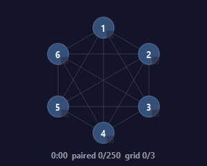
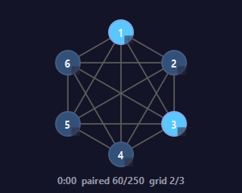
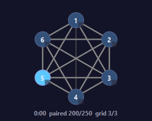
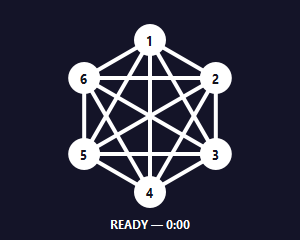
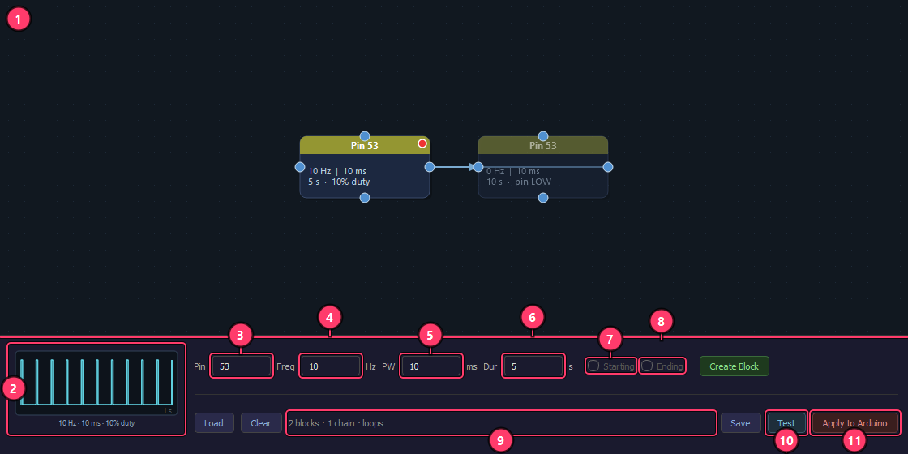
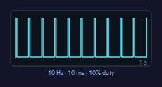
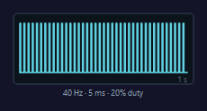
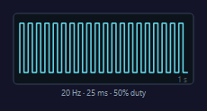
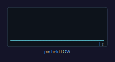
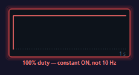

# The interface

Panopticon has two windows: the main acquisition window, and the stimulation
editor that opens from it. This page describes every control in both, what it
does, and the parts whose behavior is not obvious from the label.

Screenshots are regenerated with `uv run python docs/make_screenshots.py`. The
callout positions come from Qt's own widget geometry, so they follow the layout
rather than being measured by hand.

---

## The main window


The window is a camera grid on the left and a fixed 260 px sidebar on the right.
The sidebar has three sections — Metadata, Acquisition, Display — and a status
label at its foot. The window sizes itself on launch to about 80% of the screen
height, with the grid's aspect ratio set by the camera count.

### Preview

**1 — Camera preview grid.**
Live video from every open camera, three panes per row. The grid is rebuilt
whenever cameras are opened, so it always shows exactly the cameras that
enumerated.

The preview is cheap on purpose. Frames are downsampled 3x in each axis in the
grab thread (1920x1200 becomes 640x400) and the panes repaint on a 33 ms timer.
Beyond that, how many frames reach the preview depends on what is running:

| State | Camera mode | Frames sent to the preview |
|---|---|---|
| Idle | free-run at 30 fps | every frame |
| Calibrating | triggered at `calibration_frame_rate` (30) | every frame |
| Recording | triggered at `frame_rate` (100) | every 10th frame |

So the preview is decimated during a recording and not during a calibration. At
100 fps that leaves the panes updating about 10 times a second, which keeps
display work off the loop that has to drain the driver's buffer pool. The
preview is a monitor, not a measurement — nothing downstream reads it.

The preview also stops entirely during blocking camera work. Switching profiles
("Switching cameras…") and stopping an acquisition ("Finishing…") halt the
refresh timer, so the panes freeze on their last frame for a second or two.

**2 — One camera pane.**
One pane per camera, labeled `cam1`…`camN` in the top-left corner.

Names come from **serial-number order**: the backend sorts the enumerated
devices by serial number and the pane index becomes the name. Physical position,
switch port and boot order have no effect. That ordering is what the calibration
extrinsics attach to, so a camera that fails to enumerate would rename every
camera after it. Setting `n_cameras` in the profile makes the software refuse to
open a partial set rather than silently renumber; the error lists the serials it
did find.

**Double-click a pane to zoom that camera to the whole grid. Double-click it
again to go back.** While zoomed the other panes are hidden, so the way back is
the same pane you came in on.

**3 — Live frame rate.**
Bottom-left of each pane. Measured in that camera's grab thread over the last ten
frames and pushed to the label about three times a second.

It should sit at whatever the cameras are currently doing: ~30 fps idle, the
calibration rate while calibrating, the trigger rate while recording. One pane
reading low while the others are correct is usually the first visible sign of a
problem with that camera's link or triggers, and it is worth stopping for.

### Metadata

**4 — Rig profile.**
Selects the whole hardware configuration from `profiles/*.yaml`: resolution,
frame rates, camera settings file (`.pfs`), board config, serial port, trigger
pins, encode mode, kick-out depth, calibration exposure and gain. Changing the
selection closes every camera and reopens them against the new profile, which
takes a second or two and runs off the UI thread.

The choice is remembered per machine, not in the repo. Profile files are shared
between rigs through git, so the startup default is the profile last used on
this machine; failing that, the first profile whose `.pfs` file exists.

Selecting a profile also resets the output directory to that profile's
`output_dir`. Profile switching is ignored unless the app is idle.

**5 — Output directory.**
The root under which sessions are written. Click it to pick another folder; the
button shows a shortened path and the full path as a tooltip. Data goes to:

```
<output>/<date>/<mouse_1>_<mouse_2>/<calibration|recording>/
```

**6 — Session metadata.**
Date, Mouse 1, Mouse 2, Assay, Experimenter, Cohort, Cage, Notes. Date defaults
to today, Assay to `open_field`, Experimenter to `IT`.

Date, Mouse 1 and Mouse 2 also build the folder path, so fill them in before
recording rather than after. Blank subject fields become `m1` and `m2`.

All of them are written to `session_metadata.json` in the session folder at
stop, together with camera names, resolution, frame rates, time of day, host, OS
and Python version, and the GPU name, **driver version** and total memory. The
NVENC concurrent-session count found by the preflight is recorded too. The
driver version is there because the concurrent NVENC session cap has changed
across driver generations, and a driver update that drops it below the camera
count changes how a session records.

The fields go read-only for the duration of an acquisition, along with the
output-directory button and the profile dropdown.

### Acquisition

**7 — Calibrate.**
Starts and stops a calibration acquisition. Cameras go into trigger mode at
`calibration_frame_rate` (30 fps on the 3dpose profile) and the profile's
`calibration_exposure_us` / `calibration_gain_db` are applied for the run only.
The `.pfs` exposure and gain are restored when a recording starts, so a long
calibration exposure cannot leak into a 100 fps session.

Move the ChArUco board slowly through the arena so that every camera sees it,
every *pair* of cameras sees it at the same time, and it visits all four
quadrants of each view. Watch the coverage HUD (12) to know when to stop.
Turning Calibrate on disables Record until it is turned off.

**8 — Record.**
Starts and stops an experiment recording at the profile's `frame_rate`.

Before anything starts, a preflight runs and can refuse:

- **No cameras open.** Recording would run the trigger protocol — and any stim
  paradigm baked into the board — while saving nothing.
- **Not enough RAM** for the driver buffer pool plus the NV12 ring at this
  camera count. The message gives the arithmetic and what is available.
- **Too few NVENC sessions.** The driver caps how many encode sessions can run
  at once, and each camera needs one. Cameras beyond the cap would silently fall
  back to raw capture, which writes every full frame to disk — the refusal
  message states the size that implies for a 10-minute recording.
- **A stim workflow that must not record**: a loop with no starting block, a
  stim block on a camera trigger pin or on the UART pins, or one pin driven by
  two chains.

A tight disk is a warning, not a refusal, and warnings become a
"Start anyway?" prompt. Existing data in the target folder prompts before
overwriting; the check looks for `blockids.npy`, `frametimes.npy` and
`alignment.npz` as well as videos, so a folder whose mp4s were moved away for
labeling is still recognized as holding data.

The trigger board then has to acknowledge the start. If it never does, the
cameras are rolled back out of trigger mode, the board is stood down and the
recording is refused — an unacknowledged start would otherwise produce a
full-length session containing no frames.

A stim paradigm with an "Ending" block stops the recording by itself, at the
time that block finishes. Stopping by hand at any point does the same thing.

**9 — Solve.**
Runs the calibration solve (`1_calibrate.py`, via `uv run`) over the recorded
calibration videos and writes `calibration.toml` into the calibration folder,
then copies it into the recording folder so each session carries the calibration
it was shot with.

Non-obvious behavior worth knowing:

- It takes several minutes and the button is disabled for the duration. Nothing
  else about the app changes state, so the status bar and the state label are
  the only indication it is running. The state label reads `CALIBRATING...` in
  purple during a solve, even though no camera is capturing.
- It resolves the folder from the metadata fields **as they read now**, not from
  the calibration most recently recorded. Change the date or a subject ID and
  Solve looks somewhere else.
- It refuses with a dialog when the calibration folder does not exist, contains
  no mp4 files, or the profile's board config file is missing.
- If the calibration run saved `codet_frames.json` — the frame indices where the
  HUD saw the board in two or more cameras at once — the solve uses those frames
  instead of scanning every frame of every video.
- It is unavailable while acquiring or encoding, and a second click while a
  solve is running is ignored.

**10 — Snapshot.**
Asks every grab thread to stash its next **full-resolution** frame, then writes
one PNG per camera to:

```
<output>/<date>/<mouse_1>_<mouse_2>/snapshots/<date>_<HHMMSS>/cam<N>.png
```

The status bar reports how many cameras were saved and where. Useful for
documenting the arena, and for checking focus and framing at full resolution
rather than through the downsampled preview. Snapshots come from the raw frame,
so the brightness and contrast sliders do not affect them.

**11 — Stimulation.**
Opens the optostim node editor (see below). The window is not modal — leave it
open beside the main window while you work.

The thing to understand before using it: a stim sequence is **compiled into the
Arduino's firmware**, not streamed over the wire. Editing the canvas changes
nothing until **Apply to Arduino**, which takes about 30 s. Because firmware
survives closing the app, Panopticon reflashes a recording-only sketch at every
launch when the board is not already known to be carrying it — so stim is opt-in
per session, and a paradigm from last week cannot fire because someone pressed
Record. To reuse a paradigm, **Load** it and Apply.

**12 — Calibration coverage HUD.**
The live ChArUco coverage graph. It is hidden at idle and appears in this slot
while a calibration is running. It stays hidden for the whole run if OpenCV is
not installed or the profile's board config file is missing.

Detection runs on a worker thread at about 30 Hz on **full-resolution** frames,
not the preview copies, because obliquely-mounted cameras need full resolution
to resolve the board — the same frames the post-hoc solve works from. See the
next section for what the display means.

### Display

**13 — Brightness.**  **14 — Contrast.**
Both range from -100 to +100 and both affect the **preview only**. Contrast
scales each pixel about mid-gray by `(100 + contrast) / 100`, then brightness is
added, then the result is clipped to 0-255.

They do not affect the recorded video, the snapshots, or board detection: the
coverage HUD reads frames straight from the grab threads and the solve reads the
recorded file. If the board is too dark to detect, raise `calibration_exposure_us`
in the profile instead. Calibration runs at 30 fps, where the exposure ceiling
is around 24 ms rather than the ~3.5 ms a 100 fps recording allows. Then raise
`calibration_gain_db`. The practical limit at long exposures is motion blur, not
the ceiling — move the board slowly and pause at each pose.

**15 — Progress.**
Hidden unless a post-recording stage is running. It shows `Encoding N/M` while
the videos are being finalized and `Aligning N/M` if a post-hoc alignment pass
is needed, where M is the camera count. With real-time encode this is a
stream-copy remux and finishes in seconds; in the raw fallback it is a full
encode pass.

**16 — State.**
The application state, bottom-right of the sidebar, color-coded:

| Text | Meaning |
|---|---|
| `IDLE` (gray) | nothing running; cameras in free-run preview |
| `CALIBRATING` (blue) | calibration acquisition in progress |
| `RECORDING` (red) | recording in progress |
| `ENCODING` (amber) | finalizing video after a stop |
| `ALIGNING` (amber) | post-hoc trigger alignment re-encode |
| `CALIBRATING...` (purple) | a Solve is running — no capture |
| `Switching cameras…` / `Finishing…` / `Clearing stim firmware…` (amber) | a blocking operation; every control is disabled and the cursor is a wait cursor |

**17 — Status bar / capture health.**
The window's status bar carries whatever the app has to say: the snapshot
destination, solve progress, the encode summary after a recording, alignment
results. It has no message at idle before the first event.

During a recording it reports **how far behind real time the worst camera is**,
refreshed about three times a second:

- under 0.25 s: `Capture healthy — keeping up with the trigger (max lag N ms)`
- under 1 s: `CAPTURE FALLING BEHIND: camN is X s behind real time and growing.
  Close other applications.`
- otherwise: `CAPTURE X s BEHIND REAL TIME (camN). Frames will be lost when the
  buffer pool fills. Stop and investigate.`

The number is shown even when healthy, so the claim can be checked rather than
taken on trust. It is computed per camera from the camera's own hardware
timestamp against arrival time, referenced to the first frame of the run, so it
does not depend on the host clock. It is published by the real-time kick-out
path; with `realtime_kick` disabled it stays at zero and carries no information.

This readout exists because the failure it catches is otherwise invisible. A
grab loop running a fraction of a millisecond over budget loses nothing at
first — the driver's buffer pool absorbs the deficit — so there is no error and
no dropped frame for as long as ten minutes, while every frame retrieved gets
staler. A large lag also means the preview is showing the past, not the present,
which matters when aiming cameras.

After a recording stops, the same bar reports the encode summary: frame counts,
average frame rate, and any camera that produced no usable video. Problems are
also written to `WARNINGS.txt` in the recording folder, because a dialog is
dismissed and forgotten. A clean session produces neither a dialog nor that
file.

---

## The calibration coverage HUD

The graph is one numbered node per camera on a ring, with an edge for every
pair. It answers one question: is there enough data to solve this rig's geometry
yet.

The four figures below are rendered illustrations of specific states, not
captures of one session — which is why the elapsed timer reads `0:00` in all of
them.

| | |
|---|---|
|  |  |
| **Stage 1.** Nothing detected yet. Every edge is dark and thin, every node is dull. `paired 0/250 grid 0/3`. | **Stage 2.** Cameras 1 and 3 are lit — they can see the board right now. Edges have begun to thicken. `paired 60/250 grid 2/3`. |
|  |  |
| **Stage 3.** Nearly there. Camera 5 is lit, most edges are bright and thick, and the 1-4 edge is still thin — that pair has barely seen the board together. `paired 200/250 grid 3/3`. | **Stage 4.** Every condition met. The whole graph freezes solid white and the caption reads `READY`. |

What each element means:

- **A node lights up** (cyan, with a brighter rim) when that camera can see at
  least 4 board markers in the current detection tick. The glow decays over
  about 0.4 s, so it reads as a pulse rather than a latch.
- **An edge thickens and whitens** as that pair of cameras accumulates ticks
  where both saw at least 5 markers. It saturates at 200 shared ticks. A thin
  edge is a pair that has not yet seen the board together — walk the board
  through the space those two cameras share.
- **The 2x2 badge** on the bottom-right of each node is that camera's spatial
  coverage. Each detection's marker centroid is binned into one of four
  quadrants of that camera's field of view, and the cell turns green the first
  time it is hit.
- **The caption** reads `<elapsed>  paired <worst>/250  grid <worst>/3`. Both
  numbers are the worst camera, not an average, so they move only when the
  camera that is furthest behind improves.

**READY requires three things at once:**

1. Every camera has at least **250** co-detection ticks — ticks where it and at
   least one other camera both saw the board.
2. Every camera has hit at least **3 of its 4** field-of-view quadrants.
3. The graph is **connected** through edges of at least **80** shared ticks, so
   every camera is linked to every other directly or through a chain.

The quadrant condition exists because the first and third can be satisfied by
waving the board in one spot in front of all the cameras. That produces poorly
constrained intrinsics: the solve looks fine and behaves badly toward the frame
edges.

Counts are at the detection sample rate, so these are relative coverage signals
rather than recorded-frame totals. Once READY is reached, detection stops and
the elapsed timer freezes at the time it took.

Turning Calibrate off hides the graph and writes `codet_frames.json` beside the
videos — the frame indices where two or more cameras saw the board, which the
Solve then uses instead of scanning every frame.

---

## The stimulation editor



A block graph compiled into the Arduino sketch. Each block drives one pin with
one square wave for one duration; arrows chain blocks into sequences.

**1 — Node canvas.**
The graph. Blocks are dragged to move, and every block has four connector ports
(top, bottom, left, right).

- **Drag from a port** to another block's port to create an arrow. A port within
  snapping distance highlights and the arrow lands on it. A block can have at
  most one **outgoing** arrow — that is what makes a chain a sequence — but any
  number of incoming ones. Dragging from a port on a block that already has an
  outgoing arrow moves the block instead of starting a new arrow.
- **Click** a block to select it and load its values into the fields below.
  **Drag on empty space** for a rubber-band selection, shift-drag to add to it.
- **Delete** removes the selected blocks and arrows. **Ctrl+C / Ctrl+V** copies
  and pastes blocks at the cursor. **Middle-drag** pans, **scroll** zooms.
- Each block shows its pin in the header, then its frequency, pulse width,
  duration, and the resulting mode: `10% duty`, `constant ON`, or `pin LOW`.
  Blocks are tinted by pin number.
- A **filled red dot** in a block's top-right corner means this block starts its
  chain; a white ring around that dot means it was pinned by hand. A **hollow
  amber dashed ring** means the block sits in a loop with no start, so it would
  never run. A **black dot** to the left of the start dot marks the "Ending"
  block. Blocks that are not chain starts are drawn faded, so the block that
  begins the sequence is the one that reads as live.

**2 — Waveform preview.**
One second of the wave the current Freq and PW fields would produce. It follows
the fields as they are typed, not the selected block. See the next section.

**3 — Pin.**
The output pin for a new block, or the selected block. There is no default: an
empty field is refused rather than coerced to pin 0, which on a Mega is UART RX0
and would garble the link to the board.

Two classes of pin are rejected outright at Apply, Test and Record: the camera
trigger pins from the profile, and pins 0 and 1. A stim waveform on a trigger
line injects extra rising edges into one camera, which breaks the assumption
that a given trigger ordinal is the same instant on every camera — the
assumption every alignment step in the pipeline rests on.

**4 — Freq (Hz).**
Pulse frequency. `0` holds the pin LOW for the block's duration, which is how a
gap between stimulation periods is expressed.

**5 — PW (ms).**
Pulse width in milliseconds — how long the pin is HIGH within each cycle.

**6 — Dur (s).**
How long this block runs before the chain moves to the next one.

Pressing Enter in any of these four fields applies the values to the selected
block. With nothing selected, Enter creates a block, the same as **Create
Block**.

**7 — Starting.**
Pins the selected block as the start of its group. Disabled until exactly one
block is selected.

Normally every block with no incoming arrow starts a chain, and this flag is not
needed. A pure loop has no such block, so it must be pinned or it compiles to
nothing. Only one start per weakly-connected group: pinning one clears the flag
on the others in that group, and if an arrow later merges two pinned groups, one
flag is dropped so the canvas cannot claim something the compiler would not do.

**8 — Ending.**
Marks the block whose completion **stops the recording**. One per canvas,
disabled until exactly one block is selected.

It stops the *recording*, not the chain. A looping chain keeps running until the
recording ends, so a loop is bounded by giving it an Ending block, or by pairing
it with a parallel timer chain that carries one. The countdown is armed on the
host when Record starts, and the board is not asked to report back.

**9 — Status line.**
What the current graph would do, and what is wrong with it. It reports the stop
time (`Recording will stop 15 s after start.`), load and save confirmations,
upload progress and test countdowns. In red it reports the blocking problems:
blocks forming a loop with no start, a pin driven by two chains at once, an
Ending block that no chain reaches, or unparseable field values. (The text in
the figure above is placeholder copy for the illustration.)

**10 — Test.**
Runs the paradigm on the board with **zero camera pins**, so the stim outputs
fire and no camera is triggered. The button becomes **Stop Test** while running,
and the status line counts down; a looping paradigm has no end time and runs
until stopped.

Test runs whatever is on the board. If the canvas has changed since the last
upload it offers to upload first, because otherwise it would silently test the
previous paradigm. It borrows the main window's serial connection rather than
opening its own, so a test does not reset the board. If the board does not
confirm the stop, the status line says so in red and a dialog appears — for a
bench test with no recording to end, that single write is the only thing that
stops the output.

**11 — Apply to Arduino.**
Compiles the graph into an `.ino` and uploads it (about 30 s). Nothing on the
canvas reaches the board until this runs. Apply and Test are disabled during the
upload, and the port is handed to the upload tool and reclaimed afterwards.

On success the status line reads `Upload successful — press Record to run
paradigm.` and the sketch's hash is recorded, which is what lets the next launch
tell whether the board still carries a paradigm.

Apply is refused while an acquisition is running, and refused for any graph with
a blocking problem.

Three more buttons share that row. **Load** and **Save** read and write the
graph as JSON, defaulting to the output directory, and **Clear** empties the
canvas after a confirmation. Saving is separate from applying: a saved file is a
paradigm that can be reloaded, while the board only ever holds what was last
uploaded.

A recording started with blocks on the canvas also writes `stim_paradigm.json`
and `stim_paradigm.ino` into the recording folder, including the firmware hash
and whether it matches what was uploaded this session, so a session describes
the stimulation it delivered without needing the editor.

---

## The waveform preview

Frequency and pulse width are independent fields, so the duty cycle is
implicit — and a pulse width at or above the period is easy to type by accident
and impossible to spot in the numbers. The preview draws one second of the
resulting wave and captions it.

Duty cycle is `pulse_width_ms x freq_hz / 10`, as a percentage. The period is
`1000 / freq_hz` milliseconds.

These five figures are rendered illustrations of specific parameter pairs.

| Fields | Preview |
|---|---|
| 10 Hz, 10 ms — period 100 ms, 10% duty |  |
| 40 Hz, 5 ms — period 25 ms, 20% duty |  |
| 20 Hz, 25 ms — period 50 ms, 50% duty |  |
| 0 Hz — pin held LOW |  |
| 10 Hz, 100 ms — period 100 ms, 100% duty |  |

The first three are normal trains: same shape, different density and duty. A
train denser than 400 cycles per second of preview is drawn as a band rather
than individual pulses.

`0 Hz` (or a pulse width of 0) means the pin is held LOW for the block's
duration. That is a legitimate and common block — it is how a rest interval
between stimulation periods is written.

**The 100% case is the one to watch.** 10 Hz with a 100 ms pulse width is a
100 ms period fully filled: the pin goes HIGH and stays HIGH for the whole
block. It is not a 10 Hz train and it is not an error. The preview draws the
single rising edge, glows the border red, and captions it
`100% duty — constant ON, not 10 Hz`. A pulse width *longer* than the period
does the same thing physically, and is captioned
`pulse 150 ms > period 100 ms`.

The firmware drives the pin constantly HIGH in both cases rather than rejecting
them, so that is what the preview draws and what the block's own body text says
(`constant ON`). A block that refused to represent them would hold the pin LOW
for its whole duration instead — a silent nothing where stimulation was
intended, which is not visible anywhere in the recorded data.

---

## Controls that hide, and controls that disable

**Hidden until something is running:**

- The **coverage HUD** (12) exists only while a calibration is in progress, and
  only if OpenCV and the board config are both available.
- The **progress bar** (15) exists only during encoding or alignment.
- The **status bar** (17) has no message until the first event that produces
  one.

**Disabled rather than hidden:**

- **Record** is disabled while Calibrate is on, and Calibrate is disabled while
  Record is on.
- Both toggles are disabled during encoding and alignment.
- **Solve** is disabled for the duration of a solve, and refuses while
  acquiring or encoding.
- During any blocking operation — a profile switch, the end-of-acquisition
  finalize, the startup firmware flash — the profile dropdown, output directory,
  both toggles, Solve, Snapshot and every metadata field are disabled and the
  cursor becomes a wait cursor.
- The metadata fields and the output directory go read-only for the duration of
  an acquisition, since they name the folder being written.
- In the stimulation editor, **Starting** and **Ending** are disabled until
  exactly one block is selected; **Apply** and **Test** are both disabled while
  an upload is in flight, and **Apply** is disabled while a test is running.

**At launch**, a hardware check runs in the background and pops a dialog if it
finds something: fewer than 4 physical CPU cores, under 16 GB of RAM, under
500 GB of free disk, a measured disk write under 500 MB/s, or no `h264_nvenc`
encoder in the bundled ffmpeg. It is advisory — it does not stop anything.

**On quit**, if a session is in progress the app asks for confirmation and then
deletes the incomplete data rather than leaving a half-written session behind.
It stands the trigger board down whether or not an acquisition is running, so
closing the window cannot leave a paradigm — or a laser — running, and it says
so loudly if the board does not accept that stop.
