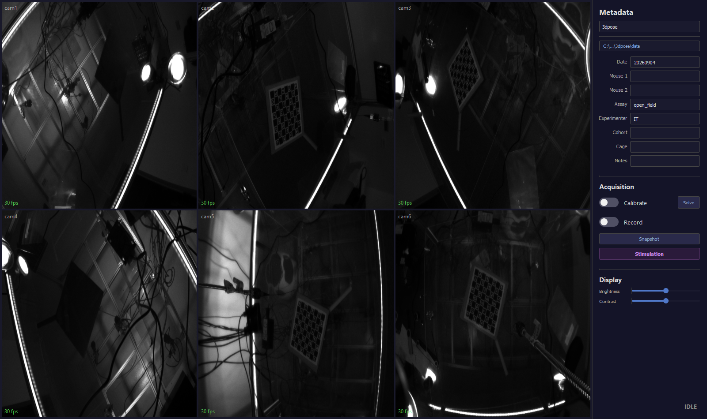
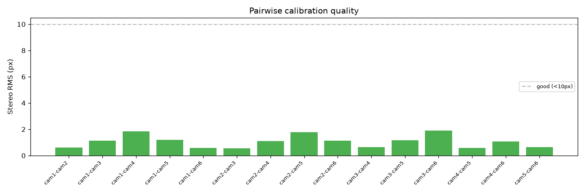
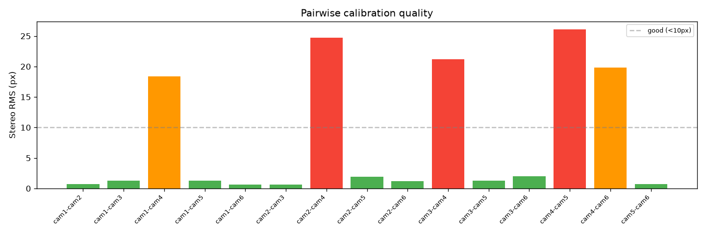
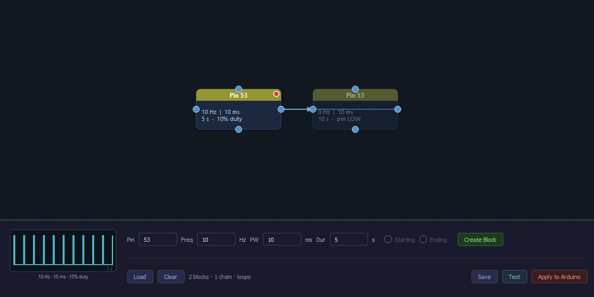

# A session, end to end

A session in Panopticon is one visit to the rig: you launch the application, tell it which
rig it is looking at and where to put the data, describe the animals, calibrate the
cameras, solve that calibration into camera geometry, optionally load a stimulation
paradigm, and then record. This page walks through those steps in the order they actually
happen, and finishes with what you find on disk afterwards and what to do when something
goes wrong.

It assumes no computing background, so terms are explained where they first come up. Every
path, filename and message quoted here is the one the software really produces, so you can
match what you are reading against what is on your screen.

Two companion pages sit either side of this one. [OVERVIEW.md](OVERVIEW.md) is the
reference for what each individual control does, and is the better page to keep open beside
the window. [INSTALLATION.md](INSTALLATION.md) covers getting the rig built, wired and
sized in the first place.

- [1. Launch](#1-launch)
- [2. Choose a profile](#2-choose-a-profile)
- [3. Set the output directory](#3-set-the-output-directory)
- [4. Fill in the metadata](#4-fill-in-the-metadata)
- [5. Calibrate](#5-calibrate)
- [6. Solve](#6-solve)
- [7. Optional: stimulation](#7-optional-stimulation)
- [8. Record](#8-record)
- [9. After you stop](#9-after-you-stop)
- [10. What the session leaves on disk](#10-what-the-session-leaves-on-disk)
- [11. Troubleshooting](#11-troubleshooting)

---

## 1. Launch

The goal of this first stage is simply to get to a window with a live picture from every
camera and the word `IDLE` in the corner. Nothing you do later can be trusted if a camera
is missing here, so it is worth a few seconds of looking before you move on.

There are three ways to start the application and they all do the same thing, so pick
whichever suits the moment:

- Double-click the **Panopticon** desktop shortcut, if one has been made
  (`make_shortcut.ps1` writes one that starts the application with no console window).
- Double-click **`_launch.bat`** in the repository folder. This one goes through `uv`, so
  it installs or updates dependencies first if `pyproject.toml` has changed; the shortcut
  does not.
- In a terminal, from the repository folder: `uv run gui.py`. Use this when something is
  going wrong — the diagnostic output appears in the terminal as it happens.

A small "Panopticon / Loading cameras..." splash appears while the cameras are opened and
their settings file is loaded, which takes a second or two, and then the main window comes
up.

Everything the application prints to the console is also written to a log file,
`logs/panopticon_<date>_<time>.log` inside the repository folder. You do not need to look
at it during a normal session, but it is the first thing to quote when reporting a problem,
because it contains the per-camera detail that the window only summarises.

Two things then happen on their own in the first half-minute, without being asked.

**A hardware check** runs quietly in the background and only interrupts you if the machine
is short of something the rig will need: fewer than 4 CPU cores, less than 16 GB of RAM,
less than 500 GB free on the output drive, a measured write speed under 500 MB/s, or no
NVENC encoder found. NVENC is the dedicated video-compression hardware built into NVIDIA
GPUs, and it is what lets six cameras be compressed at once without the CPU doing the work.
On a machine that is comfortably specified this check shows no dialog at all, so silence
here is the good outcome.

**The trigger board is put back to a stimulation-free state.** The trigger board is the
small Arduino microcontroller wired to every camera; it generates the pulse train that
makes all the cameras expose at the same instant, and on a rig with optogenetics it also
drives the laser. A stimulation paradigm lives in that board's flash memory, which means it
survives closing the application, a power cycle and even unplugging the USB cable — and it
cannot be read back over the serial link, so the application has no way to ask the board
what it is currently holding. Rather than guess, it reflashes the recording-only firmware
at every launch, unless it has a record of having already put that firmware there. When it
does reflash, the sidebar reads `Clearing stim firmware…` for about 30 seconds. The
practical consequence is worth stating plainly: stimulation is opt-in per launch, so unless
a paradigm has been applied since this launch, the board carries none.

After that the serial port to the board is opened and then deliberately held open until you
quit. Opening the port resets the board, and during that reset and the bootloader wait that
follows it — one to two seconds — the board is not running any code at all, so every pin
floats. A powered laser driver reads a floating input as "on" and flashes. Holding the one
connection open for the whole session is what takes that *port-open* reset out of the start
of every recording, which is where it used to happen.

Opening the port is not the only thing that resets the board, though, and it is worth being
exact here because this is a safety property rather than a cosmetic one. **A flash resets the
board too** — the upload tool has to reset it to reach the bootloader — so the window in
which every pin floats opens at launch, at every **Apply**, and at the start of any
acquisition that needs different firmware from what the board is already carrying. Once a
stimulation paradigm has been applied, that last case covers the next calibration and the
recording after it; [Optional: stimulation](#7-optional-stimulation) sets out exactly when,
and what you see on screen while it happens. Software cannot close the window at all, so if
you need a hard gate, use the laser's own interlock, and key the laser off or block the beam
before pressing Apply, Calibrate, or the first Record after a paradigm change.

**What a good launch looks like:**



There should be one live pane per camera, filling the grid, and the frame-rate number on
each pane should be sitting near **30**. That number is not a mistake: between acquisitions
the cameras run free at 30 fps purely to feed the preview, and they only run at the trigger
rate while you are calibrating or recording. The state label at the bottom right should
read **`IDLE`**, and there should be no dialogs on screen.

If a pane is black or missing, stop here and fix it before touching anything else — see
[Troubleshooting](#11-troubleshooting) for the specific messages. The reason this cannot be
deferred is that camera names are assigned by serial-number order, so a camera that is
absent at launch silently renames every camera after it.

With a full grid, `IDLE` and no dialogs, the application is talking to all the hardware and
you can start configuring the session.

---

## 2. Choose a profile

A **profile** is a small YAML text file describing one physical rig — how many cameras it
has, how fast they run, which serial port the trigger board is on, which of the board's
pins go where. It is the file a new site edits, and it is why the same application can run
two different rooms without a code change. The dropdown at the top of the sidebar lists
every file it finds in `profiles/*.yaml`.

Because the profile describes the hardware rather than the experiment, choosing it is the
first real decision of the session, and almost everything later inherits from it:

| The profile sets | Effect |
|---|---|
| `frame_width`, `frame_height` | Sensor region used |
| `frame_rate` | Trigger rate for a recording |
| `calibration_frame_rate` | Trigger rate for a calibration |
| `pfs_path` | The camera settings file, which is the only source of exposure and gain |
| `board_config` | Which ChArUco board the coverage display and the solve expect |
| `serial_port`, `trigger_pins` | Which board, and which of its pins drive the cameras |
| `stim_safe_pins` | Pins forced low the instant the board boots |
| `n_cameras` | How many cameras must be present before anything starts |
| `output_dir` | The default output directory |
| `realtime_encode`, `realtime_kick`, `quality`, `encode_parallel` | How frames are encoded |

One of those rows is the camera settings file, and it deserves a note now because it comes
up repeatedly later. `pfs_path` points at a `.pfs` file — a dump of the cameras' own
internal registers, made in Basler's pylon Viewer rather than by hand — and it is applied
to every camera as it opens. Exposure and gain live there and nowhere else; the application
never writes them into the profile.

Selecting a profile closes and reopens all the cameras, so expect the sidebar to read
`Switching cameras…` and the controls to grey out for a second or two. The choice is
remembered per machine, so the next launch comes up on the same profile and you will
usually not touch this dropdown again.

There is one refusal built into this step. If the profile sets `n_cameras` to a non-zero
number and a different number of cameras enumerates, the open is refused outright, with a
dialog listing the serial numbers it did find. That is deliberate rather than fussy.
Cameras are named `cam1`…`camN` in serial-number order, so if camera 3 fails to appear the
physical cameras 4 onwards get renamed `cam3` onwards — and the camera positions worked out
during calibration then attach to the wrong physical cameras. Nothing crashes: the 3D
reconstruction still runs, and it is simply wrong. Refusing to open is much cheaper than
discovering that afterwards. Power-cycle the missing camera and reselect the profile.

You cannot change profile during an acquisition; the dropdown is disabled until the rig is
idle again.

Once the grid has come back with the right number of panes, the rig is described and the
rest of the setup is about this particular experiment.

---

## 3. Set the output directory

Below the dropdown is a button showing a folder path. Click it, pick a folder, and that is
the whole step. This folder is the root under which every session is filed, and everything
a session writes lands beneath it as
`<output>/<date>/<mouse1>_<mouse2>/<calibration|recording>/`.

There is one ordering trap here. Selecting a profile resets this button to the profile's
own `output_dir`, so a manual choice made first does not survive a profile switch, and it
does not survive a relaunch either. Set the output directory *after* choosing the profile,
not before.

It is worth choosing deliberately rather than accepting whatever comes up, because six
cameras of video is a lot of data and because the disk-space check that runs when you press
Record measures whichever drive this points at. Point it at the fast, large drive.

---

## 4. Fill in the metadata

The metadata fields do two jobs at once, and it helps to keep them apart in your head. The
first three build the folder and file names, so they determine where the data goes; the
rest are recorded alongside the videos so that the session can still be identified months
later. There are eight of them, all in the sidebar:

| Field | Default | Used for |
|---|---|---|
| Date | today, as `YYYYMMDD` | folder name and filename |
| Mouse 1 | blank → `m1` | folder name and filename |
| Mouse 2 | blank → `m2` | folder name and filename |
| Assay | `open_field` | recorded in `session_metadata.json` |
| Experimenter | `IT` | recorded in `session_metadata.json` |
| Cohort | blank | recorded in `session_metadata.json` |
| Cage | blank | recorded in `session_metadata.json` |
| Notes | blank | recorded in `session_metadata.json` |

To make the naming concrete: with Date `20260904`, Mouse 1 `m1` and Mouse 2 `m2`, the
session folder becomes `<output>/20260904/m1_m2/` and each video inside it is named
`20260904-m1_m2-cam1-recording.mp4`.

**Fill these in before you calibrate, not after.** Solve looks for the calibration videos
under the path built from the fields as they are *at the moment you press it*, and Record
likewise writes to the path built from the fields as they stand then. So if you change a
subject ID between calibrating and solving, Solve goes looking in a folder that does not
exist and reports that rather than finding the videos you just recorded. Getting the names
right first, once, avoids all of that.

While an acquisition is running the fields lock — they turn grey and read-only — and they
unlock again when it finishes, so a session cannot be renamed halfway through.

Everything you type here is written to `session_metadata.json` at the end of each
acquisition, and it is joined there by a description of the machine: host name, operating
system, Python version, GPU model, **GPU driver version**, GPU memory and the number of
NVENC encode sessions the driver granted. The driver facts are recorded for a specific
reason. The number of video streams a GPU will compress at once is decided by the driver,
not by the card, and it has changed across driver generations. A driver update that lowers
that cap below the number of cameras quietly pushes the extra cameras onto the raw
fallback, which writes uncompressed frames instead — and without this record in the file, a
session that suddenly behaves differently after a routine update cannot be explained
afterwards.

**One optional step is worth taking here: Snapshot.** The Snapshot button saves one
full-resolution PNG per camera into `<session>/snapshots/<date>_<HHMMSS>/`, and the status
bar confirms `Snapshot: saved 6/6 cameras → <folder>`. It costs a couple of seconds and
gives you a full-resolution look at focus and exposure, plus a record of what the arena
looked like, before you commit to a recording.

At the end of this stage nothing has been recorded yet, but the session has a name, a
destination and a description. From here on, the steps produce data.

---

## 5. Calibrate

Calibration is how the software learns where the cameras are. Each camera sees a flat
picture; turning several flat pictures into one 3D position requires knowing each camera's
lens characteristics and its position and orientation relative to the others. You supply
that knowledge by showing all the cameras a **ChArUco board** — a printed chessboard with a
unique ArUco marker pattern inside each white square, so that software can not only find
the corners but tell which corner is which. Your job in this stage is to record video of
that board moving through the arena; the next stage turns the video into numbers.

**Check you have the right board before you start.** Not any ChArUco board will do: both the
coverage display and the solve read the board's description from the file the profile's
`board_config` points at, and if the printed board in your hand is not the board in that file,
the session is wasted. On the reference rig that file is
`configs/boards/charuco_8x8_15mm.yaml`, and it describes an **8 x 8 board of 15.0 mm squares,
each carrying a 10.0 mm marker from the 4x4 dictionary of 1000 patterns, printed in the
pre-OpenCV-4.6 ChArUco layout** (`board_legacy: true`). Count the squares and measure one
square against those numbers. If there is more than one printed board in the drawer, this is
the easiest mistake of the day to make.

A mismatch fails in two completely different ways, and the symptom tells you which mistake
you made. Get the **square count, the dictionary or the legacy
layout** wrong and nothing detects at all: the coverage display never lights up, and the solve
finds no board. Annoying, but loud, and you will notice within seconds. Get the **square size**
wrong — the right board pattern, printed at a different scale, or the right file with a
mismeasured `square_length` — and everything detects beautifully, every quality number comes
out perfect, and every 3D coordinate downstream is uniformly mis-scaled with nothing anywhere
reporting a problem. That failure is silent, which is why the ruler is worth the ten seconds.

A calibration is a full acquisition rather than a lightweight preview mode, and one
consequence is easy to miss: **every check described under [Record](#8-record) applies to
Calibrate as well.** The same stimulation-graph refusal, the same RAM, NVENC and disk
preflight, and the same `Existing files found in: <path>  Overwrite?` prompt, this time
naming the `calibration/` folder. That prompt is the one that startles people on a *repeat*
calibration into the same session, so here is exactly what Yes does. It removes
each camera's transient and bookkeeping files — `raw.bin`, `raw_tail.bin`, `stream.h264`,
`tail.h264`, `encode_error.log` and `WARNINGS.txt` — along with the acquisition-level
`WARNINGS.txt`, and the new videos overwrite the old ones. What it does **not** touch is the
previous solve's output: `calibration.toml`, `reprojection_error_histogram.png` and
`codet_frames.json` all stay where they are. So between a repeat calibration and the next
Solve, the plot and the `.toml` sitting beside your fresh videos still describe the *previous*
attempt — and if the coverage display did not run this time (no OpenCV installed, or a board
config that matches nothing) the stale `codet_frames.json` is what the next Solve will use as
its frame hints. If you want no ambiguity at all, either change a metadata field so the
recording lands in a new session folder, or delete the `calibration/` folder before
recalibrating.

With that said, flip the **Calibrate** toggle to begin. Three things change at once: the
cameras switch to hardware-triggered mode at the profile's `calibration_frame_rate` (30 fps on
the reference profile), the preview starts showing every frame instead of every tenth, and the
profile's calibration exposure and gain are applied on top of the `.pfs` values.

That last change is worth understanding, because it is free light and it is limited by
something non-obvious. Calibration gets its own exposure because a printed board usually
needs far more light than the experiment does. In triggered mode the camera's frame-rate
timer starts *after* exposure ends, so the minimum interval between frames is
`exposure + 1/AcquisitionFrameRate` — the shutter time plus a fixed readout allowance. With
that internal rate limiter at 165 (the profile's `trigger_rate_limit`), the allowance is
1/165 = 6.06 ms, and the exposure has to fit in whatever the trigger period leaves. A
100 fps recording has a 10 ms period, so its exposure ceiling is about **3.94 ms**; a 30 fps
calibration has a 33.3 ms period and allows roughly **27 ms**. That is about seven times the
light budget of a recording, for nothing. In practice the application enforces 90% of those
figures — approximately 3.5 ms and 24.5 ms — keeping a deliberate margin, and it computes
and clamps the value rather than trusting the profile: an exposure above the ceiling is
reduced with a log line explaining the clamp, because the alternative is a silently halved
frame rate. Even so, the real limit in practice is motion blur rather than the ceiling. At
15 ms a briskly waved board smears and its corners stop resolving, so slow movement matters
more than more exposure.

Which brings us to the part you actually do: **move the board slowly through the arena and
pause at each pose.** You do not have to guess when you have done enough, because the
coverage display in the sidebar is keeping score and will tell you when to stop. The four
figures below walk through the states it passes through; they are rendered illustrations of
particular moments, not frames from one continuous session.

### Stage 1 — nothing detected yet


Each numbered circle is a camera. Each line is a *pair* of cameras. Everything is dim, the
caption reads `paired 0/250  grid 0/3`, and the timer has started.

**What to do:** hold the board up where at least two cameras can see it. A node brightens
when that camera can see the board right now. If no node ever brightens, the board is too
dark or the wrong board config is selected — see
[Troubleshooting](#11-troubleshooting).

### Stage 2 — partial


Cameras 1 and 3 are glowing: they can see the board at this instant. Some lines have begun
to brighten and thicken, which means those pairs have accumulated shared detections. The
small four-cell badge on each node is that camera's field of view divided into quadrants;
a cell turns green once the board's centre has been seen in it. The caption
`paired 60/250  grid 2/3` reports the **worst** camera on each count.

**What to do:** keep moving, but deliberately. Two things need to grow at once. Carry the
board into the regions where two cameras overlap, so the lines fill in, and carry it into
the corners of each view, so the badges fill in. A board waved in the middle of the arena
grows neither.

### Stage 3 — nearly there


Most lines are now thick and bright, `grid 3/3` says every camera has hit its quadrant
minimum, and `paired 200/250` says the weakest camera is close. One pair — the vertical
line between 1 and 4 — is still thin and dark.

**What to do:** work that pair specifically. Find where both of those cameras can see the
board at the same time, which for opposed cameras usually means holding it edge-on between
them, and hold it there. READY needs the pair graph to form a *single connected component*,
not every pair to be connected, so one thin line blocks it only when that pair is the sole
link between two groups of cameras — but working it raises both of those cameras' paired
counts either way, which is what the caption is waiting on here.

### Stage 4 — READY


The whole graph freezes solid white and the caption reads `READY — m:ss`. Counting stops at
this point, so the display will not change however much longer you keep waving.

**What to do:** flip Calibrate off. You are done.

### What READY requires, and why

READY is not a time or a frame count; it is three conditions that all have to hold at once.
Each is measured per camera and re-checked on every detection tick, and the caption always
reports the *worst* camera, which is why it can sit still while one camera catches up.

The first condition is that **every camera has at least 250 paired detections.** A tick
counts towards a camera's total only when that camera *and at least one other* saw the board
in the same tick, since a view no one else shares cannot help place that camera. Detection
runs at up to about 30 ticks per second, so 250 is a coverage target rather than a frame
count — a handful of seconds of good overlap, not a stopwatch reading.

The second is that **the pair graph is connected**, counting only pairs that have
accumulated at least 80 shared detections. Connectedness matters because the geometry is
built by chaining pairs together. Two well-covered clusters of cameras that never once see
the board at the same time cannot be expressed in a single coordinate frame at all, so no
amount of coverage within each cluster makes them a calibration.

The third is that **every camera has seen the board in at least 3 of the 4 quadrants of its
field of view**, with the quadrant chosen by the centroid of the detected markers. This one
exists because the first two conditions can be satisfied by standing still and waving the
board in one spot. That produces a calibration which looks perfectly healthy in the summary
numbers and behaves badly away from the image centre, because lens distortion is only
constrained where there is data and a fit made from the middle of the frame is
extrapolating everywhere else. Requiring quadrant spread forces the data to cover the frame
instead.

### If READY does not come

It usually will not, on a first attempt, and the important thing to know is this: **READY is a
coverage target, not a gate.** Nothing forces you to reach it. You can flip Calibrate off at
any moment and you will have a perfectly ordinary calibration recording; it is the solve — its
per-camera detection counts and the pairwise plot — that decides whether what you captured is
usable. The display is advice about when you have probably done enough, not permission to stop.

That gives a simple decision rule when the caption sits at something like `paired 210/250`.
**If the numbers are still climbing, keep going.** If they have stopped moving, waving for
longer will not help, and the useful question is *which* of the three conditions is stuck,
because each has a different fix. Is a grid badge short of 3/3? Carry the board into the
corners of that camera's view. Is one edge still thin and dark? Work that specific pair, which
for opposed cameras means holding the board edge-on between them. Does one node never light at
all? Then that camera is not detecting the board — a different problem entirely, and the
Calibration rows in [Troubleshooting](#11-troubleshooting) cover it. Remember also that the
caption reports the *worst* camera and counts in detection ticks rather than frames, so the
numbers can crawl for reasons no amount of extra waving will fix.

And if you do stop short, the cost is bounded: a calibration recording takes a few minutes, so
you have risked a re-run of the calibration, not the session. Press Solve, read the plot, and
let the numbers tell you whether it was enough.

One thing that does *not* affect any of this is the brightness and contrast sliders. They
change the preview and nothing else: the coverage detector reads the cameras' own
full-resolution frames and the solve reads the recorded file, so neither of them ever sees
your adjustment. If the board is genuinely too dark to detect, the fix is to raise
`calibration_exposure_us` in the profile.

When you flip Calibrate off, the frame indices where cameras co-detected the board are
written to `codet_frames.json` — that file is what makes the next stage take minutes rather
than hours — and then the videos are finalised exactly the way a recording is (see
[After you stop](#9-after-you-stop)). If there were no co-detections at all, nothing is
written, which is the case that leaves a stale file from a previous attempt in place.

You now have a calibration *recording*: video of the board from every camera, plus the note
of where in that video the cameras saw it together. It is not yet camera geometry. Turning
it into geometry is the next step.

---

## 6. Solve

Solving is the step that converts the calibration video into the camera geometry every later
analysis depends on. It is entirely automatic, so the work here is in checking the result
rather than producing it.

With the state at `IDLE`, press **Solve**. Both toggles and the Solve button grey out while
it works, which usually takes 4 to 5 minutes, with a hard timeout at 30 minutes so a
pathological case cannot hang the session indefinitely. The state label reads
`CALIBRATING...` in purple throughout, even though no camera is capturing, and the status bar
reads `Solving calibration...` while the solve is being launched and then
`Running calibration...` for the duration. The solve's own per-camera and per-pair progress
goes to the console and the log file, which is where to look if you would rather watch than
wait.

Behind that, the work is a script — `1_calibrate.py`, run through `uv` — and the application
passes it nothing but the session folder and the profile's `board_config`. That matters later,
when a diagnosis calls for an option the button does not expose, so it is worth knowing that
Solve is a convenience wrapper rather than a separate implementation.

It works through the calibration recording in stages. It starts by reading the
`*-calibration.mp4` in each `calibration/camN/` folder, and if `codet_frames.json` is present
it decodes only the frames listed there — the ones where cameras co-detected the board —
instead of scanning whole videos. That shortcut is the difference between a few minutes and a
very long wait, which is why the coverage display writing that file matters. It then
calibrates each camera's **intrinsics** (the lens properties: focal length, optical centre and
distortion, all internal to one camera), then works out the geometry of every camera *pair* by
stereo calibration, and finally chains those pairs together into a single coordinate frame
with `cam1` as the reference camera.

The shortcut is not purely a speed trick, and it is fair to know what it costs. Run from a
terminal without `codet_frames.json`, the script scans the videos and keeps every third frame
(the `--skip` option, default 3, with a short burst of consecutive frames after each hit);
`--skip 10` produces a visibly degraded calibration, so 3 is the tested value and the number
of frames genuinely affects quality. With `codet_frames.json` present, `--skip` is ignored
entirely and the frame list decides everything. That list is denser in time than a
one-in-three scan, because the coverage display looked at roughly every frame of a 30 fps
calibration, but it is also narrower: it holds only the moments when **two or more** cameras
saw the board at once, so views a camera had to itself are absent even though the intrinsics
stage could have used them. Whether the two paths produce equivalent calibrations has not
been measured. The practical consequence is for later, when you are looking at a marginal
result: before concluding the calibration recording itself was too thin, re-run the solve by
hand with `codet_frames.json` moved aside — which both widens the frame set and is what
makes `--skip` take effect at all — and see whether the numbers improve.

What it leaves behind are two files in the `calibration/` folder:
**`calibration.toml`**, which holds the actual result in aniposelib's layout (per camera a
size, a camera matrix, distortion coefficients, a rotation and a translation), and
**`reprojection_error_histogram.png`**, which is how you judge whether that result is any
good. Nothing on screen opens that plot for you, so do not wait for a dialog — it is a file
in the `calibration/` folder to open yourself, and the next subsection is about reading it.
The `.toml` is where aniposelib belongs in this story, incidentally: the solve is
`1_calibrate.py`, and aniposelib and sleap-anipose come in downstream as the triangulation
tools that read the file it writes.

`calibration.toml` is then copied into the `recording/` folder, creating that folder if it
does not exist yet, so every recording carries the calibration it was shot with rather than
depending on you to remember which one applied. The first time, that copy is silent and the
status bar simply confirms `Calibration solved — copied to <path>`.

The second time is different, and since the advice on this page is to look at the plot and
recalibrate if it disappoints you, a second Solve is a normal event rather than an odd one. If
`recording/calibration.toml` already exists and its contents differ from the new solve, the
application asks **Replace the recording's calibration?**, explaining that if a recording in
that folder was made with the old file, replacing it changes which calibration that data
claims to have been shot with. The default answer is No. The rule for answering is simpler
than the question sounds. **Say Yes when you have recalibrated and not yet recorded** — which
is the usual case, because the whole point of the new solve is that the next recording should
carry it. **Say No when a recording already sitting in that folder was made under the
calibration that is there**, since overwriting it would silently rewrite that session's
provenance; the fresh solve stays in `calibration/`, where you can copy it by hand once you
have decided what it belongs to. Whichever you choose, the status bar records it, and those
three messages are the only durable trace of the decision:

| Status bar | What happened |
|---|---|
| `Calibration solved — copied to <path>` | The copy was made — either the first one, or a replacement you approved. |
| `Calibration solved — kept in calibration/, recording's copy left unchanged` | You declined the replacement. The recording folder still holds the older calibration. |
| `Calibration solved (no toml found to copy)` | The solve reported success but no `calibration.toml` was found in `calibration/` to copy. Treat this as a failure and check the log. |

A **Calibration Warnings** dialog appears when the solve finished but is not confident,
which it decides on two triggers: a camera pair whose stereo RMS is above 20 px, or a
camera with fewer than 30 detection frames. The dialog suggests recording a longer
calibration with the board visible to more cameras at once, and the per-pair numbers are in
the console and in the log file. The status bar then reads
`Calibration solved — copied to … (with warnings)`. Note that a calibration with warnings
is still written to disk — the software will not decide for you whether it is good enough,
which is exactly why the plot below is worth two minutes of your attention.

If you press Solve a second time while one is running, nothing happens except the status
bar reading `A solve is already running`.

### Which cameras actually made it into the solve

There is one thing to check before reading the plot at all, because the plot cannot show it.
A camera can be dropped from the solve and the solve will still report success, so
`calibration.toml` can describe five cameras out of six while everything on screen looks
normal. There are three ways a camera leaves, and none of them raises a dialog.

It is dropped if it contributed **fewer than 5 detection frames**, since that contributes
nothing but noise; the console says `Dropping (<5 detections): cam4`. It is dropped if it had
detections but **too few for its own intrinsics**, which need at least 20 usable frames, and
the console says `cam4: FAILED`. And — the quiet one — it is dropped if it **never saw the
board at the same time as any other camera**, because the geometry is built by chaining pairs
and a camera in no pair cannot be placed; the console says `Disconnected — isolated: cam4`.
In every one of those cases the solve simply continues with the survivors: no Calibration
Warnings dialog, no mention in the status bar, a perfectly valid `calibration.toml` with one
camera missing from it.

The positive check takes five seconds and is worth making every time. At the end of the solve
the console prints the list of survivors:

```
Calibration complete.
  …\calibration\calibration.toml
  Cameras: cam1 cam2 cam3 cam5 cam6
```

That same line is in `logs/panopticon_<date>_<time>.log`, and `calibration.toml` itself
carries one block per surviving camera, each with a `name = "camN"`. **Count them.** A camera
missing from that list contributes nothing to 3D no matter how good its video looks, and the
fix is to record the calibration again, deliberately sharing views with it — holding the board
where it and at least one neighbour can both see it.

The solve refuses outright, rather than writing a thin result, only when it is left with fewer
than two cameras with detections, fewer than two with valid intrinsics, no co-detecting pairs
at all, or fewer than two connected cameras. Those are genuine failures with a message
attached. Anything above that floor succeeds with whatever survived, which is why the
surviving camera list is the first thing to read.

### Reading the pairwise calibration plot

`reprojection_error_histogram.png` is the one output that tells you whether the calibration
you just spent ten minutes on is usable, and it takes some explaining — starting with its
name, which is misleading. **Despite the filename it is not a histogram.** It is a bar chart
with **one bar per camera pair** — for six cameras that is 15 bars, `cam1-cam2` through
`cam5-cam6` — rather than a distribution of individual errors. The title on the plot itself
is the accurate one: "Pairwise calibration quality".

The vertical axis is **stereo RMS in pixels**, and what it measures is the residual of that
pair's own stereo fit: the root-mean-square distance, in pixels, between where the board
corners actually were in the two images and where the fitted geometry for those two cameras
puts them. It is computed over the shared views the fit was given — frames in which both
cameras saw the board, capped at 30 and chosen to span different board poses rather than
whichever pose happened to be held longest. So a bar of 1.2 means "this pair's geometry
predicts corner positions to about a pixel", and a bar of 25 means the two cameras' positions
cannot both be right.

Two things follow from that definition, and both matter when you come to read the chart. The number
belongs to the pair alone and is computed before the pairs are chained together into one
coordinate frame, so a green bar says those two cameras agree with each other, not that the
assembled rig is correct. And it comes from a sample of the shared views rather than all of
them, so it is a sound estimate of the pair's consistency rather than an exhaustive audit.

Bars are coloured by that number, with a dashed grey line drawn across the chart at 10 px
and labelled "good (<10px)" so you can see the boundary without reading the axis:

| Colour | Stereo RMS | How to treat it |
|---|---|---|
| Green | below 10 px | Good. Nothing to do. |
| Amber | 10 to 20 px | Marginal. Usable at a pinch, worth improving. |
| Red | 20 px and above | Bad. This pair's geometry is wrong. |

A healthy solve looks like this — every pair green and comfortably below the dashed line:



*Illustrative example with synthetic numbers, drawn by the same function the real solve
uses, so the layout, colours and thresholds are exactly what you will see.* All 15 pairs
land between 0.55 and 1.91 px. Note that the tallest bars here are the ones between opposed
cameras, such as `cam1-cam4` at 1.83 px, which is expected: cameras facing each other across
the arena see the board from very different angles, and a little more error than
neighbouring cameras is normal rather than a fault.

**A missing bar matters as much as a tall one.** A pair only appears at all if the two
cameras co-observed enough board views to be stereo calibrated — at least 3 shared frames.
So if you count fewer bars than pairs, some pair of cameras never saw the board together,
and that absence is frequently the real problem: the chart cannot tell you that geometry is
wrong when it had nothing to work from. Compare the bar labels against the pairs you expect
before you start interpreting heights. This is also why a camera dropped from the solve for
too few detections shows up as *nothing* rather than as something bad: it has no bars at all.
Counting bars is not a complete substitute for the surviving camera list, though — a camera
that formed its own disconnected island with a neighbour can be dropped from the solve while
its bars against that neighbour still appear on the chart. The `Cameras:` line, not the plot,
is the authority on what went into `calibration.toml`.

#### What the plot cannot tell you

The chart is the best single indicator of calibration quality, but all-green is not the
same as all-clear. Three problems leave every bar comfortably under the dashed line.

The first is **world scale**. Every 3D coordinate produced downstream is expressed in the
units of `square_length` in the board config — 15.0 mm for the reference board — because that
number is the only thing telling the solve how big the board it is looking at really is. If it
is wrong, the entire reconstruction is uniformly scaled, and the plot cannot see it: scale the
object points and the camera translations together and every reprojection lands in exactly the
same place, so the residuals do not move at all. Measure a printed square with a ruler and
check it against the file. Nothing later in the pipeline will question it for you.

The second is a **camera that is not in the solve**, covered just above: no bars, not tall
bars, and no warning.

The third is that these are **per-pair figures from a chained solve**. The global camera poses
are built by walking a minimum-RMS spanning tree outwards from `cam1`, and there is no global
bundle adjustment afterwards to distribute error across the whole rig. All-green therefore
means the pairs the solve chose to use are mutually consistent — it does not certify that the
chained geometry is globally optimal, and small pair errors can still accumulate along a long
chain. In practice a rig with every pair under a pixel or two is fine; the point is that the
plot bounds local consistency rather than proving the whole thing correct.

#### The diagnosis rule: read down the pair names, not the bar heights

When bars *are* bad, the instinct is to look at how tall they are. Do the opposite: read the
pair **names** and ask which cameras keep appearing. That single habit separates the two
faults that look similar on the chart and have completely different fixes.



*Illustrative example with synthetic numbers, drawn by the same function the real solve
uses.* Read down the labels of the tall bars: `cam1-cam4`, `cam2-cam4`, `cam3-cam4`,
`cam4-cam5`, `cam4-cam6` — that is every pair containing cam4, at 18 to 26 px, while all ten
pairs that do not involve cam4 sit under 2.1 px. **When every pair containing one camera is
bad and everything else is fine, the fault is that one camera, not five separate pairs.**
Cameras 1, 2, 3, 5 and 6 clearly agree with each other, so the geometry they share is sound;
only cam4 disagrees with all of them. The usual causes are that the camera is out of focus,
that it was knocked or moved after the board was recorded, or that it contributed too few
usable detections. Check that camera physically — focus, that it is firmly mounted, that
nothing has shifted — and record the calibration again.

Dropping the camera from the solve instead is a last resort, because it costs you every view
that camera contributed, and it means running the solve from a terminal since the Solve button
exposes no such option. The full command, from the repository folder, is:

```
uv run 1_calibrate.py <session_dir> --board-config configs/boards/<your_board>.yaml --excluded-views cam4
```

`<session_dir>` is the session folder — the one that *contains* `calibration/`, not
`calibration/` itself. `--board-config` is required, and it should be the same file the
profile's `board_config` points at, which on the reference rig is
`configs/boards/charuco_8x8_15mm.yaml`; give it a different board and the solve will find
nothing. The result is written into `calibration/` exactly as an in-app solve would write it,
but nothing copies it into `recording/` for you, so copy `calibration.toml` across by hand
afterwards.

**A single bad pair, with both of its cameras healthy elsewhere, means something different.**
If for example `cam1-cam4` were amber while every other pair including both cam1 and cam4
were green, the problem is not either camera but the relationship between them: they share
too few views of the board, or they only ever saw it from very oblique angles, which gives
the stereo calibration almost nothing to fix the geometry with. The fix is in your board
waving, not in the rig. Recalibrate, and spend deliberate time holding the board where both
of those cameras can see it at once — for opposed cameras that usually means edge-on between
them. This is the same pair the coverage display shows as a thin, dark line, so a solve that
produces one bad pair is often one you were warned about while recording.

#### When you want a better calibration than the button gives

It is worth knowing that the in-app Solve is deliberately a fast solve, not the most
accurate one available. It reads only the frames `codet_frames.json` lists — the moments two
or more cameras saw the board — and internally it caps itself at 60 pose-diverse frames for
each camera's intrinsics and 30 shared frames for each pair. Those caps are what let it
finish in a couple of minutes instead of an hour, and for ordinary use the result is fine —
the plot above is how you confirm that.

But if the calibration is the limiting factor on your reconstruction, you can spend time to
get a better one. Move `codet_frames.json` out of `calibration/` first — while it is sitting
there the frame list decides everything and `--skip` is ignored — and then running the solver
over every frame instead of every third is a single argument:

```
uv run 1_calibrate.py <session_dir> --board-config configs/boards/<your_board>.yaml --skip 1
```

This takes substantially longer and gives the intrinsics and the pairwise fits more poses to
choose from, including the views a camera had to itself, which the co-detection list leaves
out. Going the other way is a false economy: `--skip 10` runs quickly and visibly
degrades the result, so treat 3 as a floor rather than a starting point for tuning.

Two structural limits are worth being aware of, because no amount of extra frames removes
them. The pairs are chained into a single coordinate frame along a lowest-error spanning
tree, with **no global bundle adjustment** afterwards — so errors are never redistributed
across the whole rig, and a mediocre pair sitting on the chosen path propagates its error to
everything downstream of it. That is the deeper reason to read the pairwise chart rather than
trusting a single overall number. If you need a jointly-optimised calibration, solve with a
package that performs bundle adjustment — `sleap-anipose` and `aniposelib`, which already
read the `calibration.toml` this writes, are the natural choices.

### The rule that keeps a calibration valid

There is one more thing to say before moving on, and it is the single easiest way to ruin a
session that otherwise goes perfectly. A calibration is a description of **where the cameras
were while the board was being recorded.** It is not a property of the room or of the
cameras; it is a statement about a particular arrangement, and it stops being true the moment
that arrangement changes.

So, as an instruction: **from the moment you press Solve until the last recording of the
session, do not move, re-aim, refocus or re-mount a camera, and do not move the rig.** If one
is bumped — and a knocked camera is easy to do while settling an animal — recalibrate before
recording again. Nothing downstream can detect this. The plot was drawn before the bump, the
frame counts will be perfect, no warning will appear, and every 3D coordinate from that point
on will be wrong.

The corollary is about ordering: record the calibration with the arena, the cameras and the
lighting in the exact configuration the experiment will use, rather than calibrating first and
then arranging the arena around it. And it is worth being precise about what the copy of
`calibration.toml` inside `recording/` actually is. It records *which* calibration that
recording claims to have been shot under — it is provenance, not a guarantee that the claim
still holds.

With `calibration.toml` written, copied into `recording/`, the surviving camera list checked
and a plot you have actually looked at, the cameras are calibrated and the session is ready to
record.

---

## 7. Optional: stimulation

Skip this section entirely if the session has no optogenetic stimulation — nothing later
depends on it, and a session with an empty canvas behaves exactly as if this window had
never been opened.

If you are stimulating, this is the point to set it up: after the cameras are calibrated,
before you press Record. The reason for that ordering is that applying a paradigm means
recompiling and reflashing the trigger board, which takes about half a minute and resets
the board, and you would rather that happened now than in the middle of getting an animal
settled.

Press **Stimulation** to open the editor. The block canvas is on top, and the waveform
preview, the parameter fields and the buttons run along the bottom.
[OVERVIEW.md](OVERVIEW.md) has the same window with every control numbered, if you want a
key to the layout.



### Pins, for a reader who has not used a microcontroller

The trigger board is a small computer with rows of numbered sockets along its edges, called
pins. A **digital output pin** is one the board's program can hold at either 0 V (LOW) or
5 V (HIGH). Instruments that take a TTL input read that as off or on. The number printed
beside the socket on the board's header *is* the pin number you type into the editor —
there is no mapping table. Wire the instrument's modulation or gate input to that pin and
its ground to any pin marked GND. Nothing in software knows what is connected; the pin
number is the only link between the paradigm and the physical world.

On the reference rig, pin 53 goes to the laser driver's modulation input. If the instrument
has a TTL/analog mode switch, use TTL: TTL treats the pin as on/off, while an analog mode
maps 0–5 V onto output power, which would make the delivered power depend on the board's
exact rail voltage.

**The stimulation pin must not be a camera trigger pin.** Remember that one board does both
jobs. Its trigger pins — `[2, 4, 6, 8, 10, 12]` on the reference profile — carry the pulse
train that exposes the cameras, and every frame a camera delivers is stamped with a **block
ID**, the ordinal of the trigger pulse that produced it. That stamp is what lets six
independent cameras be matched up afterwards: same block ID means same instant. A
stimulation block placed on a trigger pin adds extra rising edges to one camera, so that
camera's block IDs advance faster than everyone else's, and "frame number N" quietly stops
meaning the same moment in every view. Frame alignment, the coordinator that holds each
trigger until every camera has delivered it, and the per-frame stimulus trace all take
that identity as given, so nothing downstream would detect the problem. The editor
therefore refuses such a graph outright:

> Pin 2 cannot carry a stim waveform: camera trigger line — extra edges on one camera would
> break cross-camera block-ID alignment.

Pins 0 and 1 are refused for the same class of reason: they are the serial link to the
board, and driving them garbles both the protocol and the acknowledgement that confirms a
recording actually started. Pin 0 is easy to hit by accident, which is why a blank pin
field is refused (`Enter a pin number.`) rather than treated as 0.

### The safe-pins guard

The profile's `stim_safe_pins` (`[53]` on the reference rig) are driven LOW by the
very first statement of the generated firmware's `setup()`, before the serial link is even
opened. The order matters: `setup()` then blocks waiting for the application to send its
configuration, so anything placed after that wait would leave the pin floating for as long
as the application takes to connect — and a powered laser driver reads a floating input as
on. The guard sets each pin to OUTPUT first and then writes LOW, because writing LOW to a
pin still configured as an input only disables its pull-up and leaves it floating. Every
pin the loaded paradigm uses is added to this list automatically; the profile entry is the
floor, for pins that must be safe even when no paradigm is loaded.

There is one window the guard cannot cover: while the board is resetting and waiting in its
bootloader, no program is running at all and every pin is high-impedance. Two things reset
the board — opening the serial port, and flashing it — so it is worth knowing when each of
those happens.

The port-open reset is the one that has been engineered away. The application opens the port
once at launch and holds it until you quit, so it does not recur at the start of a recording.
The flash reset has not been engineered away, because a flash is how firmware gets onto the
board in the first place. It happens at launch (the stimulation-free reflash described under
[Launch](#1-launch)), at every Apply, and **at the start of any acquisition that needs
different firmware from what the board is currently carrying.** Two sketches exist — one
recording-only, one recording plus stimulation — and the application swaps them for you, so
in the ordinary order of a stimulation session the swap happens twice. Press Apply and the
board takes the stimulation sketch. Press Calibrate and it is flashed back to the
recording-only sketch, and the sidebar reads `Flashing recording-only firmware…` for about
30 seconds. Press Record and the stimulation sketch goes back on, reading
`Flashing recording + stimulation firmware…` for about another 30 seconds — so that
recording *does* begin with a reset and a flash of the laser. If either flash fails, the
acquisition is refused outright rather than started with unknown firmware on the board.

That a calibration is always flashed stimulation-free is deliberate and not merely tidy: the
board's configuration path starts the stimulation state machine whichever acquisition asked
for triggers, and a calibration is the one acquisition performed with a **person inside the
arena** holding the board. The cost of that safety is the flash you see before the
calibration and the one you see before the recording that follows it.

The practical instruction is therefore short: **key the laser off, or block the beam, before
you press Apply, Calibrate, or the first Record after a paradigm change.** Software cannot
cover the bootloader window, so if you want a hard gate rather than a habit, fit the laser's
own interlock.

### The paradigm is compiled into firmware, not streamed

Nothing is streamed to the board while a recording runs. The block graph you draw is turned
into Arduino source code and **flashed onto the board**, and the board then runs it on its
own clock. This is the single most important thing to understand about the editor, because
almost every stimulation surprise comes from forgetting it.

The first consequence is that **editing the canvas changes nothing until you press Apply.**
Apply is what compiles and uploads, and it takes about 30 seconds; until it finishes, the
board is still faithfully running whatever was flashed last, no matter what the screen
shows. The second is that **Record does not compile anything.** It sends the same start
command it always sends, and the paradigm already on the board runs from t = 0 alongside the
triggers — there is no host clock anywhere in the timing, which is precisely why the timing
is good. Third, **Test warns you when the canvas has drifted from the board** and offers to
upload first, since otherwise you would be watching the previous paradigm and drawing
conclusions from it.

The fourth consequence is the one to write on your hand, because it is where a session goes
quietly wrong. **Record does not make that comparison. Only Test does.** Record checks the
graph for the faults that would break the rig — a forbidden pin, a pin driven by two chains, a
loop with no start — and it does not check whether the graph in front of you is the graph on
the board. So if you change 20 Hz to 40 Hz and press Record without pressing Apply, the animal
receives the 20 Hz paradigm while `stim_paradigm.json`, `stim_paradigm.ino` and
`stim_trace.csv` are all generated from the canvas and describe 40 Hz — and the automatic stop,
if you flagged one, is armed from the canvas's durations too. The session then carries a
confident, detailed and wrong account of what happened. **Any edit after an Apply must be
followed by another Apply.** Afterwards, the only tell is a single field —
`matches_uploaded_firmware` in `stim_paradigm.json` — which reads `false` in exactly this
situation; [Checking a stimulation session afterwards](#checking-a-stimulation-session-afterwards)
sets out all three of its values.

The last consequence reaches beyond the session: **firmware outlives the application.** A
flashed paradigm survives quitting, a power cycle and an unplugged cable, which is why the
board is reflashed to a stimulation-free sketch at every launch (see
[Launch](#1-launch)) and why stimulation is opt-in per session. To reuse a paradigm you
saved on a previous day, **Load** it and then press **Apply** — loading alone puts it on the
canvas, not on the board.

### Building a paradigm

A paradigm is built out of blocks joined by arrows. A **block** is one step of stimulation —
a pin, a frequency, a pulse width and a duration — and an **arrow** means "when this block
finishes, start that one", so a chain of blocks is a sequence in time. Building one goes
like this:

1. Type into **Pin**, **Freq** (Hz), **PW** (ms) and **Dur** (s), then press
   **Create Block**. Pin has no default; the other three default to 0, 0 and 1.
2. Drag from a circle on the edge of one block to a circle on another to connect them. The
   target port highlights when you are close enough to snap. An arrow means "when this
   block finishes, start that one".
3. Click a block to select it and load its values into the fields; press Enter in a field
   to apply edits to the selected block.
4. Mouse wheel zooms, middle-button drag pans, `Delete` removes the selection, `Ctrl+C` /
   `Ctrl+V` copy and paste blocks.
5. **Save** writes the graph as JSON (offered as `stim_config.json` in the output
   directory); **Load** reads one back; **Clear** empties the canvas after a confirmation.

Those are the mechanics. [A worked paradigm](#a-worked-paradigm) below puts them together into
a complete three-block design once the remaining controls have been introduced.

### Frequency and pulse width: what you actually get

The preview at the bottom left draws one second of the waveform the current numbers
produce. These are rendered illustrations of specific parameter combinations.

| Preview | Numbers | What the pin does |
|---|---|---|
|  | 10 Hz, 10 ms | A normal train: 10 pulses per second, each 10 ms long, 10% duty |
|  | 40 Hz, 5 ms | A denser train, 20% duty |
|  | 20 Hz, 25 ms | 50% duty — on half the time |
|  | 0 Hz | Pin held LOW. This is how you write an off-period |
|  | 10 Hz, 100 ms | **100% duty — constant ON, not 10 Hz** |

The last row is the trap, and it is an easy arithmetic slip: at 10 Hz each cycle is 100 ms
long, so a 100 ms pulse fills it completely and the pin never returns low. The firmware
treats a pulse width at or above the period as a deliberate constant ON rather than as an
invalid waveform — treating it as unrepresentable would hold the pin LOW for the whole
recording instead, which is a worse failure because nothing looks wrong. The preview
red-glows and captions it `100% duty — constant ON, not 10 Hz`. A pulse width *longer* than
the period gets the same red treatment, captioned `pulse 150 ms > period 100 ms`, and also
holds the pin HIGH.

Read the caption, not the numbers. It states the duty cycle explicitly.

### Starting, Ending, and loops

**Starting** pins a block as the beginning of its sequence. The rule the compiler applies,
per group of connected blocks: an explicit Starting flag wins; failing that, every block
with no incoming arrow starts a chain, which is how parallel chains work. A pure loop has
neither — every block in it has an incoming arrow — so it must be pinned by hand or it
compiles to nothing. The editor says so and blocks Apply, Test and Record:

> 2 block(s) form a loop with no start — select one and tick 'Starting'.

Only one Starting flag per connected group; joining two pinned blocks with an arrow makes
the loser give up its flag so the canvas cannot disagree with what gets uploaded.

**Ending stops the recording, not the chain.** Ticking Ending on a block means: when that
block finishes for the first time, flip Record off. The application arms a timer for that
moment and the status line reads `Recording will stop 45 s after start.` The board is not
asked to report back, and it is not told to stop stimulating — a looping chain keeps
running until the recording's stop command reaches it. To bound a loop, either flag an
Ending block on a parallel timer chain or stop the recording by hand.

If the flagged Ending block cannot be reached from any start, the status line warns
`The 'Ending' block is not reachable from any start — the recording will not stop on its
own.`

**One pin per chain.** Chains run at the same time, so two chains driving the same pin
fight over the output and the result is neither waveform. That is refused:

> Pin 53 is driven by more than one chain. Chains run at the same time, so they would fight
> over the output and the waveform would be neither one. Give each chain its own pin, or
> merge them into a single chain.

Reusing a pin *within* one chain is fine — those blocks run in sequence.

### Test, then Apply

**Test** runs the paradigm on the board with **zero camera pins**, so the firmware's camera
loops iterate over nothing and no triggers go out. Use it to watch the laser (behind
appropriate protection) without recording. A terminating paradigm counts down
(`Testing — 12 s remaining.`); a looping one has no end and reads
`Testing — looping, press Stop Test to end.` Pressing **Stop Test** is the only thing that
ends a loop, so if the status turns red with `STOP NOT CONFIRMED — stim may still be
running.`, power-cycle the board and key off the laser.

**Apply to Arduino** compiles and uploads. On success the status reads
`Upload successful — press Record to run paradigm.` The port is handed to `arduino-cli` for
the upload and reclaimed immediately afterwards, which is what keeps the *port-open* reset
inside Apply instead of letting the next Record reopen the port and reset the board again.
The flash reset is a separate matter, and the paragraphs above say when it can still land at
the start of an acquisition.

Do not quit the application during an Apply. The upload takes about 30 seconds and killing
it part-way can leave the board with firmware that has no safe-pin boot guard.

Whenever the canvas holds any blocks at the moment a recording starts, Record writes the
paradigm down beside the videos so that the session describes itself without needing your
notes. `stim_paradigm.json` records the graph, the resolved chains, the end time, the
firmware's SHA-256 and the `matches_uploaded_firmware` flag described above, and
`stim_paradigm.ino` is the exact firmware source those blocks compile to.

Once the status reads `Upload successful — press Record to run paradigm.`, the paradigm is
on the board and will run from the instant the next recording starts. Because two sketches
are held and swapped automatically per acquisition, you only need to press Apply again when
the paradigm itself changes — not before every recording. Calibration never runs
stimulation at all; the recording-only sketch is flashed for it automatically.

### A worked paradigm

The rules above are easier to hold onto against a concrete example, so here is one: a
baseline, a stimulation train, and a post-period, with the recording stopping itself at the
end. Three blocks, all on pin 53, joined in one chain:

1. **0 Hz, 0 ms, 300 s.** The baseline. Note that this has to be written as a block —
   the sequence starts at t = 0 the instant Record is pressed, and there is no "delay before
   the first block" setting, so a pre-stimulus period is an explicit 0 Hz block that holds the
   pin LOW for its duration.
2. **20 Hz, 10 ms, 30 s.** The stimulation: 20 pulses a second, each 10 ms long, 20% duty.
3. **0 Hz, 0 ms, 300 s**, with **Ending** ticked. The post-period, and the flag that stops the
   recording when it finishes.

Create each block with **Create Block**, then drag from the edge of block 1 to block 2 and
from block 2 to block 3. With the Ending flag on the third block, the status line reads
`Recording will stop 630 s after start.` — the cumulative time through that block, which is
how you check the arithmetic without doing it yourself.

Three details in that example are worth naming, because each illustrates a rule. `Dur` is in
seconds and takes fractions, so 0.5 is half a second. **0 Hz is how an off-period is written**;
there is no "off" block type. **The same pin repeats in all three blocks and that is fine** —
what is refused is two *chains* on one pin, because chains run at the same time, whereas blocks
in a chain run in sequence. And **Ending stops the recording, not the chain**, so on a looping
paradigm it is the only thing that ends the session while the loop keeps going until the stop
command reaches the board.

Then the order of operations. Click the middle block and read the preview caption to confirm
it says what you expect. Press **Test** with the beam blocked to watch the paradigm run once
without recording. Press **Apply** and wait out the ~30 seconds. Only then press **Record** —
remembering that Record itself will not tell you if you edited anything after that Apply.

### Checking a stimulation session afterwards

Three files beside the videos answer "what did the laser do?", and they answer slightly
different questions, which is the part worth getting straight. `stim_paradigm.json` says which
paradigm the session claims and, through `matches_uploaded_firmware`, whether that paradigm is
the firmware that actually ran. That one field decides how much of the rest you can believe:

| `matches_uploaded_firmware` | What it means |
|---|---|
| `true` | The canvas recorded here is the firmware that ran. The files beside the videos describe what the animal received. |
| `false` | It is not. The canvas was edited after the last Apply, so the board kept running the earlier paradigm. Trust the board's last Apply, **not** `stim_trace.csv`. |
| `null` | Nothing was uploaded during that run of the application, so what the board was holding is unknown rather than wrong. The distinction is deliberate. |

`stim_paradigm.ino` is the exact firmware source, so it settles any argument about what that
firmware would have done. And `stim_trace.csv` gives you one row per recorded frame — which is
what analysis usually wants — but it is **a model of what that firmware should have delivered,
not a measurement.** It is computed from the paradigm. It cannot know whether the laser was
keyed on, whether the interlock was in, or whether something was sitting in the beam.

If you need a real witness rather than a model, know what it costs before you rely on it.
Putting the laser's sync LED in one camera's field of view does record something genuine, but
at 100 fps with a ~3 ms exposure a camera resolves stimulation **envelopes** — when a train
started and stopped — rather than individual pulses, and a 20 Hz train aliases against the
frame rate. Per-pulse ground truth needs a photodiode wired to a spare board input.

This is also the reason the end-of-session checks in
[After you stop](#telling-a-good-session-from-a-bad-one) include a stimulation check: three
frame-count checks say nothing at all about the laser.

---

## 8. Record

This is the stage everything so far was preparation for, and it is also the stage where a
mistake is most expensive, because you cannot re-run an animal's first exposure to
something. Flip the **Record** toggle and a sequence of checks runs before any frame is
captured. They are worth knowing about, because the design principle throughout is that a
check refuses rather than half-recording: it is always better to be told no now than to
discover a hollow session afterwards.

**The stimulation graph** is checked first, if the editor has been opened at all. A graph
with a forbidden pin, a pin driven by two chains, or a loop that can never start stops the
recording with `Cannot record with this stim workflow`. It may seem odd that the canvas can
block a recording when Record only runs whatever is already on the board — but the canvas is
what `stim_paradigm.json` and `stim_trace.csv` will claim about this session afterwards, so
a graph that contradicts the rig's assumptions would produce a misleading record even if the
board behaved. Be clear about the limit of this check, though: it looks for those three
structural faults and nothing else. In particular it does **not** compare the canvas against
the firmware on the board, so it will not catch an edit you forgot to Apply — see
[the fourth consequence](#the-paradigm-is-compiled-into-firmware-not-streamed) above.

**Capacity** is checked next, against the actual number of open cameras rather than the
profile's expectation. Three of these are hard failures that cannot be overridden:

- `No cameras are open. Recording would run the trigger protocol — and any baked-in stim
  paradigm — while saving nothing.`
- `Not enough RAM for 6 cameras: …` with the arithmetic — the pylon driver's buffer pool
  plus the ring of NV12 buffers, NV12 being the pixel layout the GPU encoder consumes,
  weighed against available memory — and the suggestion to lower `MaxNumBuffer` or
  `kick_max_lag` or close other applications.
- `NVENC granted only N concurrent sessions but 6 cameras need one each.` The driver caps
  this, and cameras beyond the cap would silently fall back to writing uncompressed frames to
  disk. The message quotes the cost per camera, because that is how it scales:
  **about 129 GiB per camera per ten minutes** at 1920x1200 and 100 fps, since "raw" means the
  whole 2.3 MB frame every frame. H.264 at `quality: 21` averages about 4.6 KB a frame, so raw
  is roughly 500 times larger — six cameras that fell back would want some 770 GiB for ten
  minutes against about 1.7 GB encoded.

Alongside those there are two warnings — tight RAM and short disk space — which you can
override with **Start anyway?**. They warn rather than block because the disk figure is
computed for a ten-minute recording, and ten minutes is an assumption about what you are
about to do, not a fact. A shorter recording may fit comfortably.

**An existing recording in the target folder** is the last thing checked. If the folder
already holds an `.mp4`, `raw.bin`, `stream.h264`, `blockids.npy`, `frametimes.npy` or
`alignment.npz`, you are asked `Existing files found in: <path>  Overwrite?` and nothing is
touched unless you say yes. Notice that metadata counts as data here: a folder whose videos
have been moved away for labelling still holds the small files that make those videos
interpretable, and overwriting them would orphan the videos.

With the checks passed, the cameras go to triggered mode at the profile's `frame_rate` with
the `.pfs` exposure and gain *restored*. "Restored" is precise and matters: the original
values are put back rather than recalculated, and that is what guarantees a long calibration
exposure can never leak into a 100 fps session and silently halve its frame rate.

Next, the board is given the firmware this acquisition needs, and this is the step that
surprises people because it can take about 30 seconds that nothing warned you about. If the
board is already carrying the right sketch — the usual case — nothing happens and there is no
delay. If it is not, the sidebar reads `Flashing recording + stimulation firmware…` (or
`Flashing recording-only firmware…` before a calibration) while it is flashed, and a flash
resets the board, which means a brief laser flash as described under
[the safe-pins guard](#the-safe-pins-guard). The case that comes up in practice is a
recording that follows a calibration in a stimulation session, since the calibration will have
displaced the stimulation sketch. If the flash fails, the acquisition is refused outright
rather than started against unknown firmware.

Finally the start command goes to the trigger board, and the board has to acknowledge it. If it does
not acknowledge even after a forced reset, and it has acknowledged before at some point, the
whole start is rolled back:

> The trigger board did not acknowledge the start command, so no triggers would be sent.

That confirmation exists because a mis-parsed configuration looks exactly like a good start
right up until the session comes back with no frames in it.

### While it runs

The state label reads **`RECORDING`** in red, and each pane's frame-rate number should be
sitting at the trigger rate — 100 on the reference profile. A single pane reading low is
worth stopping for; it usually means an exposure problem on that camera, and the
[Troubleshooting](#11-troubleshooting) table covers the common case.

The status bar keeps reporting how far behind real time the worst camera is, and there are
three things it can say:

| Status bar | Meaning |
|---|---|
| `Capture healthy — keeping up with the trigger (max lag 3 ms)` | What you want. The number is shown even when healthy so the claim can be checked. |
| `CAPTURE FALLING BEHIND: cam5 is 0.42 s behind real time and growing. Close other applications.` | Act now. |
| `CAPTURE 2.1 s BEHIND REAL TIME (cam5). Frames will be lost when the buffer pool fills. Stop and investigate.` | Stop. |

That readout exists because the failure it catches is invisible otherwise. Each camera has
a *grab loop*: a thread of its own that collects one frame per trigger from the driver and
passes it on, and that has one trigger period to do it in. A grab loop a fraction of a
millisecond over budget loses nothing at first — the driver's buffer pool absorbs the
deficit — so there is no error and no dropped frame for up to ten minutes, while every
frame retrieved gets staler. A large lag also means the preview is showing you the past.

The preview updates from every tenth frame during a recording, so it looks less smooth than
during calibration. That is deliberate; the preview never has priority over capture.

### Stopping

Flip Record off when you are finished. If a stimulation block is flagged **Ending**, you do
not have to: the toggle flips itself the first time that block completes. Either way, the
application takes over from here and the next stage happens without you.

---

## 9. After you stop

Stopping is not instantaneous, because the frames have to be turned into finished, readable
video files and the bookkeeping that goes with them. Four things happen in sequence, and the
state label always names the one you are in, so you can tell at a glance whether the machine
is busy or done.

**`Finishing…`** — the stop command goes to the board (the serial port stays open so the
next recording does not reset it), the encoders drain, the cameras go back to free-run
preview, and the per-camera `frametimes.npy` and `blockids.npy` are written. Then
`session_metadata.json`, then `stim_trace.csv` if a paradigm was recorded. This is about a
second.

**`ENCODING`** — the sidebar shows `Encoding 3/6`. With real-time encode (the default) the
frames were already compressed on the GPU during capture, so this is a stream copy of each
camera's `stream.h264` into an `.mp4` and finishes in seconds. In the raw fallback it is a
full NVENC encode pass over `raw.bin`, `encode_parallel` cameras at a time. Either way the
source file is deleted only after the `.mp4` has been confirmed to exist and be non-trivial
in size; a camera whose encode failed keeps its source and gets an `encode_error.log`.

**`ALIGNING`** — usually skipped. With real-time kick-out on, a trigger only reaches the
encoders once every camera has captured it, so the videos are already equal in length and
aligned trigger-for-trigger and there is nothing to do. Alignment runs when kick-out is off,
or when something went wrong during capture. When it runs it always writes the index
(`aligned/alignment.npz` and `alignment.json`) and, if some camera really is holding frames
another camera is missing, re-encodes each video down to the frames common to all cameras,
replaces the original atomically, and rewrites that camera's `blockids.npy` and
`frametimes.npy` to match. The status bar then reads
`Aligned: 32901 synchronized frames per camera`.

**`IDLE`** — the session is complete, the videos are final, and the rig is ready for
another acquisition.

### Telling a good session from a bad one

It is worth spending a minute on this before the animal goes back, because most problems are
much cheaper to fix while the rig is still set up. There are four checks, given here in the
order of how quickly you can do them, plus a fifth if you stimulated. The first three are
about trigger bookkeeping — whether the frames line up — and the fourth is about whether the
frames are any good, which no amount of bookkeeping can tell you.

**1. The status line.** It is deliberately built from every camera, not only the ones that
worked, so it cannot flatter a session:

```
Recording encoded: 6022 frames, 100.0 fps
```

A single frame count means every camera produced the same number. A range means they did
not:

```
Recording encoded: 5980-6022 frames, 99.8 fps
```

and a failure is named outright:

```
Recording encoded: 6022 frames, 100.0 fps  —  1 CAMERA(S) FAILED: cam4
```

The frame rate is computed from each camera's own timestamps and should read the trigger
rate.

**2. No `WARNINGS.txt`.** A clean session has none anywhere under its folder, so this check
is a quick look for a file that should not be there. Any problem worth knowing about months
later is written down as well as shown in a dialog, on the reasoning that a dialog gets
dismissed and forgotten while a file beside the data does not. Stale ones are deleted when a
new acquisition starts in the same folder, so a `WARNINGS.txt` you find always describes the
recording sitting next to it rather than some earlier attempt. It can appear in two places:
at `<recording>/WARNINGS.txt`, which covers the acquisition as a whole — capture warnings,
retired cameras, cameras that produced no usable video — and at
`<recording>/camN/WARNINGS.txt`, which means that one camera's frame-to-trigger bookkeeping
was repaired or could not be verified.

**3. Equal `blockids.npy` lengths — which one command checks for you.** Each of those files
holds one trigger ordinal per recorded frame, so in kick-out mode every camera's array should
be identical; if they are not, the videos are not trigger-aligned regardless of what anything
else says. You do not have to open those files to find out, and you could not read them in a
text editor anyway — they are NumPy binaries. Run this on the finished recording folder
instead:

```
uv run 2_align.py <recording_dir>
```

It prints the camera list, the union trigger span, the number of common (aligned) frames, and
then a per-camera table:

```
cam     recorded  dropped   %drop
cam1        6022        0   0.00%
cam2        6022        0   0.00%
```

On a clean kick-out recording every camera's `recorded` equals the common-frame count and
every `%drop` reads `0.00%`. A nonzero `dropped` on **one** camera means that camera is
missing triggers the others captured, so the videos are of unequal length and need the
alignment pass. The **same** nonzero figure on **every** camera means something different and
less alarming: that trigger was withheld from all of them, which is what kick-out does when one
camera failed to deliver in time — frames were lost, but the videos are still aligned with
each other.

Two things about that command can catch you out. It re-runs the block-ID rate check on the way
past, which settles both this check and the "looks perfect and is not" case below in one go.
And it always writes an `aligned/` index as a side effect, even on a clean recording — so
`aligned/` appearing after you run it is not a symptom (see
[What the session leaves on disk](#10-what-the-session-leaves-on-disk)). Only `--replace`
touches the videos, so the plain form above is safe to run on anything.

Be careful about the converse of this check, though: equal lengths are necessary but not
sufficient. There is one failure — a camera that ignores triggers rather than dropping frames —
which leaves the lengths equal and the block IDs gapless while the videos drift apart in time.
That is what the block-ID rate check catches, and it is described under
[After a recording](#after-a-recording) in Troubleshooting because it is the one problem
that presents as success.

**4. Look at an actual frame.** Nothing in the three checks above can see whether the images
are usable, and on this rig that is a real failure with a date on it rather than a
hypothetical. Open one of the finished `.mp4`s and confirm the animal is neither crushed into
black nor blown out. If you would rather check before recording than after, press **Snapshot**
instead: those PNGs are full resolution and unaffected by the preview's brightness and
contrast sliders, which is exactly what makes them trustworthy.

The reason this needs its own check is that exposure and gain live **only** in the `.pfs`
camera settings file, and the preview cannot show you a problem with either — it free-runs at
30 fps and is downsampled, so an exposure that is far too long looks perfectly healthy there.
The reference rig records at **3000 µs and 6.0 dB**, raised from 2000 µs and 0 dB on
2026-08-11 because the older pair put 65% of pixels in levels 0–15 with **21.5% clipped at
exactly 0** — destroyed at the converter, and unrecoverable however much you brighten the
video afterwards. If you need more light, the order is **more infrared illumination first,
then exposure, then gain**, and Step 6 of [INSTALLATION.md](INSTALLATION.md) has the measured
history behind those values along with the exposure ceiling you must not exceed.

**5. If you stimulated, check the stimulation too.** The four checks above are entirely about
the video. What the laser did is a separate question, answered by `stim_paradigm.json`,
`stim_paradigm.ino` and `stim_trace.csv` — and answered with an important caveat about what
`stim_trace.csv` can and cannot know. See
[Checking a stimulation session afterwards](#checking-a-stimulation-session-afterwards).

A clean session produces no dialog at all — silence at the end is the good outcome, just as
it is at launch.

### Quitting in the middle

Closing the window during an acquisition, an encode, an alignment or a solve asks
`State is RECORDING. Quit anyway?` and warns that the unfinished session's data will be
**deleted**. That is the design: a half-finished recording cannot be interpreted, and
leaving it on disk to be found later is worse than not having it. Answer No if you want to
keep it — stop the acquisition normally first. Quitting always sends the stop command to
the board, so closing the application cannot leave a paradigm or a laser running.

---

## 10. What the session leaves on disk

The layout on disk is predictable by design, so you can find any file without the
application and so that analysis code can be pointed at a folder rather than told about
each file. This section is reference material — read the first part once and use the tables
afterwards to look things up.

### Paths and names

Every path has the same shape:

```
<output directory>/<date>/<mouse1>_<mouse2>/<calibration|recording>/<camN>/
```

The **date** and the two **subject IDs** come straight from the sidebar fields, with blank
subject fields becoming `m1` and `m2`. Below them, **`calibration/`** and **`recording/`**
are the two acquisition types, kept as separate folders under one session so that a single
calibration can serve the recording sitting beside it. Inside those, **`camN`** is
`cam1`…`camN` in camera serial-number order — the same positional naming that makes a
missing camera at launch such a problem.

Video filenames follow `<date>-<mouse1>_<mouse2>-<camN>-<acquisition type>.mp4`:

```
20260904-m1_m2-cam1-calibration.mp4
20260904-m1_m2-cam1-recording.mp4
```

The acquisition type is part of the name, not decoration: the solve looks for `.mp4` files
with `calibration` in the name, and the alignment pass prefers ones with `recording` in it.

### Every file a session can contain

**In each `camN/` folder:**

| File | What it is | What reads it |
|---|---|---|
| `<date>-<session>-<cam>-<type>.mp4` | The video. H.264 in `yuv420p`, one IDR per second, `moov` atom at the front. Both properties exist so the file opens in a browser: without an explicit GOP length a whole recording can come out with a single keyframe, which makes seeking impossible, and with the `moov` atom at the end a browser has to download the entire file before showing frame 1. | LUC3D; the calibration solve; any pose pipeline |
| `frametimes.npy` | 2 × N array: frame numbers `1..N` and each frame's timestamp in seconds from the first frame. | the encode worker (frame count), the alignment pass, analysis |
| `blockids.npy` | N int64 values: the GigE block ID — the trigger ordinal — of every recorded frame. A dropped frame shows as a gap, which is what makes cross-camera alignment possible after a drop. | `alignment.py`, `stim_trace.py`, `2_align.py` |
| `WARNINGS.txt` | Present only when this camera's frame-to-trigger mapping was repaired or could not be verified. | you |
| `encode_error.log` | Present only when this camera's encode failed. `ffmpeg`'s stderr. Removed on success. | you |
| `stream.h264` | Transient. The GPU-produced elementary stream during real-time capture; remuxed to `.mp4` and deleted. Left behind means the encode failed. | the encode worker |
| `raw.bin` | Transient. Uncompressed frames, written when the profile sets `realtime_encode: false` or for a camera whose GPU encoder failed to start. Deleted after a successful encode. | the encode worker |
| `raw_tail.bin`, `tail.h264` | Transient. Frames captured after a camera's GPU encoder died mid-recording, appended to `stream.h264` before the remux. | the encode worker |
| `aligned_tmp.mp4` | Transient. An alignment pass in progress; renamed over the original on success. | the alignment pass |

**In the acquisition folder (`calibration/` or `recording/`):**

| File | What it is | What reads it |
|---|---|---|
| `calibration.toml` | Camera parameters: per camera a `size`, `matrix`, `distortions`, `rotation` and `translation`, in aniposelib's layout. Written into `calibration/` by the solve and copied into `recording/` so each recording carries the calibration it was shot with. | LUC3D; triangulation (aniposelib / sleap-anipose) |
| `codet_frames.json` | `{"cam1": [frame numbers], …}` — the frames where this camera and at least one other saw the board, collected live by the coverage display. Calibration only. | `1_calibrate.py`, to avoid scanning whole videos |
| `reprojection_error_histogram.png` | The solve's quality plot: one bar per camera pair showing that pair's stereo RMS in pixels, despite the "histogram" in the name. Calibration only. See [Reading the pairwise calibration plot](#reading-the-pairwise-calibration-plot). | you |
| `stim_paradigm.json` | The stimulus paradigm as recorded at the moment the recording started: `safe_low_pins`, `end_time_s`, `firmware_sha256`, `matches_uploaded_firmware`, the resolved `chains` (pin, frequency, pulse width, duration and duty `mode` per step, plus whether the chain loops) and the raw `blocks`/`edges`. `matches_uploaded_firmware` is the flag to read first: `true` means the canvas recorded here is the firmware that ran; `false` means it is not, so trust the board's last Apply rather than `stim_trace.csv`; `null` means nothing was uploaded during that run of the application, so the board's contents are unknown — not wrong, unknown. | `stim_trace.py`, `3_stim_trace.py`, you |
| `stim_paradigm.ino` | The exact firmware source the graph compiles to. Nothing reads it; it is the record of what the board would have run. | you |
| `stim_trace.csv` | One row per recorded frame: `frame`, `blockid`, `t_s`, `any_active`, then `chain<i>_step`, `chain<i>_active`, `chain<i>_freq_hz`, `chain<i>_pw_ms` per chain, then a modelled `pin<N>_ttl` per pin. Time comes from `(blockid − 1) / fps`, never the frame index, because cameras drop frames independently and frame *i* is not trigger *i*. **Derived, not observed** — it says what the paradigm should have delivered given the uploaded firmware, and cannot know whether the laser was keyed on, the interlock in, or the beam unblocked. For a witness, put the laser's sync LED in a camera's field of view — but see [Checking a stimulation session afterwards](#checking-a-stimulation-session-afterwards), because at 100 fps that records envelopes rather than individual pulses. | analysis, you |
| `WARNINGS.txt` | Present only when something went wrong: a retired camera, truncated bookkeeping, a camera with no usable video. Its absence is a positive signal. | you |
| `aligned/alignment.npz` | `common_block_ids`, `frame_index` (cameras × common frames) and `camera_names` — the lossless alignment index. Written whenever an alignment pass runs, whether or not it re-encoded anything. | analysis, `2_align.py` |
| `aligned/alignment.json` | The same thing readable: `recording`, `camera_names`, `trigger_span`, `common_frames`, `replaced`, and per camera `recorded` and `dropped`. This is how you tell a real alignment from a folder left behind by a check: `replaced: false` with every `dropped` at 0 means somebody ran `2_align.py` on a clean recording. | you |

**In the session folder:**

| File | What it is | What reads it |
|---|---|---|
| `session_metadata.json` | The sidebar fields plus camera names and count, frame rates, resolution, time of day, ISO timestamp, host, OS, Python version, GPU, GPU driver version, GPU memory and the NVENC session count. Rewritten at the end of every acquisition, so its timestamp is the end of the last one. | you |
| `snapshots/<date>_<HHMMSS>/camN.png` | Full-resolution stills, one per camera, one folder per press of Snapshot. | you |

Application logs live outside the session, in `logs/panopticon_<date>_<time>.log` in the
repository folder.

### A calibration-only session

```
data/
└── 20260904/
    └── m1_m2/
        ├── session_metadata.json
        ├── snapshots/
        │   └── 20260904_101500/
        │       ├── cam1.png
        │       └── …  cam2.png … cam6.png
        └── calibration/
            ├── codet_frames.json
            ├── calibration.toml
            ├── reprojection_error_histogram.png
            ├── cam1/
            │   ├── 20260904-m1_m2-cam1-calibration.mp4
            │   ├── blockids.npy
            │   └── frametimes.npy
            └── …  cam2/ … cam6/, each with the same three files
```

Pressing Solve also creates `recording/` containing nothing but the copied
`calibration.toml`, ready for the recording that follows.

### A recording with stimulation

```
data/
└── 20260904/
    └── m1_m2/
        ├── session_metadata.json
        ├── calibration/                          (as above)
        └── recording/
            ├── calibration.toml                  copied by Solve
            ├── stim_paradigm.json
            ├── stim_paradigm.ino
            ├── stim_trace.csv
            ├── cam1/
            │   ├── 20260904-m1_m2-cam1-recording.mp4
            │   ├── blockids.npy
            │   └── frametimes.npy
            └── …  cam2/ … cam6/, each with the same three files
```

That is a clean session: no `WARNINGS.txt`, no leftover `stream.h264` or `raw.bin`. A session
that hit trouble adds `WARNINGS.txt` at the recording level and possibly inside a camera
folder; a session recorded without real-time kick-out, or one that lost frames unevenly, adds
`aligned/`.

`aligned/` needs one qualification, because it means two different things and the folder name
does not distinguish them. It appears when the alignment pass ran on a recording that needed
it — but it *also* appears when somebody simply ran `uv run 2_align.py <recording_dir>` to
check a recording, because that command always writes the index. Open
`aligned/alignment.json` to tell which you are looking at: `replaced: false` with every
camera's `dropped` at 0 is a check on a clean recording, while nonzero `dropped` values are
the real thing. A re-encode of the videos only ever happens with `--replace`, so an `aligned/`
folder is never by itself evidence that the videos were touched.

---

## 11. Troubleshooting

The tables below are grouped by when in a session the problem appears, so start with the
section matching where you are and look for the message you actually saw. Messages are
quoted as the software prints them, with the variable parts abbreviated. One entry — the
block-ID rate warning under [After a recording](#after-a-recording) — is not a message about
a failed session but a message about a session that looks fine and is not, so it is worth
reading before you need it.

### At launch

| What you see | What it means |
|---|---|
| `No cameras found or .pfs missing. Check connections and profile.` | Either nothing enumerated, or the profile's `pfs_path` does not exist. Check the cameras have power and link lights, then check the path in the profile YAML. |
| `Expected 6 cameras but 5 enumerated.` with a list of serial numbers | A camera did not appear: dead switch port, no power, or still booting. The open is refused rather than continuing with five, because camera names are positional by serial number and a missing camera would rename every camera after it and attach the calibration extrinsics to the wrong physical cameras. Power-cycle the missing camera and reselect the profile. |
| `Camera <serial> failed to open/configure: PixelFormat is Mono12, not Mono8.` | The settings file was changed in pylon Viewer and the pixel format moved. The capture path assumes 8-bit, and anything wider is truncated silently, producing a full-length, perfectly aligned, visually shredded recording. Fix the `.pfs`. |
| `Camera <serial> failed to open/configure: resolution 1920x1080 differs from camera 1 …` | One camera has a different region of interest. All cameras must match. |
| A `Hardware Check` dialog | Advisory: cores, RAM, free space, measured disk write speed or a missing NVENC encoder. It does not block anything. |
| `Could not clear stim firmware` | The board could not be reflashed, so it may still carry a paradigm from a previous session — including a looping one. Open Stimulation and press Apply with an empty canvas, or key off the laser. |
| The laser flashes briefly at launch | Expected. During the board's reset and bootloader wait no program is running and every pin floats. The board resets whenever it is flashed or the port is opened, so this happens at launch, at every Apply, and at the start of any acquisition that needs the other sketch — which after a paradigm has been applied means the next calibration and the recording after it. Holding one serial connection open for the session is what keeps the *port-open* reset out of a recording; the flash reset remains. Key the laser off or block the beam before Apply, Calibrate or the first Record after a paradigm change, and fit the interlock if you need a hard gate. |
| A pane is black but the frame rate is counting | A display problem, not a capture problem. Check the brightness and contrast sliders — they affect the preview only. |

### Starting an acquisition

| What you see | What it means |
|---|---|
| `No cameras are open. Recording would run the trigger protocol — and any baked-in stim paradigm — while saving nothing.` | The cameras never opened. Fix that first; a recording here would produce triggers, possibly stimulation, and no data. |
| `Not enough RAM for 6 cameras: …` | The pylon buffer pool plus the NV12 ring exceeds available memory. Close other applications, or lower `kick_max_lag` in the profile — the ring scales with it. |
| `NVENC granted only 5 concurrent sessions but 6 cameras need one each.` | The GPU driver caps concurrent encode sessions, and that cap has changed across driver generations. Cameras beyond it would silently fall back to writing raw frames. Close anything else that might be holding encode sessions, record fewer cameras, or set `realtime_encode: false` in the profile to record raw deliberately. |
| `Disk may be short: a 10-minute recording would need ~X GiB and only Y GiB is free.` | A warning, not a refusal: ten minutes is an assumption, not a known recording length. A shorter recording is fine. |
| `Disk is tight: a 10-minute recording needs ~X GiB of Y GiB free.` | The milder version of the same check, raised once ten minutes would use more than 80% of the free space. This session will fit; a second one may not. Better to clear space now than between recordings. |
| `Existing files found in: <path>  Overwrite?` | The target folder already holds videos or their metadata. This fires for a calibration as well as a recording, so it is what you see on a second calibration into the same session. Yes replaces the videos and sweeps each camera's transient and bookkeeping files, but leaves a previous solve's `calibration.toml`, `reprojection_error_histogram.png` and `codet_frames.json` in place. Change the metadata fields to name a new session if you would rather keep the old attempt. |
| `Could not open serial port COM3. Close Arduino Serial Monitor / other apps holding the port and retry.` | Something else has the port: an Arduino Serial Monitor, a second copy of the application, or the wrong port in the profile. |
| `The trigger board did not acknowledge the start command, so no triggers would be sent.` | The board did not confirm the configuration, even after a forced reset, and it has confirmed before. The cameras are rolled back rather than recording a full-length session with no frames in it. Check the USB cable and that the board is running the Panopticon sketch. |
| `Cannot record with this stim workflow` | The canvas has a forbidden pin, one pin driven by two chains, or a loop with no Starting block. Fix the graph. The message names which. |
| `Solve unavailable while acquiring/encoding` | Solve only runs at `IDLE`. |
| `A solve is already running` | One solve at a time, and it takes 4 to 5 minutes. The state label reads `CALIBRATING...` in purple throughout, even though no camera is capturing, so check there before pressing again. A second press is ignored rather than queued. |

### During a recording

| What you see | What it means |
|---|---|
| `CAPTURE FALLING BEHIND: cam5 is 0.42 s behind real time and growing. Close other applications.` | That camera's grab loop is over budget. Nothing has been lost yet — the driver's buffer pool is absorbing the deficit — but frames will be lost when the pool fills. Close whatever else is using the machine. |
| One pane's frame rate reading about half the trigger rate | Classic symptom of an exposure over the ceiling. In triggered mode the minimum interval is `exposure + 1/AcquisitionFrameRate`, so an exposure that pushes it past the trigger period makes the camera ignore every second trigger — about 3.94 ms is the ceiling at 100 fps with the limiter at 165. Exposure and gain come from the `.pfs`; check it against the rate you are recording at. The reference rig records at 3000 µs, which leaves roughly 0.94 ms of margin, so a value pushed to 3500 would leave only 0.44 ms. It looks fine in the preview, because the preview runs free at 30 fps with 33 ms of headroom. |
| The recording stops on its own | A stimulation block flagged **Ending** finished. That is what the flag does. |

### After a recording

| What you see | What it means |
|---|---|
| `1 CAMERA(S) FAILED: cam4` in the status line, and a dialog | That camera produced no usable video. Its source files were **kept** rather than deleted — look for `raw.bin` / `stream.h264` and `encode_error.log` in its folder. |
| `cam3: block-ID bookkeeping claimed 6022 frames but only 5990 were persisted … truncated to 5990 so frame indices still map to the correct triggers` | An encoder fell behind or died. A frame accepted by the queue is not necessarily a frame that got encoded, so the metadata is trimmed to what is actually in the video. Without that repair, frame *i* of the mp4 would map to the wrong trigger and nothing downstream would notice. |
| `cam3: encoder did not finish draining, so the frame-to-trigger mapping is UNVERIFIED.` | Counters were still moving at teardown, so no repair was attempted rather than one being guessed from a moving target. Check that camera's mp4 frame count against `blockids.npy` before trusting its alignment. |
| `cam5 was RETIRED mid-recording (…). Its video ends at that point; the other cameras continued and stay aligned with each other.` | That camera's stream stalled or its trigger ordinals could not be re-established after a restart, so it was dropped from the alignment set. The alternative — publishing frames under a guessed ordinal — would corrupt every camera. The survivors are fine. |
| `Recording did not finish cleanly` | Saving failed, for example a full disk. The raw capture files are still in the folder and have **not** been encoded or deleted. Do not start another recording into that folder. |
| `Alignment failed: … — videos left as-is` | The alignment pass could not complete. The originals are untouched. `uv run 2_align.py <recording_dir> --replace` retries it from a terminal. |
| `Trigger board did not confirm the stop` | The stop command was not accepted. The board may still be triggering, and a looping stimulation chain never ends on its own. Power-cycle the board and key off the laser. |
| `cam2: block IDs advanced at 99.31/s while the trigger board runs at 100/s …` | That camera did not produce one frame per trigger, so its frames are paired with the other cameras' frames from a different instant. See [When a recording looks perfect and is not](#when-a-recording-looks-perfect-and-is-not) below — this is the one failure that presents as success. |
| `All 6 cameras report the same block-ID rate (99.31/s), which is off the configured 100/s by the same amount.` | Not a camera fault. Cameras do not fail identically, so suspect the reference: the profile's frame rate may not match what the board is driving, or these cameras may not report device timestamps in nanoseconds. The videos are probably aligned with each other; it is the absolute timebase that is in question. |

#### When a recording looks perfect and is not

Everything downstream of a recording — the real-time kick-out coordinator, the post-hoc
alignment pass, the per-frame stimulus trace, the 3D solve — rests on a single assumption:
that a given block ID means the same instant in every camera. That holds as long as each
camera produces exactly one frame per trigger, which is almost always true. There is one way
for it to stop being true, and it is worth knowing precisely because none of the usual
warning signs fire.

A camera whose exposure exceeds the ceiling is still busy reading out when the next trigger
pulse arrives, and its response is to **ignore** that pulse rather than to drop a frame. The
difference is everything. No frame is acquired, so no block ID is consumed, and from that
point on the camera's block ID N corresponds to trigger N+k.

Now consider what an inspection of that recording finds. The camera's block IDs are
**gapless**, because a gap is what a *dropped* frame leaves behind and nothing here was
dropped. Its frame count still **matches** the other cameras, because only the block IDs
common to all cameras are kept and the intersection is total. And **no** packet, buffer,
underrun or forced-drop counter has moved, so the capture statistics are spotless.

So the videos come out equal in length, gapless and visually perfect, while drifting further
and further apart in time. **Equal frame counts and gapless block IDs do not prove
alignment.** This is the one failure that survives every other check in the pipeline,
because the release rule compares block IDs and nothing else — and if you are holding a
recording and wondering whether to trust it, this is the possibility the other checks cannot
rule out for you.

What settles it is a second, independent clock. Each camera's device clock is a free-running
hardware oscillator with no connection to its block-ID counter, so the two can be compared:
over any span of the recording, block IDs must advance at the trigger rate. That check runs
per camera when a recording stops, and anything it finds is shown in the
"Recording completed with problems" dialog and written to `<recording>/WARNINGS.txt`, so it
lands in the same two places as every other session problem.

It also runs inside the alignment pass, which is the useful part for a recording you are
already holding: **`uv run 2_align.py <recording_dir>` re-examines an existing recording** —
including one made before this check existed. Run it on anything you are unsure about. It
writes the alignment index and prints any rate warning without needing `--replace`, and the
check happens even when the recording reports as already aligned, which is exactly what this
failure looks like. If the recording was not made at 100 fps, pass the real rate with
`--fps`, because that is the reference the check compares against.

Two limits on that reassurance, because "no warning" is only informative when the check
actually ran. It compares block IDs against each camera's **own device clock**, so it needs
the real `frametimes.npy` written at capture, sitting beside `blockids.npy` and at least as
long. A camera missing a usable one is skipped without comment, and if no camera qualifies the
function returns nothing at all — indistinguishable, on screen, from a clean result. The
second limit is subtler: a recording that has already been trimmed by an earlier
`2_align.py --replace` pass may carry a `frametimes.npy` that was *regenerated* from the
trigger rate rather than measured, in which case block IDs against those times give exactly
the configured rate by construction and the check can never fail. Prefer an untrimmed copy,
and treat a silent pass as meaningful only when `frametimes.npy` is the original.

The tolerance is 0.3%, and it is a measured figure rather than a guess. Across 74
camera-sessions of real data spanning 2026-06-12 to 2026-09-03, at both 30 and 100 fps and
including the sessions that lost 24% and 43% of their frames, the measured rate always sat
between +220 and +250 ppm of the configured rate — that band is the fixed offset between the
trigger board's resonator and the cameras' oscillators, and it is stable. A 0.3% window is
therefore about twelve times the worst real sample, while still being tight enough to catch
a camera skipping one trigger in a hundred. The check abstains rather than guessing on very
short clips: it needs at least 300 frames and 2 seconds before the arithmetic can separate a
skipped trigger from end effects.

If a warning does appear, read whether it names one camera or all of them, because the two
mean opposite things. **One camera off the trigger rate is a camera fault**, and the usual
cause is exactly the one above: check `ExposureTime` in the `.pfs`, remembering that
`exposure + 1/trigger_rate_limit` has to stay under the trigger period, so about 3.94 ms is
the ceiling at 100 fps with the limiter at 165. Do not use that recording for 3D
reconstruction. **Every camera off by the same amount is not a camera fault** — cameras do
not fail identically. In that case you get a warning for each camera and then one final line
saying that all of them agree with each other, and it is that last line which tells you to
distrust the six individual warnings and suspect the reference instead: a profile frame rate
that does not match what the board is really driving, or a camera model that does not report
its device timestamps in nanoseconds. So do read to the bottom of the list; the summary line
is the whole diagnosis.

### Calibration and solve

| What you see | What it means |
|---|---|
| No node ever brightens in the coverage display | Nothing is detecting the board. Either it is too dark — raise `calibration_exposure_us`, and note that a 30 fps calibration has room for roughly 27 ms of exposure against about 3.94 ms at 100 fps, of which the application allows 90% — or the profile's `board_config` does not describe the physical board. A board printed before the OpenCV 4.6 layout change needs `board_legacy: true`, without which newer detectors find every marker and return zero board corners, silently. |
| The coverage display never appears | OpenCV is missing, or the profile's `board_config` path does not exist. The display disables itself so the rest of the application still runs. |
| `paired` climbs but `grid` sticks at `1/3` or `2/3` | The board is being waved in one place. Carry it into the corners of each camera's view. |
| One line stays thin while everything else is bright | That pair of cameras rarely sees the board together. READY needs the pair graph to be one connected component rather than every pair connected, so a single thin line holds READY up only when that pair is the sole link between two groups — but working it raises both cameras' paired counts either way, and the solve wants that pair. Work it on its own. |
| `No ChArUco board detections found.` | The solve found nothing to work with. Check the board was visible to all cameras during the calibration recording and that the board config matches the physical board. |
| `Calibration solve failed (singular matrix).` | Too few detections, or the board only ever seen from one angle. Record a longer calibration with more orientations. |
| `Consider recording calibration longer with the board visible to more cameras simultaneously.` | The solve produced a calibration but is not confident: a pair with a stereo RMS above 20 px, or a camera with fewer than 30 detection frames. The per-pair numbers are in the log, and `reprojection_error_histogram.png` shows them — see [Reading the pairwise calibration plot](#reading-the-pairwise-calibration-plot). |
| Every amber or red bar in the plot contains the same camera | That camera is the fault, not the pairs. Check its focus, check nothing has moved it since the calibration was recorded, and recalibrate. See [the diagnosis rule](#the-diagnosis-rule-read-down-the-pair-names-not-the-bar-heights). |
| One bad bar, with both of its cameras fine in every other pair | Those two cameras share too few views of the board, or only very oblique ones. Recalibrate and deliberately hold the board where both can see it — edge-on between them for opposed cameras. It is the same pair the coverage display showed as a thin line. |
| Fewer bars in the plot than there are camera pairs | A pair only appears once the two cameras have co-observed at least 3 board views, so a missing bar means those two never saw the board together. That absence is often the real problem, and no bar height will reveal it. |
| `Calibration timed out (30 min)` | The solve did not finish. The likeliest cause is a calibration recorded with no coverage display running: without `codet_frames.json` the solve scans every third frame of every video instead of only the co-detection frames. |
| `calibration.toml` was written but there is no `reprojection_error_histogram.png` beside it | The solve skipped the plot because matplotlib is not installed. It says so — `matplotlib not available, skipping histogram` in the console and the log — and finishes normally, so the calibration itself is fine. `uv sync` restores matplotlib; in the meantime the per-pair RMS numbers the plot would have drawn are printed in the log under `Pairwise quality:`. If the `.toml` is missing too, the solve failed rather than skipped, and the failure message will be one of the rows above. |
| Fewer cameras in `calibration.toml` than you recorded, with no warning anywhere | A camera was dropped from the solve: too few detection frames, too few for its own intrinsics, or no co-detections with any other camera. This does not raise a dialog. Read the `Cameras: …` line the solve prints at the end — see [Which cameras actually made it into the solve](#which-cameras-actually-made-it-into-the-solve). |
| `Calibration failed (exit code 1): …` | The tail of the solve's error output. `fewer than 2 cameras with detections`, `fewer than 2 cameras with valid intrinsics` and `no camera pairs with co-detections` all mean the calibration recording was too thin to solve — record it again and watch the coverage display. |
| `Board config not found: …  Set board_config in your profile YAML to a valid file in configs/boards/.` | The profile points at a board description that is not there. |
| `uv not found on PATH` | The solve is launched as `uv run 1_calibrate.py`, in the project environment. Install `uv`, or run `1_calibrate.py` by hand with the project's Python. |
| `Calibration directory not found: <path>` or `No calibration videos found in: <path>` | The metadata fields do not match the calibration that was recorded. Solve builds the path from the fields as they are when you press it. |

### Stimulation

| What you see | What it means |
|---|---|
| `arduino-cli was not found, so the stim firmware cannot be compiled or uploaded.` | Install the Arduino IDE (which bundles it), or put `arduino-cli` on `PATH`, or set `PANOPTICON_ARDUINO_CLI` to its full path. Camera acquisition does not need it — only Apply and Test. |
| `Compile failed (arduino-cli exit …)` | A toolchain problem, and nothing was flashed, so the board still runs what it ran before. If the error mentions a missing core: `arduino-cli core install arduino:avr`. |
| `Upload failed on COM3 (…)` | The sketch compiled, so this is the link to the board: the port is held by something else, the profile names the wrong port, or the board is not an Arduino Mega. An upload that failed part-way leaves the firmware — including the laser-pin boot guard — in an unknown state. Power-cycle the board. |
| `The serial port is in use by the running acquisition. Stop it before uploading.` | Apply and Test need the port. Stop the acquisition first. |
| `2 block(s) form a loop with no starting block, so they would never run.` | Every block in that loop has an incoming arrow, so nothing marks the beginning. Select one and tick **Starting**. |
| `Pin 2 cannot carry a stim waveform: camera trigger line …` | The block is on a camera trigger pin. Extra edges on one camera break the assumption that a given trigger ordinal is the same instant in every view. Move the block to a free pin. |
| `Pin 53 is driven by more than one chain.` | Chains run concurrently and would fight over the output. Give each chain its own pin, or merge them into one chain. |
| The preview is red and says `100% duty — constant ON, not 10 Hz` | The pulse width is at least as long as the period, so the pin never returns low. Almost always an arithmetic slip. Fix the numbers, or keep it if a constant output is what you want. |
| The paradigm did not run at all | It was probably never applied. The sequence is compiled into the firmware, so editing the canvas changes nothing until **Apply**. `matches_uploaded_firmware` in `stim_paradigm.json` records whether what was on the canvas matched what was flashed. |
| A paradigm ran that nobody chose | This is what the launch-time reflash prevents, so it means the reflash failed — check for the `Could not clear stim firmware` warning at launch. Firmware survives closing the application. |
| `STOP NOT CONFIRMED — stim may still be running.` | The board did not accept the stop. A looping chain never ends on its own. Power-cycle the board and key off the laser. |
